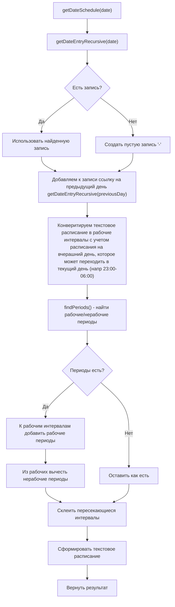
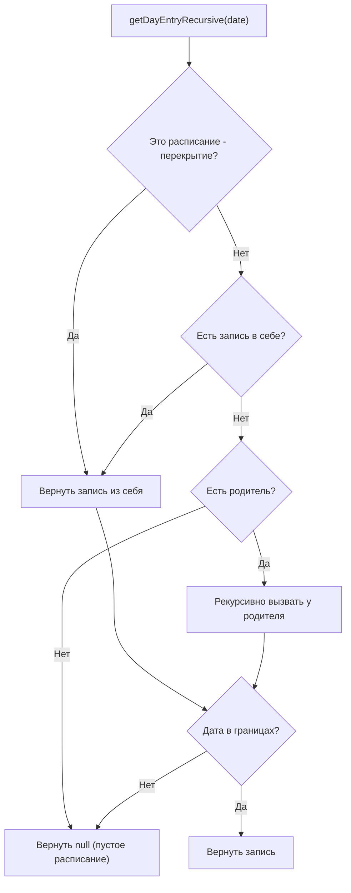
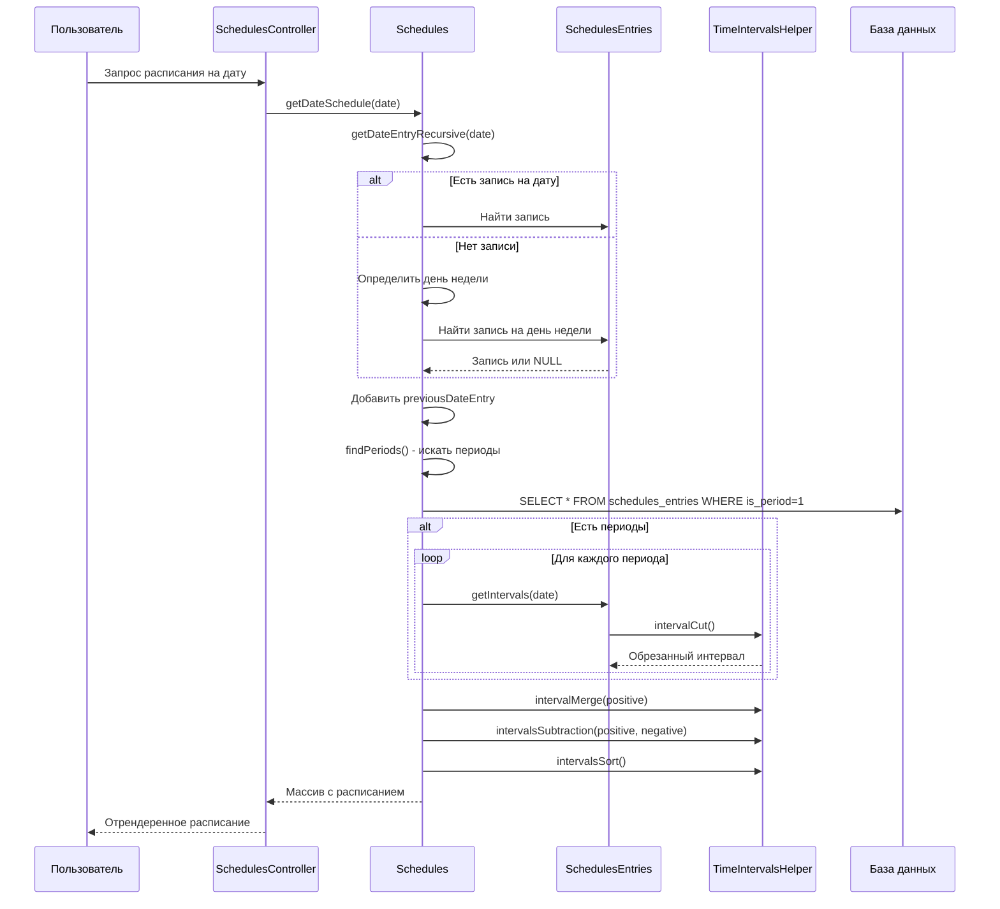

# Документация системы Schedules (Расписания)

## 1. Общая архитектура

### 1.1 Назначение

Система `Schedules` предназначена для управления временными графиками работы различных сущностей системы ARMS:
- **Время предоставления сервисов** (`providingSchedule`) - когда услуга доступна клиентам
- **Время поддержки сервисов** (`supportSchedule`) - когда оказывается техническая поддержка
- **Расписание доступа** (`acl`) - когда предоставляется доступ к ресурсам
- **Рабочее время** (`working`) - для отображения рабочих часов
- **График регламентных работ** (`job`) - для планового обслуживания

### 1.2 Ключевые классы

| Класс | Файл | Назначение |
|-------|------|-----------|
| [`Schedules`](models/Schedules.php) | Модель расписания (заголовок, периоды) |
| [`SchedulesEntries`](models/SchedulesEntries.php) | Модель записей расписания (дни/даты, периоды) |
| [`SchedulesModelCalcFieldsTrait`](models/traits/SchedulesModelCalcFieldsTrait.php) | Вычисляемые поля для Schedules |
| [`ScheduleEntriesModelCalcFieldsTrait`](models/traits/ScheduleEntriesModelCalcFieldsTrait.php) | Вычисляемые поля для SchedulesEntries |
| [`TimeIntervalsHelper`](helpers/TimeIntervalsHelper.php) | Математика интервалов времени |

---

## 2. Структура базы данных

### 2.1 Таблица `schedules`

```sql
CREATE TABLE schedules (
    id              INT PRIMARY KEY AUTO_INCREMENT,
    parent_id       INT NULL,           -- Родительское расписание (наследование)
    override_id     INT NULL,           -- Перекрываемое расписание
    name            VARCHAR(255),       -- Название
    description     VARCHAR(255),       -- Описание
    start_date      VARCHAR(64),        -- Дата начала действия
    end_date        VARCHAR(64),        -- Дата окончания действия
    history         TEXT,               -- История изменений
    -- Связи:
    -- providing_schedule_id -> services (сервисы предоставляемые по расписанию)
    -- support_schedule_id   -> services (сервисы поддерживаемые по расписанию)
    -- schedules_id         -> acls    (ACL с этим расписанием)
    -- schedules_id         -> maintenance_jobs (работы по расписанию)
);
```

### 2.2 Таблица `schedules_entries`

```sql
CREATE TABLE schedules_entries (
    id              INT PRIMARY KEY AUTO_INCREMENT,
    schedule_id     INT,                -- Ссылка на расписание
    date            VARCHAR(64),        -- День недели (1-7) / дата (Y-m-d) / 'def' (по умолчанию)
    date_end        VARCHAR(64),       -- Дата окончания периода
    schedule        VARCHAR(255),       -- Расписание формата "ЧЧ:ММ-ЧЧ:ММ,ЧЧ:ММ-ЧЧ:ММ" или '-' (выходной)
    is_period       BOOLEAN,            -- Это период (TRUE) или запись на день (FALSE)
    is_work         BOOLEAN,            -- Рабочий период (TRUE) или нерабочий (FALSE)
    comment         VARCHAR(255),       -- Комментарий
    history         TEXT,               -- История
    created_at      TIMESTAMP,          -- Время создания
);
```

#### Формат поля `date`:
- `'1'`..`'7'` - день недели (понедельник=1, воскресенье=7)
- `'def'` - расписание по умолчанию (применяется если нет записи на конкретный день)
- `'YYYY-MM-DD'` - конкретная дата (исключение)

#### Формат поля `schedule`:
- `'-'` - нерабочий день
- `'08:00-17:00'` - один период
- `'08:00-12:00,12:45-17:00'` - несколько периодов (с перерывом)
- `'22:00-06:00'` - период переходящий на следующий день
- `'08:00-17:00{comment}'` - с метаданными (опционально)

---

## 3. Иерархия расписаний

### 3.1 Наследование (parent_id)

```
Базовое расписание (parent_id = NULL)
    ↓
Наследуемое расписание 1 (parent_id = id_базового)
    ↓
Наследуемое расписание 2 (parent_id = id_наследуемого_1)
```

**Логика поиска расписания на день:**
1. Искать в текущем расписании
2. Если не найдено → искать в родительском
3. Если не найдено → искать в родителе родителя и т.д.

**Что наследуется:**
| Тип записи | Наследуется | Примечание |
|------------|-------------|------------|
| Конкретная дата (YYYY-MM-DD) | ✅ Да | Ищется в текущем, затем в предках |
| День недели (1-7) | ✅ Да | Ищется в текущем, затем в предках |
| Расписание по умолчанию ('def') | ✅ Да | Ищется в текущем, затем в предках |
| Границы расписания (start/end) | ❌ Нет | Проверяются только для текущего |

**Нюансы:**
- Границы расписания (`start_date`/`end_date`) проверяются **только для текущего** расписания
- Если дата выходит за границы предка, поиск всё равно продолжается по цепочке (предок не исключается)
- Перекрытия работают **независимо** и не наследуют записи от базового расписания

### 3.2 Перекрытия (override_id)

```
Базовое расписание (override_id = NULL)
    ↓
Перекрытие 1 (override_id = id_базового, start_date/end_date = период)
    ↓
Перекрытие 2 (override_id = id_базового, другой период)
```

**Логика работы перекрытий:**
1. Перекрытия **НЕ наследуют** записи от базового расписания
2. Перекрытия имеют **собственные границы** действия (`start_date` → `end_date`)
3. При запросе расписания на дату:
   - Найти активное перекрытие для этой даты (проверка `matchDate()`)
   - Если есть → использовать перекрытие
   - Если нет → использовать базовое расписание
4. Перекрытия **не поднимаются по иерархии parent_id** — они полностью независимы

---

## 4. Логика формирования расписания на день

### 4.1 Алгоритм `getDateSchedule()`

[`getDateSchedule()`](models/traits/SchedulesModelCalcFieldsTrait.php:612) — основной метод получения расписания на день:



**Важно:** Периоды (`is_period=1`) ищутся **только в текущем расписании**, они **НЕ наследуются** от предков!

### 4.2 Логика поиска записи дня `getDayEntryRecursive()`

Метод ищет запись на конкретный день с учётом иерархии:



**Приоритет поиска записи в расписании:**
1. Конкретная дата (`YYYY-MM-DD`)
2. День недели (`1`-`7`)
3. Расписание по умолчанию (`def`)

### 4.3 Периоды и наследование

| Компонент | Берется из | Примечание |
|-----------|------------|------------|
| Запись на день | Текущее + предки | [`getDayEntryRecursive()`](models/traits/SchedulesModelCalcFieldsTrait.php:246) |
| Границы расписания | Только текущее | [`getDateEntryRecursive()`](models/traits/SchedulesModelCalcFieldsTrait.php:587) |
| Периоды (`is_period=1`) | **Только текущее** | [`findPeriods()`](models/Schedules.php:353) — **НЕ наследуются!** |

### 4.4 Математика интервалов

Расписание на день хранится как набор **минутных интервалов** от начала суток:

| Формат записи | Математический вид | Комментарий |
|---------------|-------------------|-------------|
| `'08:00-17:00'` | `[480, 1020]` | Обычный период |
| `'22:00-06:00'` | `[1320, 1500]` | Переход на следующий день |
| `'12:00-12:45'` | `[720, 765]` | Обеденный перерыв |

**Преобразование "переходящих" периодов:**
```
22:00-06:00 → [1320, 1440] + [0, 360]
```

### 4.5 Детали реализации `getDateSchedule()`

```php
function getDateSchedule($date) {
    // 1. Получить базовую запись на день (из наследованной цепочки)
    $dateScheduleEntry = $this->getDateEntryRecursive($date);
    
    // 2. Добавить запись предыдущего дня (для периодов 22:00-06:00)
    $dateScheduleEntry->previousDateEntry = $this->getDateEntryRecursive(previousDay($date));
    
    // 3. Найти все периоды (is_period=1), перекрывающие эту дату
    // ВАЖНО: Периоды ищутся ТОЛЬКО в текущем расписании, они НЕ наследуются от предков!
    $periods = $this->findPeriods(
        strtotime($date . ' 00:00:00'),
        strtotime($date . ' 23:59:59')
    );
    
    // 4. Сформировать рабочие интервалы:
    $positive = $dateScheduleEntry->getIntervals($date); // из записи на день
    $negative = []; // нерабочие интервалы
    
    foreach ($periods as $period) {
        if ($period->is_work) {
            $positive = array_merge($positive, $period->getIntervals($date));
        } else {
            $negative = array_merge($negative, $period->getIntervals($date));
        }
    }
    
    // 5. Склеить рабочие интервалы
    $positive = TimeIntervalsHelper::intervalMerge($positive);
    
    // 6. Вычесть нерабочие из рабочих
    if (count($negative)) {
        $negative = TimeIntervalsHelper::intervalMerge($negative);
        $positive = TimeIntervalsHelper::intervalsSubtraction($positive, $negative);
    }
    
    // 7. Отсортировать и сформировать текстовое расписание
    // Возвращает: ['schedule' => '08:00-17:00', 'day' => $entry, ...]
}
```

---

## 5. Оценка рабочее/нерабочее время

### 5.1 Метод `isWorkTime()` ([`SchedulesModelCalcFieldsTrait.php:711`](models/traits/SchedulesModelCalcFieldsTrait.php:711))

```php
function isWorkTime($date, $time) {
    $scheduleArray = $this->getDateSchedule($date);
    $schedule = $scheduleArray['day'];
    $periods = $schedule->schedulePeriods; // массив "ЧЧ:ММ-ЧЧ:ММ"
    
    $now = SchedulesEntries::strTimestampToMinutes($time); // текущее время в минутах
    
    foreach ($periods as $period) {
        $interval = SchedulesEntries::scheduleExToMinuteInterval($period);
        if (TimeIntervalsHelper::intervalCheck($interval, $now)) {
            return 1; // Рабочее время
        }
    }
    return 0; // Нерабочее время
}
```

### 5.2 Метод `getStatus()` - текущий статус расписания

```php
function getStatus() {
    // Использует gmdate с учетом часового пояса из Yii::$app->params['schedulesTZShift']
    return $this->isWorkTime(
        gmdate('Y-m-d', time() + Yii::$app->params['schedulesTZShift']),
        gmdate('H:i', time() + Yii::$app->params['schedulesTZShift'])
    );
}
```

### 5.3 Примеры работы

| Расписание на день | Запрос | Результат |
|-------------------|--------|-----------|
| `'08:00-17:00'` | 2024-01-15 10:00 | Рабочее время |
| `'08:00-17:00'` | 2024-01-15 18:00 | Нерабочее время |
| `'-'` | 2024-01-15 10:00 | Нерабочее время |
| `'22:00-06:00'` | 2024-01-15 23:00 | Рабочее время |
| `'22:00-06:00'` | 2024-01-15 02:00 | Рабочее время |
| `'22:00-06:00'` | 2024-01-15 10:00 | Нерабочее время |

---

## 6. Использование расписаний в системе

### 6.1 Связь с сервисами

```php
// В модели Services:
- providing_schedule_id → Schedules (время предоставления)
- support_schedule_id   → Schedules (время поддержки)
```

### 6.2 Связь с ACL (доступом)

```php
// В модели Acls:
- schedules_id → Schedules (расписание доступа)
```

### 6.3 Связь с регламентными работами

```php
// В модели MaintenanceJobs:
- schedules_id → Schedules (график выполнения)
```

### 6.4 Методы для получения связанных сервисов

```php
// Schedules:
$schedule->providingServices  // Сервисы предоставляемые по этому расписанию
$schedule->supportServices    // Сервисы поддерживаемые по этому расписанию
$schedule->acls              // ACL с этим расписанием
$schedule->maintenanceJobs   // Работы по этому расписанию
```

---

## 7. Формат вывода описаний

### 7.1 Метод `getWeekWorkTimeDescription()`

Формирует человекочитаемое описание недельного графика:

```
Примеры вывода:
- "08:00-17:00 пн-пт, выходные"
- "00:00-23:59 ежедн."
- "08:00-12:00,13:00-17:00 пн,вт,ср,чт,пт"
- "круглосуточно"
```

### 7.2 Метод `getDateWorkTimeDescription()`

Описание периода действия расписания:

```
Примеры вывода:
- "с 2024-01-01"
- "до 2024-12-31"
- "с 2024-01-01 до 2024-12-31"
```

### 7.3 Метод `getUsageWorkTimeDescription()`

Полное описание с указанием применения:

```
Примеры вывода:
- "Услуга/сервис предоставляется 08:00-17:00 пн-пт с 2024-01-01"
- "Доступ предоставляется без перерывов 24/7"
- "Выполняется 00:00-23:59 ежедн."
```

---

## 8. Словарь (dictionary)

Система использует словарь для формирования текстовых описаний в зависимости от `providingMode`:

| Ключ | acl | providing | support | job | working |
|------|-----|-----------|---------|-----|---------|
| usage | Доступ предоставляется | Услуга/сервис предоставляется | Услуга/сервис поддерживается | Выполняется | Рабочее время |
| usage_complete | Доступ предоставлялся | Услуга/сервис предоставлялся | Услуга/сервис поддерживался | Выполнялось | Рабочее время было |
| usage_will_be | Доступ будет предоставляться | Услуга/сервис будет предоставляться | Услуга/сервис будет поддерживаться | Будет выполняться | Рабочее время будет |
| nodata | Доступ не предоставляется никогда | Услуга/сервис не предоставляется никогда | Услуга/сервис не поддерживается никогда | Не выполняется никогда | Рабочее время отсутствует |
| always | всегда | без перерывов 24/7 | без перерывов 24/7 | всегда 24/7 | всегда 24/7 |

---

## 9. Точки роста

### 9.1 Производительность

| № | Проблема | Место | Рекомендация |
|---|----------|-------|--------------|
| 1 | **Кэширование расписаний** | `getDateSchedule()`, `getDayEntryRecursive()` | Результаты не кэшируются между вызовами. Для часто запрашиваемых дат (сегодня, завтра) добавить кэш в `$attrsCache` |
| 2 | **N+1 запросов** | При выводе списка сервисов с расписаниями | Использовать `with(['providingSchedule', 'supportSchedule'])` в запросах |
| 3 | **Сложные вычисления интервалов** | `TimeIntervalsHelper::intervalMerge()` | Интервалы на больших периодах (годы) могут создавать тысячи записей |

### 9.2 Архитектурные улучшения

| № | Проблема | Рекомендация |
|---|----------|--------------|
| 1 | **Отсутствие версионирования** | Добавить таблицу `schedules_versions` для хранения истории изменений с возможностью отката |
| 2 | **Нет поддержки праздников** | Добавить справочник праздников с автоприменением |
| 3 | **Жёсткая привязка к дням недели** | Добавить шаблоны расписаний (еженедельно, ежемесячно) |
| 4 | **Нет временных зон** | `Yii::$app->params['schedulesTZShift']` - костыль. Добавить поле `timezone` в таблицу `schedules` |

### 9.3 UX улучшения

| № | Проблема | Рекомендация |
|---|----------|--------------|
| 1 | **Сложный интерфейс ввода** | Добавить визуальный редактор расписания (drag-and-drop) |
| 2 | **Нет предпросмотра** | Добавить календарь с подсветкой рабочего/нерабочего времени |
| 3 | **Нет批量 редактирования** | Добавить массовое копирование расписаний между сервисами |

### 9.4 Код

| № | Проблема | Место | Рекомендация |
|---|----------|-------|--------------|
| 1 | **Дублирование кода** | `ScheduleEntriesModelCalcFieldsTrait::getMergedSchedule()` и `getWorkSchedule()` | Выделить общую логику |
| 2 | **TODO в коде** | [`SchedulesModelCalcFieldsTrait.php:777`](models/traits/SchedulesModelCalcFieldsTrait.php:777) | `nextWorkingMeta()` - некорректная логика с учётом периодов |
| 3 | **Неиспользуемый метод** | [`SchedulesModelCalcFieldsTrait.php:733`](models/traits/SchedulesModelCalcFieldsTrait.php:733) | `getAclStatus()` - пустой метод |
| 4 | **Магические числа** | `1`..`7` для дней недели | Вынести в константы класса |

### 9.5 Тесты

| № | Проблема | Рекомендация |
|---|----------|--------------|
| 1 | **Нет unit-тестов** | Добавить тесты на `TimeIntervalsHelper` |
| 2 | **Нет интеграционных тестов** | Добавить тесты на формирование расписания с периодами |
| 3 | **Нет тестов на граничные случаи** | 22:00-06:00, високосные годы, смена часовых поясов |

---

## 10. Примеры использования

### 10.1 Получить расписание на конкретный день

```php
$schedule = Schedules::findOne(1);
$dateSchedule = $schedule->getDateSchedule('2024-01-15');

echo $dateSchedule['schedule']; // "08:00-17:00"
echo $dateSchedule['day']->mergedSchedule; // Склеенное расписание
```

### 10.2 Проверить рабочее время

```php
$schedule = Schedules::findOne(1);
if ($schedule->isWorkTime('2024-01-15', '10:30')) {
    echo "Сейчас рабочее время";
} else {
    echo "Сейчас нерабочее время";
}
```

### 10.3 Получить текущий статус

```php
$schedule = Schedules::findOne(1);
$status = $schedule->status; // 1 - работает, 0 - не работает
```

### 10.4 Получить недельное описание

```php
$schedule = Schedules::findOne(1);
echo $schedule->weekWorkTimeDescription; 
// "08:00-17:00 пн-пт, выходные"
```

---

## 11. Диаграмма взаимодействия



---

## 12. Константы и форматы

### SchedulesEntries

```php
class SchedulesEntries {
    // Дни недели
    public static $days = [
        'def' => "По умолч.",
        '1' => "Пн",
        '2' => "Вт",
        '3' => "Ср",
        '4' => "Чт",
        '5' => "Пт",
        '6' => "Сб",
        '7' => "Вс",
    ];
    
    // Комментарии для рабочих/нерабочих периодов
    public static $isWorkComment = [
        'default' => [0 => 'нерабочий период', 1 => 'рабочий период'],
        'acl' => [0 => 'доступ отозван', 1 => 'доступ предоставляется'],
    ];
}
```

### Schedules

```php
class Schedules {
    public static $titles = 'Расписания';
    public static $title  = 'Расписание';
    public static $noData = 'никогда';
    public static $allDaysTitle = 'ежедн.';
    public static $allDayTitle = 'круглосуточно.';
}
```
