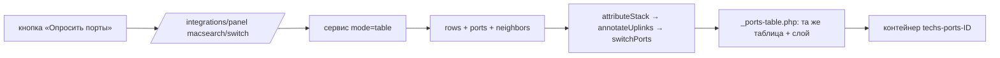

# Карта сети: порты коммутаторов и связи между устройствами

Реализованная часть работы «карта сети» (issue #218 и далее). Что ещё не
сделано — в [plans/network-map.md](../../plans/network-map.md). Здесь —
как это устроено и почему именно так; пользовательская сторона описана в
справке ([techs.md](../help/models/techs.md), раздел «Сетевые порты», и
[tech-models.md](../help/models/tech-models.md)).

Сторона сервиса — отдельный репозиторий `arms.macsearch` (его `README.md` и
`docs/architecture-v2.md`). Здесь про ARMS.

## 1. Главные тезисы

- **Таблица MAC даёт направление, а не звено.** «Адрес X виден на порту 24»
  значит лишь, что X где-то в той стороне: между коммутаторами может стоять
  неуправляемая пятипортовка, медиаконвертер или коммутатор, которого нет в
  инвентаризации. Поэтому связи коммутатор↔коммутатор берутся из **LLDP/CDP**
  (факт с оборудования), а FDB — для «что за портом» и как резерв.
- **Опрос не приносит новую сущность.** Патч-корд в iLO сервера и MAC этого
  iLO на том же порту — один факт с двух сторон. Поэтому таблица портов в
  карточке **одна**, её владелец — карточка, а результат опроса ложится на
  неё **слоем**: где записанное совпало, где разошлось и что предлагается
  сделать. Отдельного экрана связей нет.
- **Запись связей — только предложением с подтверждением.** Молча
  переписать заведённую руками топологию хуже, чем показать расхождение.
- **Тишина на порту — не «пропало».** Порт без адресов значит и «убрали»,
  и «выключено», и «молчит дольше старения записи». Снять связь предлагаем,
  но подтверждение прямо говорит об этом; решает человек.
- **Раскладка портов объявляется, а не выводится.** Строки `ports` ленивые
  (появляются только под связь) и порядка не несут; на вопрос «где
  физически порт Gi1/0/13» отвечает объявленный список и геометрия корпуса.
- **Сервис без состояния.** ARMS присылает цели и режим, сервис опрашивает
  и отдаёт сырые строки. Кто это в инвентаризации и что с этим делать —
  решает ARMS.

## 2. Что приходит от сервиса

`POST /api/search` с `mode`:

| Режим | Что возвращает | Где используется |
|---|---|---|
| `lookup` | строки `{target, host, vlan, port, port_macs}` по одному адресу | панель «Порт коммутатора» у MAC объекта |
| `table` | `rows` (вся таблица MAC) + `ports` (паспорт портов по SNMP: `type` (ifType), `description`, `admin`/`oper`, `speed`, `aggregate`, `vlans`) + `neighbors` (LLDP/CDP) | кнопка «Опросить порты» в карточке коммутатора |
| `neighbors` | только соседи | резерв |

Паспорт и соседи — добавки: не снялись — таблица от этого не портится.
Паспорт читается по SNMP стандартными MIB и не зависит от драйвера CLI.
Ответ с `status=pending` означает «ещё опрашиваем» — панель перезапрашивает
себя сама (скрипт внутри подменяемого контейнера, число попыток ограничено).

Диагностика: пустой ответ не равен «ничего нет» — сервис возвращает
`diagnostics` (команды, что разобрал, образец отброшенного, вердикт), ARMS
показывает их свёрнутым блоком «почему пусто».

## 3. Модель данных

| Где | Что | Зачем |
|---|---|---|
| `tech_models.ports` | объявление портов модели: строка = порт, порядок = физический | порядок и состав розеток |
| `tech_models.ports_layout` | геометрия корпуса: `<столбцов>x<рядов> [вниз\|вправо] [подпись]`, строка = блок | карта портов (`PortsMapWidget`) |
| `techs.ports_override` | порты **экземпляра** — тот же формат; заполнен → действует только он | стек перенумеровал порты, MikroTik переименовал интерфейсы: модельные имена — фантомы |
| `ports.aggr` | ярлык группы (`Po1`, `BAGG1`) на каждом её порту | видеть, какие порты работают как один; раскладывать адреса с агрегата по его портам |
| `ports.link_ports_id` | связь **порт↔порт**, парная (`afterSave` ведёт встречную) | `link_techs_id` — виртуальное поле формы; «без порта» = безымянный встречный порт |

Группа портов — **ярлык, а не сущность** (первый вариант со строкой-агрегатом
и self-FK переделан). Довод владельца: физически кабелей несколько, из
двух розеток в две розетки, и именно это инвентаризация должна записать;
«один логический линк» — свойство конфигурации, а не проводки. Ярлык
считается содержимым порта: строка с одним лишь `Po1` не удаляет себя как
пустая.

Геометрия читается как **размер сетки** (`24x2` — 24 столбца на 2 ряда =
48 портов), потому что так её читает человек; первый вариант
`<портов>x<рядов>` прочитывался как «два ряда по 24». Направление `вниз`
(по умолчанию) — первый порт сверху слева, второй под ним, как считают
коммутаторы. Блоки съедают объявленные имена по очереди; геометрия у модели,
имена у экземпляра. Карта рисуется от `params['ports.mapMinPorts']` портов.

Разбор обоих форматов — `helpers/PortsHelper` (`parseList`, `parseLayout`,
`layoutSlots`). Эффективное объявление экземпляра — `Techs::getPortsTemplate()`,
все потребители идут через `Techs::getPortsList()`.

## 4. Как устроен опрос в карточке коммутатора

- Панель объявлена `'auto' => false` и зовётся поимённо:
  `PanelsWidget::widget(['only' => 'macsearch/switch', 'target' => 'techs-ports-ID'])`.
  Виджет рисует только кнопку, ответ заменяет содержимое **готового** блока
  карточки. Контейнер есть всегда, даже если портов не объявлено — иначе
  результату некуда лечь.
- `MacSearchProvider::switchPorts()` собирает по каждому объявленному порту:
  что записано (`link`, `linked`), что увидено (`macs`, `found`,
  `neighbors`, паспорт) и вердикт. Порядок — объявленный; порты, которых в
  объявлении нет, — в хвост по имени; интерфейсы без розетки (`Po1`,
  `Vlan120`, `CPU`; по `ifType` ≠ 6, без типа — по имени) в таблицу не
  попадают, их содержимое отдано членам группы, а полный список — в сыром
  блоке.
- Объявленное и настоящее имя порта хранятся рядом (`port` / `real`):
  инвентаризация зовёт розетку `Ge0/23`, а коммутатор — `Gi1/0/47`; паспорт и
  соседи лежат под именем коммутатора. Сопоставление для показа
  ослаблено: точное имя → числовой хвост (`portKey`) → номер, и на каждом
  шаге нужен единственный кандидат; агрегаты в приблизительное сравнение не
  пускаются (`Po1` иначе выдаёт себя за порт 1).
- Состояния («идёт опрос», «сервис недоступен») в кэш панели не попадают
  (`IntegrationProvider::$cacheable`), `refresh=1` обходит кэш после действий,
  `ttl = 0` значит «без кэша» (`PanelsCache::fresh`). Отметка «сформировано
  за N c, когда» берётся из данных сервиса, а не из времени рендера — так
  видно, тот же это ответ или новый, какой бы слой его ни вернул.

### Вердикты

| Вердикт | Что случилось | Пометка |
|---|---|---|
| `ok` | найдено то, что записано | серая галочка |
| `replaced` | на порту другое известное устройство | предложение ⟳ |
| `added` | записано пусто, найдено известное | предложение ➕ |
| `foreign` / `quiet` | записанное не отозвалось (адреса чужие / адресов нет) | ✕ с предупреждением «может быть выключено» |
| `seen` | адреса или сосед есть, объектов с ними нет | адреса как есть |
| `free` | ни записи, ни адресов | «линка нет» (не «свободен»: та сторона может быть выключена) |
| `transit` | связан с другим коммутатором либо адресов ≥ `transitFrom` (4) | бейдж с объяснением |
| `disabled` | порт выключен администратором | «выключен» |
| `self` | за портом адрес самого коммутатора (служебный `CPU`, петля) или соседа по стеку | «!», привязка не предлагается |

Транзит по связи — только если на той стороне устройство типа из
`switchTypes`: сервер или СХД на том конце — не сеть, а то самое устройство.
Опознанный сосед по LLDP перебивает «транзит»: факт важнее счёта адресов.

### Предложения и действия

`proposals` у порта — список «? Порт X: Устройство» в ячейке соединения,
кнопка на каждое в последней колонке (`PortsController::actionScanApply`,
`do=attach|chain|detach|aggregate|names`). Связь парная, поэтому привязка
требует порта на той стороне: единственный свободный подставляется сам, из
нескольких — селект в строке, нет объявленных — без порта.

**Цепочка телефон→ПК** узнаётся только в вырожденной схеме: у одного
найденного ровно два объявленных порта (мост), у другого один либо ни
одного (лист). Тогда `? Порт Internet: ТЕЛ : Порт PC → Порт eth: ПК`, одна
кнопка 🔗 пишет оба звена; порт моста к коммутатору — переключатель, имена
подсказок в конфиге (`bridgeToSwitchPorts`, `bridgeToDevicePorts`).
Цепочка предлагается и поверх записанной связи (записан телефон, нашёлся
ПК; или наоборот). Всё, что не вырожденное, — список кандидатов без схемы,
«принять все находки» их не трогает (берёт только порты с одним
предложением). Записанная связь через двухпортовый мост и рисуется
цепочкой — тем же рендером узла на каждый хоп.

**Группа портов**: коммутатор говорит `aggregate` в паспорте; расхождение с
`ports.aggr` видно в колонке «Агрегация», кнопка ставит ярлык всем портам
группы. Адреса, которые коммутатор ведёт на `Po1`, раскладываются по его
портам по составу из паспорта; агрегат без паспорта остаётся строкой.

**Имена портов**: «Взять имена портов с коммутатора» пишет
`ports_override` именами и порядком железа (только розетки), а
`Techs::renamePortsByPosition()` переносит заведённые строки по позициям —
второй порт остаётся вторым. В формах это флажок `rename_ports`: включён,
пока число строк не меняется, и снимается сам при сдвиге списка (добавили
`CON` в начало — связи первого порта переехали бы на консоль). Имена
меняются напрямую в БД в два прохода через временные: сдвиг
`Gi1/0/1 → Gi1/0/2` при живом `Gi1/0/2` — обычное дело.

### Стеки

Стек — конфигурное состояние, не инвентарная единица: у членов свои
карточки, а management-IP общий. Он **выводится, а не хранится**:
`stackOf()` — тот же тип, та же площадка (корень ветки помещений), тот же
первый IP. Цель опроса — одна на стек (представитель — первый по id), иначе
сервис схлопывает N целей по host и результат прилипает к первой. Раскладка
результата — `attributeStack()`/`portOwner()`: порт принадлежит члену, в чьём
объявлении он есть (точное имя → ключ, единственный кандидат); не нашёлся
или нашёлся у нескольких (члены с одинаковыми модельными именами без своих
«портов фактически») — остаётся на представителе с пометкой `?`. Карточка
члена показывает свою долю (`stackSlice`), «взять имена» не берёт порты
соседей, адрес соседа по стеку за портом — `self`.

## 5. Карта сети площадки

`/network-map/index?place=<корень помещений>` (`NetworkMapController`,
`components/NetworkMap.php`, `views/network-map/{index,_map}.php`).

- **Граф из записей**: узлы — коммутаторы площадки (`switchTypes`
  провайдера, неархивные, по ветке помещений), стек (общий первый IP) —
  один узел; рёбра — связи порт↔порт между узлами, каждая пара портов один
  раз, группа (`aggr`) — одно ребро с числом кабелей; связи внутри стека в
  рёбра не идут. «Наружу» перечисляются только аплинки на коммутаторы других
  площадок: связи с не-коммутаторами не выводятся вовсе — на боевой площадке
  это все патч-корды разом. `groupByPlace` (галочка «учитывать помещения»)
  заворачивает узлы в mermaid-subgraph их помещений; узел на корне площадки
  остаётся вне рамок. Рендер — mermaid (`MermaidAsset`, но со
  своей инициализацией `securityLevel: loose` ради `click` на узлах; текст
  диаграммы только наш, экранирование в `NetworkMap::quote()`).
- **Сверка** (`actionScan`): один `mode=neighbors` со всеми целями площадки
  (`MacSearchProvider::siteNeighbors()`, строки разложены по стекам),
  `NetworkMap::overlay()` сравнивает с записанным: `confirmed` / `unseen`
  (не видно ни с одной из ответивших сторон — только пометка, не
  предложение снять) / `found` (с конфликтами по обеим сторонам:
  `conflict`, `conflict_remote`) / `unknown` / `outside` / `failed`. LLDP
  симметричен — находки складываются по неупорядоченной паре концов.
- **Имя порта из LLDP → объявленный порт** для записи:
  `MacSearchProvider::resolvePortName()` — точное → единственный по ключу →
  кандидаты списком (человеку); без объявленных портов — связь без порта.
  Запись — тот же `ports/scan-apply do=attach`; «записать всё» берёт только
  однозначные без конфликтов.
- **Последний опрос** держится в `Yii::$app->cache` 15 минут
  (`reuse=1`): после записи связи карта пересобирается без нового обхода.
  Это не хранение результатов — штамп опроса на экране.
- Сосед опознаётся `identifyNeighbor()`: MAC → диапазон → имя (с доменом и
  без) → IP управления (sysName у некоторых железок — адрес).
- Шум сверки (по итогам первого прогона на проде — 304 «неопознанных»):
  телефоны отсеиваются `neighborIgnore` (конфиг провайдера, по умолчанию
  SEP/SIP+MAC и «IP Phone»), записи без имени и адреса — как безличные,
  повторы одного соседа схлопываются со счётчиком; всё это видно цифрами в
  шапке, фильтры не молчат. На схеме — не больше `UNKNOWN_ON_DIAGRAM` (12)
  узлов «?». Сервис со своей стороны дедуплицирует LLDP-записи по timeMark
  (`snmp_bridge`). Неподтверждённое ребро можно снять кнопкой ✕ из списка.
- «Найдено» включает опознанные коммутаторы ЛЮБОЙ площадки (аплинк между
  площадками — внешний узел на схеме, запись той же кнопкой); опознанные
  не-коммутаторы — счётчик `endpoints`. Неопознанному соседу прямо на
  странице выбирается карточка (`actionAssign`, PERM_EDIT): имя — в пустой
  hostname (домен: свой → из FQDN → `domains.default`), адрес — в MAC;
  ничего не перезаписывается, при невалидном имени пишется хотя бы MAC.
  Неработающий коммутатор со связями остаётся узлом карты с красной
  пометкой (ошибка документации должна быть видна), связь с ним
  подсвечена и снимается ✕; без связей — не узел и не цель.
- Везде учитывается `tech_states.operating`: цели опроса, кнопка в карточке,
  узлы карты и члены стеков — только работающее (без статуса — считается
  работающим).

## 6. Панель «Порт коммутатора» у объекта

Иконка у MAC (`MacSearchWidget`) → меню: искать среди оборудования / ОС
(обычные списки) / на портах коммутаторов площадки объекта / всех.
Область входит в ключ кэша. Цели собирает `targets()`: тип из `switchTypes`,
непустой IP, неархивные, по ветке помещений; транзитные порты размечаются
по связям (`annotateUplinks`) после раскладки по стеку.

## 7. Готчи (найдены на живых данных)

- **Font Awesome 5** (`fas fa-*`); классы шестёрки (`fa-solid`, `fa-xmark`)
  рисуют пустые квадратики.
- Тултипы — атрибут **`qtip_ttip`** (HTML), не `title`; прикрепляются
  интервалом, ajax-контент подхватывается сам.
- Кнопка в `target`-режиме живёт вне подменяемого контейнера и сама не
  восстанавливается — `PanelsWidget::registerLoader()` возвращает её и на
  успехе, и на ошибке (иначе спиннер вечный).
- Сервис читает `config.priv.json` (или `MACSEARCH_CONFIG`), не
  `config.json`; `/api/health` показывает действующий файл и `scan.*`.
- `Ports`: безымянный встречный порт («без порта») не проходит `required`
  для `name` — сохраняется без валидации имени; порт, удаляющий себя как
  пустой, обязан снять встречную ссылку (`releasePeer`), иначе у соседа
  остаётся связь в никуда; `dropLink()` обнуляет виртуальный
  `link_techs_id`, иначе перепривязывает заново.
- `annotateUplinks` сравнивает имена по числовому хвосту: несовпадающие
  схемы имён (`Ge0/7` / `Gi1/0/7`) маскируют ошибки — после «взять имена»
  они всплывают.
- Цвета слотов карты — токены `--ports-slot-*` (`arms.css` светлая,
  `themes.css` тёмная); SVG схемы коммутации в тултипе порта —
  `currentColor`, не `black`.
- Тестовый дамп `tests/_data/arms_demo.sql` обязан содержать миграции
  `techs_ports_override`, `ports_aggregation` (`aggr`), `tech_models_ports_layout`.

## 8. Где что лежит

| Файл | Роль |
|---|---|
| `components/integrations/providers/MacSearchProvider.php` | цели, стеки, опрос, раскладка по портам, вердикты, предложения |
| `components/integrations/providers/views/macsearch/{switch,ports,_raw,_diagnostics}.php` | панели, сырой дамп, диагностика |
| `views/techs/_ports-table.php` | единая таблица портов (карточка + слой опроса), JS действий |
| `views/techs/ports.php` | блок «Сетевые порты»: контейнер + кнопка |
| `controllers/PortsController.php` | `actionScanApply` |
| `controllers/NetworkMapController.php`, `components/NetworkMap.php`, `views/network-map/` | карта сети площадки и сверка |
| `models/Ports.php`, `models/Techs.php`, `models/TechModels.php` | `aggr`, `ports_override`/`rename_ports`, `ports_layout` |
| `helpers/PortsHelper.php`, `components/PortsMapWidget.php`, `components/PortsGroupWidget.php` | разбор объявлений, карта, редактор списка и сторож флажка |
| `tests/unit/components/integrations/MacSearchProviderTest.php`, `tests/unit/models/{PortsScanApplyTest,TechsPortsTemplateTest}.php`, `tests/unit/components/PortsLayoutTest.php` | тесты |
