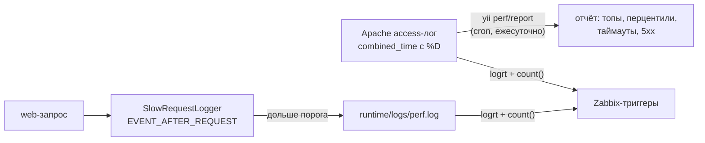

# Мониторинг производительности: механизм

Как устроены инструменты диагностики производительности. Применение
(включение, cron, Zabbix, разбор инцидентов) — в административной странице
[docs/help/admin/monitoring.md](../help/admin/monitoring.md); здесь — контракты
и внутренности для доработки.

## Философия

По конвенции проекта производительность не оптимизируется «заранее»; но чтобы
узнать, *где* тормозит, метрики нужны *до* инцидента. Компромисс — «дешёвая
диагностика без постоянного сбора»:

- **всё** пишется только там, где это бесплатно (Apache и так пишет access-лог —
  добавлено лишь поле длительности);
- **приложение** журналирует только аномалии (запрос дольше порога) — журнал
  пуст, пока всё хорошо, и его наполнение само по себе сигнал;
- **агрегаты** (перцентили, топы) считаются оффлайн-отчётом по access-логу,
  а не онлайн-инструментацией.



## Время обработки в access-логе

`docker/apache/site.conf` определяет формат `combined_time`: стандартный
combined + `%Dus` (длительность обработки запроса в **микросекундах**,
суффикс `us` — самодокументация единиц). Поле в конце строки, поэтому
старые логи и сторонние анализаторы combined не ломаются.

На точный формат завязаны:

- парсер [`helpers/AccessLogAnalyzer`](../../helpers/AccessLogAnalyzer.php);
- regexp Zabbix-итема 5xx (`"\" 5[0-9][0-9] \""` — код статуса между кавычкой
  запроса и размером ответа).

Менять формат — только синхронно с ними.

## SlowRequestLogger

[`components/SlowRequestLogger`](../../components/SlowRequestLogger.php) —
бутстрап-компонент web-конфига. На `Application::EVENT_AFTER_REQUEST`
сравнивает `microtime(true) - REQUEST_TIME_FLOAT` с порогом
(`params['perf.slow_request_seconds']`, 0 = выключено) и при превышении пишет
`Yii::warning(..., 'perf')`.

Маршрутизация логов в `config/web.php`: категория `perf` идёт в **отдельный**
`FileTarget` (`runtime/logs/perf.log`, `logVars=[]` — одна строка на событие,
без дампов окружения), а из основного лога исключена (`except`), чтобы не
дублировалась. Отдельный файл нужен Zabbix: `logrt`-итем следит именно за ним,
и любая строка в нём — событие.

Формат строки — **контракт** (Zabbix-regexp `slow request`, возможный разбор):

```text
slow request: 12.345s status=200 route=services/view url="/services/view?id=5" user=ivanov mem=64.5M
```

Особенности реализации:

- `EVENT_AFTER_REQUEST` срабатывает *до* отправки ответа — время передачи
  контента клиенту не входит (его покрывает %D Apache);
- сбор каждого поля обёрнут в try/catch: диагностика не имеет права уронить
  запрос (identity может быть недоступна при падении БД и т.п.);
- запрос, убитый фатально (`max_execution_time`), в perf.log не попадает —
  такие видны только в access-логе; поэтому у access-лога свой триггер.

## AccessLogAnalyzer

[`helpers/AccessLogAnalyzer`](../../helpers/AccessLogAnalyzer.php) — чистый PHP
(без Yii), разбор и агрегация access-лога:

- `parseLine()` — combined/combined_time; строки без `%Dus` учитываются
  в счётчиках, но без таймингов (переходный период после смены формата);
  неразбираемые строки считаются в `skipped`, не роняют разбор;
- `normalizeRoute()` — запрос → маршрут: без query string, числовые сегменты
  пути → `{id}` (`GET /services/view`, `PUT /api/techs/{id}`), иначе каждая
  карточка была бы отдельной строкой агрегата. Метод — часть ключа: у REST
  `GET` и `PUT` одного URL разная стоимость;
- агрегаты по маршруту: count, сумма, avg, p50/p95/p99 (метод ближайшего
  ранга), max, статусы по классам;
- отдельные списки: «дольше `slowSeconds`» (кандидаты в таймауты) и 5xx;
  ограничены `listLimit` (защита памяти), сверх лимита — только счётчик;
- `consumeFile()` читает через `gzopen` — ротированные `.gz` куски
  распаковывать не нужно (несжатые файлы zlib читает как есть);
- фильтр периода `[from, to)` по timestamp строки — маска файлов может смело
  захватывать ротацию, чужие дни отсечёт фильтр.

Покрытие: [`tests/unit/helpers/AccessLogAnalyzerTest.php`](../../tests/unit/helpers/AccessLogAnalyzerTest.php).

## PerfController

[`console/commands/PerfController`](../../console/commands/PerfController.php) —
тонкая обёртка: разворачивает маски файлов (`--file` или
`params['perf.access_log']`, glob, список через запятую), скармливает файлы
анализатору за период суток и рендерит текстовый отчёт
(`yii\console\widgets\Table`). `--email` шлёт тот же текст письмом
(`<pre>` + существующий mailer): один рендер — два канала доставки.

Секции отчёта и их смысл — в [админской странице](../help/admin/monitoring.md#ежедневный-отчёт).

## Zabbix-шаблон

[`zabbix/arms-perf-template.yaml`](../../zabbix/arms-perf-template.yaml)
(экспорт 6.0): два `logrt`-итема активного агента (perf.log + access-лог)
и триггеры `count(...,5m) >= {$MACRO}` — порог чувствительности, а не «алерт
на каждое событие». `skip` в ключе — при подключении к хосту исторические
строки не считаются. Пути к логам и пороги — макросы, переопределяются
на хосте.

## Дальнейшее развитие (сознательно отложено)

- **p95 в Zabbix**: cron-скрипт раз в минуту считает p95 по хвосту access-лога
  (окно ~5 минут) и шлёт `zabbix_sender`-ом в trapper-итем; триггер на рост
  относительно базовой линии. Делать, когда случится инцидент, при котором
  лог-триггеры промолчали (деградация ниже порога slow-лога). Расчёт можно
  переиспользовать: `AccessLogAnalyzer::percentile()`.
- **тайминги консольных команд** (синхронизации, notify и пр.):
  `beforeAction`/`afterAction` в общем базовом консольном контроллере со
  строкой в тот же perf.log — если понадобится коррелировать инциденты
  с внутренними job-ами (внешние синхронизации видны и так — через /api
  в access-логе).
