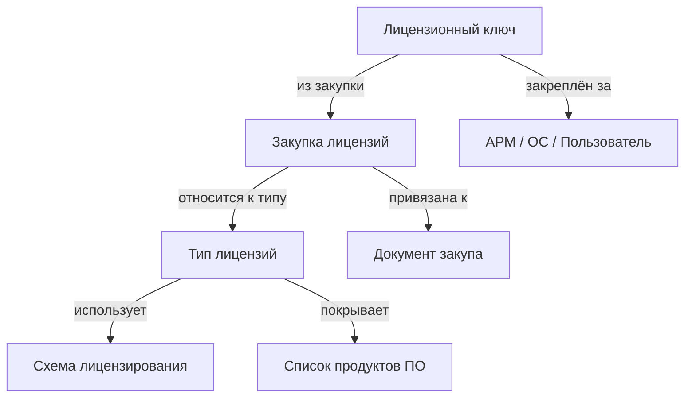

# Лицензии

Учёт лицензий в инвентаризации.

Для учёта лицензий используются:

- [Типы лицензий](../models/lic-groups.md) — по сути это полное описание одного из вариантов лицензий для какого/каких-либо продуктов (например, для Windows 10 возможны совершенно разные схемы лицензирования: например, VL-лицензия может допускать даунгрейд, а BOX — нет. Поэтому надо учитывать, какие именно лицензии мы закупили, какие версии/редакции софта они покрывают)
- [Схемы лицензирования](../models/lic-types.md) — описание схем лицензирования продуктов; в основном они используются многократно, хотя есть и уникальные, которые будут подходить только под свой продукт
- [Закупки лицензий](../models/lic-items.md) — собственно основные объекты учёта: пачки лицензий, которые мы закупаем и которые можно привязать к документам закупа
- [Лицензионные ключи](../models/lic-keys.md) — если нужно вести учёт лицензионных ключей, то он должен быть тут.

Информация о лицензиях консолидируется в типах лицензий: закупки и ключи привязываются к типу лицензий, а тип связывает их со схемой лицензирования и списком покрываемых продуктов.

Точность привязки закупленных лицензий очень вариативна (в случае, если лицензии вообще к чему-то привязываются):

- **Можно привязать конкретный лицензионный ключ** — тут всё просто: было X ключей, один привязали, осталось X-1. Чётко видно, куда потрачен тот, что привязали
- **Можно привязать конкретную закупку** — это будет подразумевать, что лицензии из конкретной закупки (кроме тех, которые явно привязаны через ключи) распределяются между всеми привязанными к ней АРМ/ОС/пользователями. Например, купив плавающие лицензии для конкретного офиса, можно привязать все его компьютеры к этой закупке (и настроить лицензирование в софте аналогично).
- **Можно привязать весь тип лицензий** — это будет подразумевать, что свободные лицензии (не распределённые через ключи или закупки) из закупок этого типа распределяются между всеми АРМ/ОС/пользователями, привязанными к этому типу лицензий. Для Касперского, например, такая схема пойдёт на ура.
