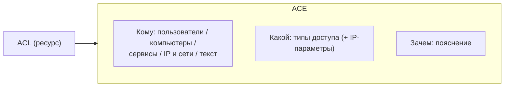

# Записи доступа (ACE)

**ACE (Access Control Entry, запись доступа)** — строка внутри
[списка доступа (ACL)](acls.md): **кто** и **какой** доступ получает
к ресурсу этого ACL. Самостоятельно, вне ACL, записи доступа не существуют.

Запись состоит из трёх частей:

- **Субъекты** («кому»): пользователи, компьютеры/серверы, сервисы
  (доступ получают все узлы сервиса), IP-адреса и сети. Объекты, которых
  нет в системе, вписываются текстом в поле «Прочее».
- **Типы доступа** («какой»): значения справочника типов доступа
  (RDP, VPN, SSH…). Комплексный тип автоматически включает свои дочерние;
  для IP-типов у записи можно уточнить порты/протоколы (IP-параметры) —
  по умолчанию они берутся из типа.
- **Пояснение** («зачем»): с какой целью субъект получает доступ.

## Особенности

- IP-адреса субъектов вводятся текстом (по одному в строке);
  отсутствующие адреса создаются автоматически, а сети должны быть
  заведены заранее — незаведённые отбрасываются при сохранении.
- В группе ACL (см. [Списки доступа](acls.md)) один и тот же набор ACE
  повторяется в каждом ACL; правка через групповые операции меняет
  запись во всех ACL сразу.

## Список

Меню **Доступы → Доступы** — таблица всех ACE системы: срез
«субъект → тип доступа → ресурс → временное ограничение», по которому
удобно искать, у кого куда есть доступ.

См. руководство: [Временные доступы](../guides/temporary-access.md).
