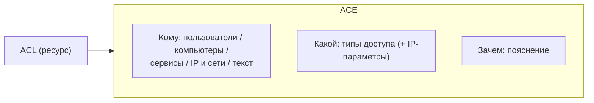

# Записи доступа (ACE)

**ACE (Access Control Entry, запись доступа)** - одна запись из
[списка доступа (ACL)](acls.md): **кто** и **какой** доступ получает
к ресурсу этого ACL. Самостоятельно, вне ACL, записи доступа не существуют.

Запись состоит из трёх частей:

- **Субъекты** ("кому"): пользователи, компьютеры/серверы, сервисы
  (доступ получают все узлы сервиса), IP-адреса и сети. Объекты, которых
  нет в системе, вписываются текстом в поле "Прочее".
- **Типы доступа** ("какой"): выбирается справочника типов доступа
  (RDP, VPN, SSH...). Можно создать "комплексный" тип, который автоматически
  включает свои дочерние;
  для IP-типов у записи можно уточнить порты/протоколы (IP-параметры).
- **Пояснение** ("зачем"): с какой целью субъект получает доступ.

```mermaid
flowchart LR
    ACL["ACL (ресурс)"] --> ACE
    subgraph ACE ["ACE"]
        direction TB
        WHO["Кому: пользователи / компьютеры /<br>сервисы / IP и сети / текст"]
        WHAT["Какой: типы доступа (+ IP-параметры)"]
        WHY["Зачем: пояснение"]
    end
```

## Особенности

- Если ресурсом ACL является сервис с заданными [стандартными типами
  доступа](services.md) (настраиваются в карточке сервиса), форма новой записи
  открывается с уже выставленными галочками этих типов и их сетевыми
  параметрами (включая переопределённые сервисом порты) — набор всегда
  можно поменять вручную.
- Новый тип доступа можно завести не покидая форму — кнопка "+" над
  списком типов открывает форму справочника в модальном окне.
- IP-адреса субъектов вводятся текстом (по одному в строке);
  отсутствующие адреса создаются автоматически, а сети должны быть
  заведены заранее — незаведённые отбрасываются при сохранении.
- В группе ACL (см. [Списки доступа](acls.md)) один и тот же набор ACE
  повторяется в каждом ACL; правка через групповые операции меняет
  запись во всех ACL сразу.

## Архивность

Запись доступа считается **архивной**, когда пользоваться этим доступом
уже некому или незачем:

- **архивен её ACL** — ушёл в архив ресурс либо истекло расписание
  доступа (см. [Списки доступа](acls.md));
- **все субъекты записи ушли в архив** — уволенные сотрудники, архивные
  ОС, сервисы, сети, адреса в архивных сетях.

Пока жив хотя бы один субъект, запись остаётся действующей. Запись, где
субъекты описаны только текстом ("Прочее"), архивной не считается —
архивироваться нечему.

Архивные записи по умолчанию скрыты: в списке их возвращает
переключатель "Архивные" над таблицей, в блоках "Имеет доступ к:"
на карточках сотрудников, ОС и сервисов — общий режим показа архивных.

## Список

Меню **Доступы → Доступы** — таблица всех ACE системы: список
"субъект → тип доступа → ресурс → временное ограничение", по которому
удобно искать, у кого куда есть доступ.

См. руководство: [Временные доступы](../guides/temporary-access.md).
