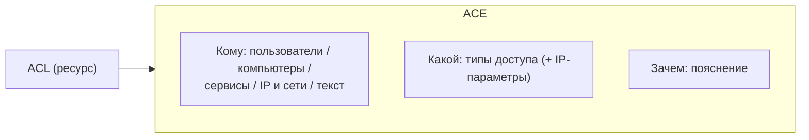

# Записи доступа (ACE)

**ACE (Access Control Entry, запись доступа)** - одна запись из
[списка доступа (ACL)](acls.md): **кто** и **какой** доступ получает
к ресурсу этого ACL. Самостоятельно, вне ACL, записи доступа не существуют.

Запись состоит из трёх частей:

- **Субъекты** ("кому"): [пользователи](users.md),
  [компьютеры/серверы](comps.md), [сервисы](services.md)
  (доступ получают все узлы сервиса), [IP-адреса](net-ips.md) и
  [сети](networks.md). Объекты, которых
  нет в системе, вписываются текстом в поле "Прочее".
- **Типы доступа** ("какой"): выбирается справочника типов доступа
  (RDP, VPN, SSH...). Можно создать "комплексный" тип, который автоматически
  включает свои дочерние;
  для IP-типов у записи можно уточнить порты/протоколы (IP-параметры).
- **Пояснение** ("зачем"): с какой целью субъект получает доступ.

```mermaid
flowchart LR
    ACL["ACL (ресурс)"] --> ACE
    subgraph ACE ["ACE"]
        direction TB
        WHO["Кому: пользователи / компьютеры /<br>сервисы / IP и сети / текст"]
        WHAT["Какой: типы доступа (+ IP-параметры)"]
        WHY["Зачем: пояснение"]
    end
```

## Особенности

- Если ресурсом ACL является сервис с заданными [стандартными типами
  доступа](services.md) (настраиваются в карточке сервиса), форма новой записи
  открывается с уже выставленными галочками этих типов и их сетевыми
  параметрами (включая переопределённые сервисом порты) — набор всегда
  можно поменять вручную.
- Новый тип доступа можно завести не покидая форму — кнопка "+" над
  списком типов открывает форму справочника в модальном окне.
- IP-адреса субъектов вводятся текстом (по одному в строке);
  отсутствующие адреса создаются автоматически, а [сети](networks.md)
  должны быть заведены заранее — незаведённые отбрасываются при сохранении.
- В группе ACL (см. [Списки доступа](acls.md)) один и тот же набор ACE
  повторяется в каждом ACL; правка через групповые операции меняет
  запись во всех ACL сразу.

## Транзит: маршрут из нескольких хопов

Запись доступа описывает один шаг(хоп): субъект → ресурс. Когда сервис ходит в
другой сервис **через посредника** (реверс-прокси, шлюз), связь
документируется двумя записями и указателем между ними:

1. `Документооборот → прокси` (HTTPS, TCP 44344);
2. `прокси → ERP` (HTTPS, TCP 443);
3. у первой записи в поле
   [«Следующие хопы»](#doc-select:.field-aces-next_aces_ids) выбрана
   вторая (или у второй в
   [«Предыдущих хопах»](#doc-select:.field-aces-prev_aces_ids) — первая:
   это одна связь, заполнять достаточно с любой стороны).

Кандидаты в списках подбираются по посреднику: в следующие хопы
предлагаются записи, где субъект - ресурс этой записи (с его узлами и
адресами), в предыдущие - записи доступа к субъектам этой записи.
Несколько входящих хопов могут сходиться в один исходящий, а один хоп с
разными портами - расходиться в несколько.

Собранные маршруты показывает колонка **«Маршрут»** в списках доступов и
блок на карточке записи: "первый субъект → посредник → конечный ресурс",
с типами доступа и портами на стрелках. Хоп, с которого вы смотрите,
выделен: у посредника видно, какие соединения транзитные, у конечного
сервиса — кто приходит к нему через посредника. Значок предупреждения на
стыке означает, что среди субъектов следующего хопа нет ресурса
предыдущего: либо субъект задан шире (сетью), либо маршрут собран
неверно. Замкнуть маршрут в кольцо не даст проверка при сохранении.

На странице сервиса над вкладками доступов есть переключатель **уровня**:
*информационный* оставляет субъектов, ресурс и маршрут (кто к чему и каким
путём), *сетевой* — узлы с адресами и порты (что нужно для настройки
сетевых ACL на один хоп).

## Пробросы (NAT, реверс-прокси)

Проброс соединения документируется той же записью доступа — отдельной
сущности под него нет. Достаточно поставить в записи галочку
[**«Проброс»**](#doc-select:.field-aces-is_forward). Признак живёт на самой
записи, а не на типе доступа: типы остаются обычными (HTTPS, RDP, VoIP),
заводить их копии «для проброса» не нужно.

В записи-пробросе:

- **субъект** — адрес входа: белый IP, на который приходит соединение;
- **ресурс** списка доступа — узел назначения (ОС/оборудование) или его
  адрес;
- **сетевые параметры** типа доступа — `порт входа -> порт назначения`,
  например `TCP 443->8443`. Без стрелки (`UDP 1194`) порт не меняется.

Такие записи показываются там, где о пробросе нужно знать: на карточке
ОС и оборудования — блок «Доступен снаружи», на карточке
[IP-адреса](net-ips.md) — «Пробрасывается на» (адрес входа) и «Доступен
снаружи как» (адрес назначения), на карточке [DNS-имени](dns-names.md) —
вся цепочка «имя → адрес входа → узел». В [маршрутах](#транзит-маршрут-из-нескольких-хопов)
проброшенный хоп помечен значком. Роутер, на котором настроен NAT,
отдельно не указывается: белый адрес и так привязан к его ОС.

Архивные пробросы (истёкшее расписание, списанный узел) в этих блоках не
показываются.

## Архивность

Запись доступа считается **архивной**, когда пользоваться этим доступом
уже некому или незачем:

- **архивен её ACL** — ушёл в архив ресурс либо истекло расписание
  доступа (см. [Списки доступа](acls.md));
- **все субъекты записи ушли в архив** — уволенные сотрудники, архивные
  ОС, сервисы, сети, адреса в архивных сетях.

Пока жив хотя бы один субъект, запись остаётся действующей. Запись, где
субъекты описаны только текстом ("Прочее"), архивной не считается —
архивироваться нечему.

Архивные записи по умолчанию скрыты: в списке их возвращает
переключатель "Архивные" над таблицей, в блоках "Имеет доступ к:"
на карточках сотрудников, ОС и сервисов — общий режим показа архивных.

## Список

Меню **Доступы → Доступы** — таблица всех ACE системы: список
"субъект → тип доступа → ресурс → временное ограничение", по которому
удобно [искать](<#doc-select:.grid-view .filters input>) (поля фильтров
под заголовками; сортировка — клик по
[заголовку](<#doc-select:.grid-view th a[data-sort]>)), у кого куда
есть доступ.

См. руководство: [Временные доступы](../guides/temporary-access.md).
