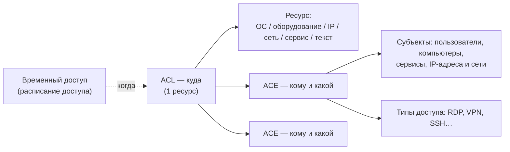

# Списки доступа (ACL)

**ACL (Access Control List, список доступа)** — учётная запись о том, что
к **одному ресурсу** кем-то предоставлен доступ. ACL отвечает на вопрос
«**куда**» и держит в себе [записи доступа (ACE)](aces.md), отвечающие
на вопросы «**кому**» и «**какой**».

Ключевое правило: **один ACL — ровно один ресурс**. Ресурсом может быть:

- операционная система (ОС/компьютер),
- оборудование,
- IP-адрес или IP-сеть,
- сервис — тогда доступ автоматически распространяется на все узлы,
  обеспечивающие работу сервиса (включая дочерние сервисы),
- либо просто текстовое описание («Другое») — для объектов,
  не заведённых в системе.

## Связи

- **Записи доступа (ACE)** — содержимое списка: кто и какой доступ
  получает. Подробнее: [Записи доступа](aces.md).
- **Расписание доступа** — если указано, ACL действует только в рамках
  временного доступа (см.
  [руководство «Временные доступы»](../guides/temporary-access.md)) —
  так служба ИБ учитывает, кому, куда, на какое время и на каком
  основании предоставлен доступ. Без расписания ACL постоянный — этим
  фиксируются межсервисные связи (например, «Сервис1 → Сервис2 по
  LDAPS, TCP 939»).
- Предоставленные доступы видны и «с другой стороны»: на страницах самих
  ресурсов и субъектов (пользователей, ОС, сервисов).

## Группы ACL

Так как один ACL держит один ресурс, доступ «той же команды к нескольким
ресурсам» оформляется несколькими ACL с **одинаковым набором ACE**. Такие
ACL внутри одного временного доступа автоматически объединяются
в **группу**: на странице временного доступа они показываются одной
карточкой «N ресурсов», а правки участников (добавление/изменение/
удаление ACE) и состава ресурсов применяются сразу ко всей группе.
Переключатель «Группировать / Детально» позволяет увидеть каждый ACL
отдельно.

«Одинаковость» ACE считается по субъектам, типам доступа, IP-параметрам
и полям «Прочее»/«Записная книжка»; поле «Пояснение» в сравнении не
участвует. ACL без расписания в группы не объединяются.

## Добавление

Из временного доступа («Добавить» под списком доступов) или из списка
ACL. В форме сразу заполняются участники (ACE) и выбираются ресурсы;
при выборе нескольких ресурсов на каждый создаётся отдельный ACL группы.

## Удаление

Удаление ACL удаляет и все его ACE. Удаление временного доступа удаляет
все его ACL.
