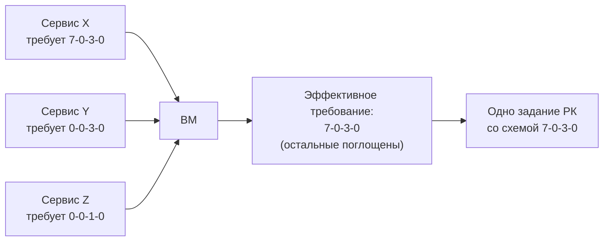

# Требования по обслуживанию

Декларативная часть регламентного обслуживания: *что должно* регулярно
делаться с сервисами, оборудованием и ОС: индексация БД, резервное 
копирование VM, дампы конфигураций оборудования. 
Фактически выполняемые работы — отдельная сущность, 
[Регламентное обслуживание](maintenance-jobs.md); работа
"выполняет" требования, и сопоставление одного с другим показывает
непокрытые требования на карточках ОС и оборудования.

## Соглашение: требования РК предъявляются к сервисам, а не к ОС

Задача, которую решает соглашение: как бэкапить конечную ОС/ВМ? 
Ответ: Требовния к бэкапу ОС/ВМ должны вытекать из ее задач.

Как это оформить в инвентаризации?  
Ответ: требования РК предъявляются **к сервисам** и автоматически
**наследуются** на ОС/ВМ, на которых сервис работает (флаг
"Распространяется на ОС"; для железа аналогично — "Распространяется на
оборудование"). Владелец сервиса формулирует потребность в терминах
своего сервиса, а на ВМ требования собираются со всех её сервисов сами.

Что делать, если ОС/ВМ является платформой сразу для нескольких сервисов, 
и на нее может упасть сразу несколько требований РК?  
Ответ: требования можно сделать дополняющими друг друга, тогда из всего
набора требований можно выбрать тот, который содержит наиболее полный набор
требований (см. далее "готовый набор вместо произвольных требований").
Дополняемость требований объявляется явно.

## Состав требования (пример соглашения)

Требование РК описывается одним параметром — **GFS-сценарием** вида
Д-Н-М-Г (сколько хранится дневных, недельных, месячных и годовых копий).
Сценарий одновременно задаёт и RPO (самый частый слой), и глубину
хранения.

Сознательно **не заявляются**:

- **RTO** — не заявляется нигде: для Veeam существует Instant Recovery,
  который в типовом сценарии восстановления 1–2 ВМ сводит RTO к
  нескольким минутам, поэтому торговаться о нём в требованиях незачем;
- **лента и офсайт** — теоретически объявляются здесь же, но для
  простоты регламента РК принято, что эти требования идентичны для всех
  данных: правило "3-2-1" должно соблюдаться всегда и для всех.

## Готовый набор вместо произвольных требований

Если позволить каждому сервису заявить произвольную схему, на одну ВМ
могут упасть три несовместимых требования — и её придётся бэкапить тремя
разными заданиями с тремя разными схемами retention.

Поэтому требования оформлены **конечным набором** (разрабатывался в
координации с владельцами основных крупных сервисов; выбор ограничен этим
набором). Набор разбит на группы, внутри группы требования сортируются по
строгости (RPO), а GFS-сценарии составлены так, что требование из
середины отсортированной группы удовлетворяет и всем требованиям ниже.
Эта связь заведена в самих объектах — поле «Перекрывает требования».

Пример цепочки: `7-3-3-0` перекрывает `7-0-3-0`, которое перекрывает
`0-0-3-0`, которое перекрывает `0-0-1-0`.

Когда на ВМ собирается несколько требований, целевым считается самое
«требовательное»: остальные помечаются как поглощённые и в итоговом
наборе игнорируются. В результате ВМ попадает в **одно** задание РК с
**одной** схемой retention, закрывающее все предъявленные требования.

## Свойства перекрытия

- Перекрытие **транзитивно**: проверка удовлетворённости рекурсивна,
  поэтому достаточно цепочки связей (`7-3-3-0` → `7-0-3-0` → `0-0-3-0`) —
  не нужно объявлять связь от каждого требования к каждому перекрываемому.
- Перекрытие **только явное**: требования, не связанные перекрытием,
  действуют на объекте параллельно, и каждое должно быть закрыто своей
  работой. Это нормальная ситуация для требований разной природы
  (например, «резервная копия ВМ» и «выгрузка БД» на одной машине
  дополняют друг друга, а не конкурируют).
- **Архивные** требования исключаются из расчёта эффективного набора;
  **поглощённые** помечаются в карточках — видно, какое требование
  фактически действует и почему остальные игнорируются.
