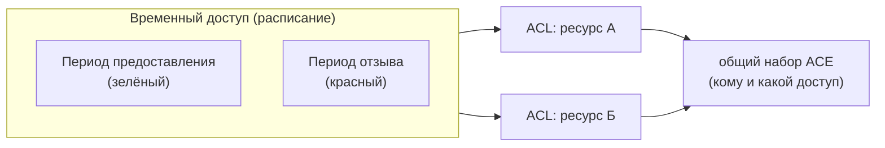

# Временные доступы

**Временный доступ** — это расписание, к которому привязаны
[списки доступа (ACL)](acls.md). Отдельной сущности в базе нет: как только
у расписания появляется хотя бы один ACL, оно показывается как «временный
доступ» (меню **Доступы → Временные доступы**) и отвечает на вопрос
«**когда** доступ предоставлен». Так служба ИБ учитывает, кому, куда,
на какое время и на основании чего предоставлен доступ.

## Просмотр

Слева — карточки [ACL](acls.md): по умолчанию сгруппированно (ACL
с одинаковым набором участников объединяются в одну карточку с несколькими
ресурсами; правки участников такой карточки применяются ко всей группе),
переключатель «Детально» показывает каждый ACL отдельной карточкой.
Справа — периоды предоставления (зелёные) и отзыва (красные), индикатор
«сейчас доступ есть/нет», заметки. Продление — добавление нового периода.

## Добавление

Кнопка «Добавить» открывает единую форму: название и заметки, участники
(записи доступа) и ресурсы. Всё создаётся одним сохранением: расписание +
ACL (по одному на ресурс) + записи доступа.

## Удаление

Удаление временного доступа удаляет все его ACL и их записи доступа.

См. руководство: [Временные доступы](../guides/temporary-access.md).
