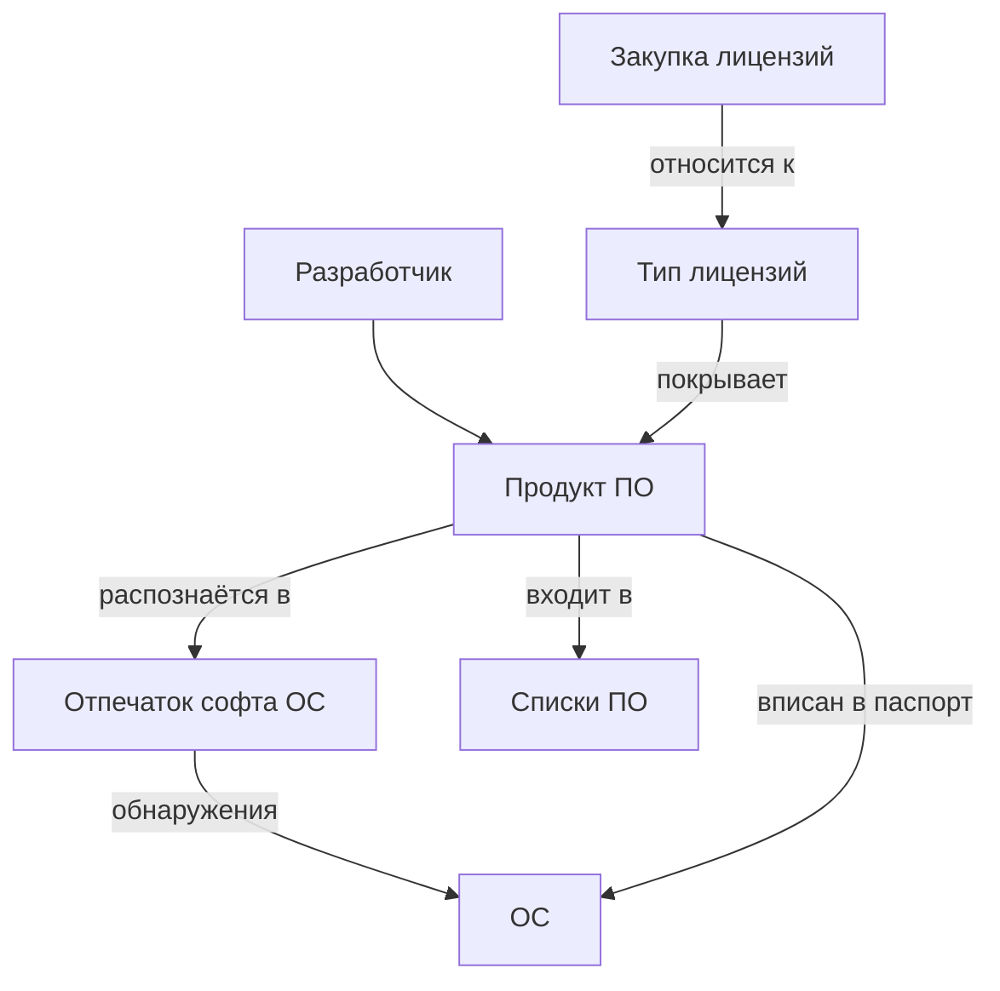

# ПО (программные продукты)

> ⚠ TODO-REVIEW: страница сгенерирована по коду, требует вычитки человеком.

**Программный продукт** — учётная единица реестра ПО: связка
[разработчика](manufacturers.md) и наименования плюс набор
regexp-выражений, по которым продукт распознаётся в
[отпечатках софта](comps/raw_soft.md) [операционных систем](comps.md).

Продукт — это узел, на котором сходится весь учёт софта:

## Распознавание в отпечатке

У продукта два набора regexp-выражений (по одному на строку):

- **основные элементы** — совпадение хотя бы одного с строкой отпечатка
  означает «продукт установлен на этой [ОС](comps.md)» (обнаружение);
- **дополнительные элементы** — вычёркиваются из отпечатка только вместе
  с основными. Сюда вносятся разделяемые компоненты, которые сами по себе
  продуктом не являются (сервисы обновления и т.п.).

Если на строку претендуют несколько продуктов, побеждает более
релевантный: сначала по количеству совпавших строк, затем по суммарной
длине сработавших выражений (длиннее выражение — точнее попадание).

После изменения состава выражений (или создания продукта) система находит
все ОС, чьи отпечатки задевают новые выражения, и отправляет их на
пересканирование — сразу или через фоновую очередь (режим задаёт
администратор параметром `soft.deferred_rescan`). Пока очередь не
разобрана, на карточке продукта висит плашка «Данные устарели».

**Обнаружение** («продукт найден в отпечатке») и **паспорт** («продукт
закреплён за этой ОС и попадает в
[паспорт АРМ](../guides/arm-passport.md)») — независимые привязки:
обнаружения приходят и уходят со сканами, паспорт ведётся руками
(кнопка «Вписать ПО в паспорт» в блоке «Софт» карточки ОС).

## Списки ПО и категории согласования

Продукты объединяются в **списки ПО** (справочник «Списки ПО»). Три
служебных списка управляют раскладкой блока «Софт» на карточке
[ОС](comps.md):
согласованное (`soft_agreed`), бесплатное (`soft_free`) и игнорируемое
(`soft_ignore`) ПО. Подробнее о категориях —
в [описании отпечатка софта](comps/raw_soft.md).

## Связь с лицензиями

Продукт сам по себе лицензий не имеет: его включают в
[типы лицензий](lic-groups.md), к которым уже привязываются
[закупки](lic-items.md) и [ключи](lic-keys.md). Схема учёта — в гайде [Лицензии](../guides/licenses.md).

## Список

Доступен через главное меню **ПО → Установленное ПО**. Помимо
атрибутов продукта, в колонках — счётчики: обнаружений, внесений
в паспорта, типов лицензий и лицензий (расшифровка — в подсказках
заголовков).

## Просмотр

Карточка продукта собрана из блоков:

- **шапка** — [разработчик](manufacturers.md) и наименование, описание,
  ссылки, изображения (скриншоты, сканы коробок);
- вкладки:
  - **Обнаружения** — [ОС](comps.md), на которых продукт распознан; колонка
    «В паспорте» показывает, закреплён ли он там же вручную;
  - **Совместимые лицензии** — [типы лицензий](lic-groups.md),
    покрывающие продукт, со счётчиком активных лицензий;
  - ссылки на вики-страницы продукта (если заполнены в «Ссылках»).

Значения полей поясняют их собственные подсказки (иконка «?») — здесь
только состав карточки.

### Удаление

Удалить продукт можно
[кнопкой-корзиной](<#doc-select:h1 .delete-item-button, h1 .fa-lock>)
в окне просмотра: привязки
к [ОС](comps.md) (обнаружения и паспорта) при этом снимаются автоматически.
История обнаружений при этом теряется, поэтому осмысленно удалять
только ошибочно заведённые продукты и дубликаты.

## Добавление

Типовые пути появления продукта в реестре:

- из карточки [ОС](comps.md) — кнопка «Создать продукт из этого элемента» у
  нераспознанной строки отпечатка (основной путь: выражение сразу
  заполнено реальной строкой);
- вручную из списка ПО — когда продукт нужно завести до появления
  на компьютерах;
- синхронизацией с другим экземпляром инвентаризации (консольные
  команды `sync/soft`, `sync/soft-lists` — подтягивают реестр ПО
  с эталонного сервера).

## Редактирование

- [Наименование](#doc-select:.field-soft-descr) вносится **без** имени
  [разработчика](manufacturers.md) — если название
  вендора продублировано в наименовании, при сохранении оно будет
  автоматически отрезано;
- [элементы пакета](#doc-select:.field-soft-items,.field-soft-additional) —
  regexp-выражения: спецсимволы (`( ) . +` и т.п.)
  нужно экранировать;
- после сохранения изменённого состава затронутые ОС уходят на
  пересканирование — свежую раскладку софта они покажут не мгновенно.
