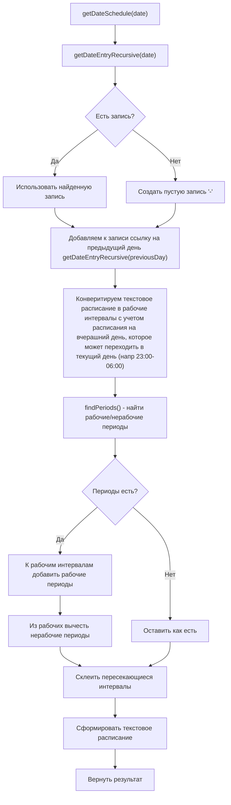
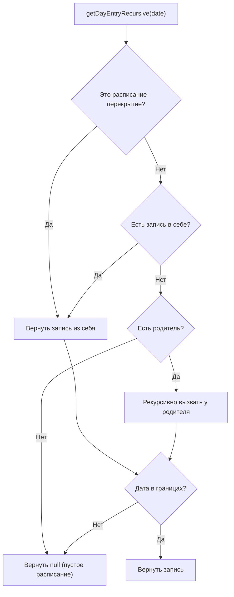
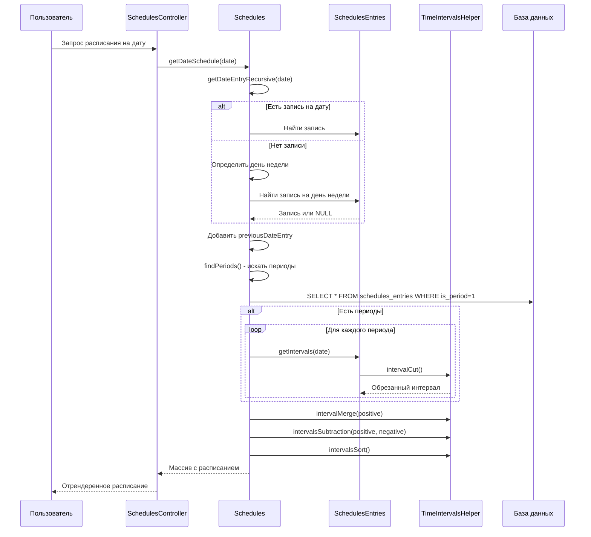

# Schedules — модуль расписаний

## Назначение

Модуль управляет временными графиками работы различных сущностей системы ARMS. Расписание отвечает на вопрос «когда?» — когда предоставляется сервис, когда действует доступ, когда выполняется регламентная работа.
Поддерживается

- ежедневное расписание
- расписание на дни недели
- расписание на конкретные даты (исключения, праздники, внеочердные рабочие даты)
- иерархическое наследование расписаний (через `parent_id`) например для наследования праздничных дней
- механизм временных перекрытий (через `override_id`) для изменения рабочего графика на другой в определенный период дат.
- периоды непрерывной работы/отключения (через `is_period`), например для обозначения аварийных отключений, либо внепланового предоставления доступа в нерабочее время.
- закрепление метаданных за рабочиими периодами для привязки комментариев, ответственных, дежурных и т.п.

Ограничения консистентности данных (валидация):

- Периоды (непрерывное рабочее/нерабочее время) не могут пересекаться внутри одного расписания. Валидация не даст создать перекрывающиеся периоды.
- Перекрытия не могут пересекаться. Валидация не даст создать несколько перекрытий на одну дату.
- В одном расписании не может быть несколько записей на один и тот же день недели/одну дату. Валидация не даст создать дублирующие записи.

Не поддерживаются расписаниния вида

- каждый первый понедельник месяца
- каждые 3 дня
- каждые 2 недели по средам

и подобные. Надобности пока не было, а модуль и без того громоздкий.

## Термины

- **Расписание/schedule** — основная сущность, которая может наследовать другое расписание и иметь перекрытия. Содержит заголовок, описание, границы действия и т.п.
- **Запись расписания/entry** — конкретная запись на день недели или дату, или период времени (start-end), которая может
  - содержать **график работы** (например, "08:00-12:00, 13:00-17:00") на этот день недели/дату
    - который состоит из минутных **интервалов/intervals** которые можно конвертировать string → int: 08:00-12:00 → [480, 720], 13:00-17:00 → [780, 1020]
  - задавать **периоды/periods** непрерывной работы/отключения (is_period=1)
- **запись на день недели/week entry** — конкретная запись на день недели. Для поиска расписания на день недели ищется запись на нужный день (1-7), затем запись def (на каждый день)
- **запись на дату/date entry** — конкретная запись на определенную дату. Для поиска расписания на дату ищется запись на эту дату
- **перекрытие/override** — расписание, которое в границах (start_date-end_date) меняет недельный график работы: перекрывает записи на день недели базового расписания своими. (не может содержать periods, не может содержать overrides)

## Структура модуля

```text
modules/schedules/
├── Module.php                          — точка входа Yii2-модуля
├── controllers/
│   ├── SchedulesController.php         — CRUD расписаний (providingMode: providing/support/job/working)
│   ├── SchedulesEntriesController.php  — CRUD записей расписания (дни/периоды)
│   └── ScheduledAccessController.php  — CRUD расписаний доступа (providingMode: acl)
├── models/
│   ├── Schedules.php                   — основная модель расписания
│   ├── SchedulesEntries.php            — модель записи расписания (день/период)
│   ├── SchedulesSearch.php             — поисковая модель для расписаний
│   ├── SchedulesEntriesSearch.php      — поисковая модель для записей
│   ├── SchedulesHistory.php            — модель истории изменений расписания
│   ├── SchedulesEntriesHistory.php     — модель истории изменений записей
│   ├── SchedulesAclSearch.php          — поисковая модель для расписаний доступа
│   └── traits/
│       ├── SchedulesModelCalcFieldsTrait.php        — вычисляемые поля и бизнес-логика Schedules
│       └── ScheduleEntriesModelCalcFieldsTrait.php  — вычисляемые поля SchedulesEntries
├── helpers/
│   └── TimeIntervalsHelper.php         — математика временных интервалов (слияние, вычитание, пересечение)
├── views/
│   ├── schedules/                      — шаблоны для SchedulesController
│   ├── schedules-entries/              — шаблоны для SchedulesEntriesController
│   └── scheduled-access/              — шаблоны для ScheduledAccessController
└── migrations/                         — 9 миграций БД (история создания таблиц)
```

## Ключевые классы

| Класс | Назначение |
| ----- | ---------- |
| [`Schedules`](models/Schedules.php) | Модель расписания (заголовок, периоды) |
| [`SchedulesEntries`](models/SchedulesEntries.php) | Модель записей расписания (дни/даты, периоды) |
| [`SchedulesModelCalcFieldsTrait`](models/traits/SchedulesModelCalcFieldsTrait.php) | Вычисляемые поля для Schedules |
| [`ScheduleEntriesModelCalcFieldsTrait`](models/traits/ScheduleEntriesModelCalcFieldsTrait.php) | Вычисляемые поля для SchedulesEntries |
| [`TimeIntervalsHelper`](helpers/TimeIntervalsHelper.php) | Математика интервалов времени |

---

## Структура базы данных

см файл `docs/database.md` для подробного описания структуры таблиц, полей, связей и индексов.

---

## Иерархия расписаний

### Наследование (parent_id)

```text
Базовое расписание (parent_id = NULL)
    ↓
Наследуемое расписание 1 (parent_id = id_базового)
    ↓
Наследуемое расписание 2 (parent_id = id_наследуемого_1)
```

**Логика поиска расписания на день:**

- Искать в текущем расписании
- Если не найдено → искать в родительском
- Если не найдено → искать в родителе родителя и т.д.

**Что наследуется:**

| Тип записи | Наследуется | Примечание |
| ---------- | ----------- | ---------- |
| Конкретная дата (YYYY-MM-DD) | ✅ Да | Ищется в текущем, затем в предках |
| День недели (1-7) | ✅ Да | Ищется в текущем, затем в предках |
| Расписание по умолчанию ('def') | ✅ Да | Ищется в текущем, затем в предках |
| Границы расписания (start/end) | ❌ Нет | Проверяются только для текущего |

Перекрытия работают **независимо** и не наследуют записи от базового расписания

### Перекрытия (override_id)

```text
Базовое расписание (override_id = NULL)
    ↓
Перекрытие 1 (override_id = id_базового, start_date/end_date = период 1)
Перекрытие 2 (override_id = id_базового, start_date/end_date = период 2)
```

**Логика работы перекрытий:**

- Перекрытия **НЕ наследуют** записи от базового расписания
- Перекрытия имеют **собственные границы** действия (`start_date` → `end_date`)
- При запросе расписания на дату:
  - Найти активное перекрытие для этой даты (проверка `matchDate()`)
  - Если есть → использовать перекрытие
  - Если нет → использовать базовое расписание
- Перекрытия **не поднимаются по иерархии parent_id** — они полностью независимы

---

## Логика формирования расписания на день

### Алгоритм `getDateSchedule()`

[`getDateSchedule()`](models/traits/SchedulesModelCalcFieldsTrait.php:612) — основной метод получения расписания на день:



**Важно:** Периоды (`is_period=1`) ищутся **только в текущем расписании**, они **НЕ наследуются** от предков!

### Логика поиска записи дня `getDayEntryRecursive()`

Метод ищет запись на конкретный день с учётом иерархии:



**Приоритет поиска записи в расписании:**

1. Конкретная дата (`YYYY-MM-DD`)
2. День недели (`1`-`7`)
3. Расписание по умолчанию (`def`)

### Периоды и наследование

| Компонент | Берется из | Примечание |
| --------- | ---------- | ---------- |
| Запись на день | Текущее + предки | [`getDayEntryRecursive()`](models/traits/SchedulesModelCalcFieldsTrait.php:246) |
| Границы расписания | Только текущее | [`getDateEntryRecursive()`](models/traits/SchedulesModelCalcFieldsTrait.php:587) |
| Периоды (`is_period=1`) | **Только текущее** | [`findPeriods()`](models/Schedules.php:353) — **НЕ наследуются!** |

### Математика интервалов

Расписание на день хранится как набор **минутных интервалов** от начала суток:

| Формат записи | Математический вид | Комментарий |
| ------------- | ------------------ | ----------- |
| `'08:00-17:00'` | `[480, 1020]` | Обычный период |
| `'22:00-06:00'` | `[1320, 1500]` | Переход на следующий день |
| `'12:00-12:45'` | `[720, 765]` | Обеденный перерыв |

**Преобразование "переходящих" периодов:**

```text
22:00-06:00 → [1320, 1440] + [0, 360]
```

---

## Формат вывода описаний

### Метод `getWeekWorkTimeDescription()`

Формирует человекочитаемое описание недельного графика:

```text
Примеры вывода:
- "08:00-17:00 пн-пт, выходные"
- "00:00-23:59 ежедн."
- "08:00-12:00,13:00-17:00 пн,вт,ср,чт,пт"
- "круглосуточно"
```

### 7.2 Метод `getDateWorkTimeDescription()`

Описание периода действия расписания:

```text
Примеры вывода:
- "с 2024-01-01"
- "до 2024-12-31"
- "с 2024-01-01 до 2024-12-31"
```

### 7.3 Метод `getUsageWorkTimeDescription()`

Полное описание с указанием применения:

```text
Примеры вывода:
- "Услуга/сервис предоставляется 08:00-17:00 пн-пт с 2024-01-01"
- "Доступ предоставляется без перерывов 24/7"
- "Выполняется 00:00-23:59 ежедн."
```

---

## Словарь (dictionary)

Система использует словарь для формирования текстовых описаний в зависимости от `providingMode`:

| Ключ | acl | providing | support | job | working |
| ---- | --- | --------- | ------- | --- | ------- |
| usage | Доступ предоставляется | Услуга/сервис предоставляется | Услуга/сервис поддерживается | Выполняется | Рабочее время |
| usage_complete | Доступ предоставлялся | Услуга/сервис предоставлялся | Услуга/сервис поддерживался | Выполнялось | Рабочее время было |
| usage_will_be | Доступ будет предоставляться | Услуга/сервис будет предоставляться | Услуга/сервис будет поддерживаться | Будет выполняться | Рабочее время будет |
| nodata | Доступ не предоставляется никогда | Услуга/сервис не предоставляется никогда | Услуга/сервис не поддерживается никогда | Не выполняется никогда | Рабочее время отсутствует |
| always | всегда | без перерывов 24/7 | без перерывов 24/7 | всегда 24/7 | всегда 24/7 |

---

## Точки роста

### Производительность

| Проблема | Место | Рекомендация |
| -------- | ----- | ------------ |
| **Кэширование расписаний** | `getDateSchedule()`, `getDayEntryRecursive()` | Результаты не кэшируются между вызовами. Для часто запрашиваемых дат (сегодня, завтра) добавить кэш в `$attrsCache` |
| **N+1 запросов** | При выводе списка сервисов с расписаниями | Использовать `with(['providingSchedule', 'supportSchedule'])` в запросах |
| **Сложные вычисления интервалов** | `TimeIntervalsHelper::intervalMerge()` | Интервалы на больших периодах (годы) могут создавать тысячи записей |

### Архитектурные улучшения

| Проблема | Рекомендация |
| -------- | ------------ |
| **Жёсткая привязка к дням недели** | Дополнительные шаблоны расписаний (еженедельно, ежемесячно и пр.) |
| **Нет временных зон** | `Yii::$app->params['schedulesTZShift']` - костыль. Добавить атрибут `timezone` в таблицу `schedules` и обеспечить поддержку |

### UX улучшения

Текущий интерфейс скорее первая заработавшая редакция чем отполированный результат. Надо конкретно посмотреть на все со стороны и возможно упростить и сделать все это удобнее. Добавить JS для оперативного отображения изменений.

### Код

| Проблема | Место | Рекомендация |
| -------- | ----- | ------------ |
| **Дублирование кода** | `ScheduleEntriesModelCalcFieldsTrait::getMergedSchedule()` и `getWorkSchedule()` | Выделить общую логику |
| **TODO в коде** | [`SchedulesModelCalcFieldsTrait.php:777`](models/traits/SchedulesModelCalcFieldsTrait.php:777) | `nextWorkingMeta()` - некорректная логика с учётом периодов |
| **Неиспользуемый метод** | [`SchedulesModelCalcFieldsTrait.php:733`](models/traits/SchedulesModelCalcFieldsTrait.php:733) | `getAclStatus()` - пустой метод |

### Тесты

| Проблема | Рекомендация |
| -------- | ------------ |
| **Нет unit-тестов** | Добавить тесты на `TimeIntervalsHelper` |
| **Нет интеграционных тестов** | Добавить тесты на формирование расписания с периодами |
| **Нет тестов на граничные случаи** | 22:00-06:00, високосные годы, смена часовых поясов |

---

## Примеры использования

### Получить расписание на конкретный день

```php
$schedule = Schedules::findOne(1);
$dateSchedule = $schedule->getDateSchedule('2024-01-15');

echo $dateSchedule['schedule']; // "08:00-12:00, 12:00-17:00"
echo $dateSchedule['day']->mergedSchedule; // Склеенное расписание "08:00-17:00"
```

### Проверить рабочее время

```php
$schedule = Schedules::findOne(1);
if ($schedule->isWorkTime('2024-01-15', '10:30')) {
    echo "Сейчас рабочее время";
} else {
    echo "Сейчас нерабочее время";
}
```

### Получить текущий статус

```php
$schedule = Schedules::findOne(1);
$status = $schedule->status; // 1 - работает, 0 - не работает
```

### Получить недельное описание

```php
$schedule = Schedules::findOne(1);
echo $schedule->weekWorkTimeDescription; 
// "08:00-17:00 пн-пт, выходные"
```

---

## Диаграмма взаимодействия


