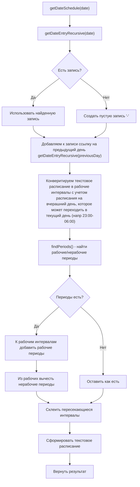
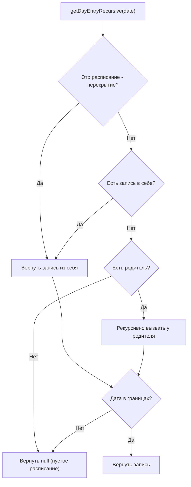
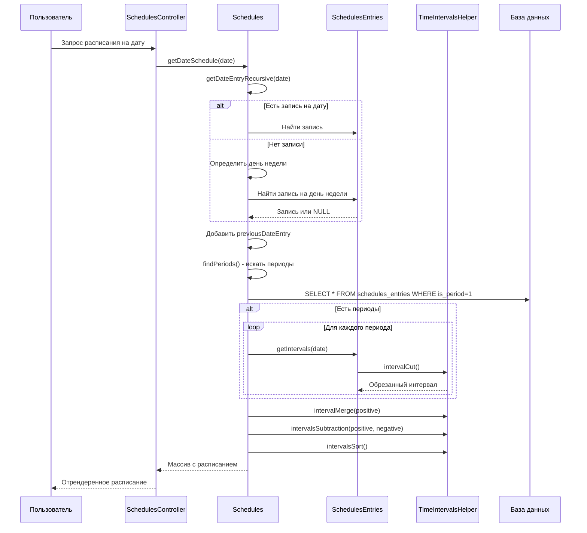

# Schedules — модуль расписаний

## Назначение

Модуль управляет временными графиками работы различных сущностей системы ARMS. Расписание отвечает на вопрос «когда?» — когда предоставляется сервис, когда действует доступ, когда выполняется регламентная работа.
Поддерживается

- ежедневное расписание
- расписание на дни недели
- расписание на конкретные даты (исключения, праздники, внеочердные рабочие даты)
- иерархическое наследование расписаний (через `parent_id`) например для наследования праздничных дней
- механизм временных перекрытий (через `override_id`) для изменения рабочего графика на другой в определенный период дат.
- периоды непрерывной работы/отключения (через `is_period`), например для обозначения аварийных отключений, либо внепланового предоставления доступа в нерабочее время.
- закрепление метаданных за рабочиими периодами для привязки комментариев, ответственных, дежурных и т.п.

Ограничения консистентности данных (валидация):

- Периоды (непрерывное рабочее/нерабочее время) не могут пересекаться внутри одного расписания. Валидация не даст создать перекрывающиеся периоды.
- Перекрытия не могут пересекаться. Валидация не даст создать несколько перекрытий на одну дату.
- В одном расписании не может быть несколько записей на один и тот же день недели/одну дату. Валидация не даст создать дублирующие записи.
- При проверке попадания отметки времени t в границы start ... end: t >= start и t < end. Т.е. если расписание заканчивается в 17:00, то 17:00 уже не входит в рабочее время. Это касается всех сценариев: попадание отметки в периоды, в перекрытия, в интервалы
- При наложении временных интервалов друг на друга (например, 08:00-12:00{meta1} и 10:00-14:00{meta2}) более поздний интервал затирает более ранний и такая запись должна трактоваться как 08:00-10:00{meta1} и 10:00-14:00{meta2} (совпадение границ 10:00 и 10:00 не коллизия ввиду предыдущего правила)

Не поддерживаются расписаниния вида

- каждый первый понедельник месяца
- каждые 3 дня
- каждые 2 недели по средам

и подобные. Надобности пока не было, а модуль и без того громоздкий.

## Термины

- **Расписание/schedule** — основная сущность, которая может наследовать другое расписание и иметь перекрытия. Содержит заголовок, описание, границы действия и т.п.
- **Запись расписания/entry** — конкретная запись на день недели или дату, или период времени (start-end), которая может
  - содержать **график работы** (например, "08:00-12:00, 13:00-17:00") на этот день недели/дату
    - который состоит из минутных **интервалов/intervals** которые можно конвертировать string → int: 08:00-12:00 → [480, 720], 13:00-17:00 → [780, 1020]
  - задавать **периоды/periods** непрерывной работы/отключения (is_period=1)
- **запись на день недели/week entry** — конкретная запись на день недели. Для поиска расписания на день недели ищется запись на нужный день (1-7), затем запись def (на каждый день)
- **запись на дату/date entry** — конкретная запись на определенную дату. Для поиска расписания на дату ищется запись на эту дату
- **перекрытие/override** — расписание, которое в границах (start_date-end_date) меняет **только недельный график** работы: перекрывает записи на дни недели (и `def`) базового расписания своими. Дни-исключения на конкретные даты и периоды (is_period) в перекрытие **не входят** — они существуют только в основном расписании и применяются поверх перекрытия (см. «Приоритет источников расписания на дату»). (не может содержать дат-исключений, не может содержать periods, не может содержать overrides)

## Структура модуля

```text
modules/schedules/
├── Module.php                          — точка входа Yii2-модуля
├── controllers/
│   ├── SchedulesController.php         — CRUD расписаний (providingMode: providing/support/job/working)
│   ├── SchedulesEntriesController.php  — CRUD записей расписания (дни/периоды)
│   └── ScheduledAccessController.php   — CRUD расписаний доступа (providingMode: acl)
├── models/
│   ├── Schedules.php                   — основная модель расписания
│   ├── SchedulesEntries.php            — модель записи расписания (день/период)
│   ├── SchedulesSearch.php             — поисковая модель для расписаний
│   ├── SchedulesEntriesSearch.php      — поисковая модель для записей
│   ├── SchedulesHistory.php            — модель истории изменений расписания
│   ├── SchedulesEntriesHistory.php     — модель истории изменений записей
│   ├── SchedulesAclSearch.php          — поисковая модель для расписаний доступа
│   └── traits/
│       ├── SchedulesModelCalcFieldsTrait.php        — вычисляемые поля и бизнес-логика Schedules
│       └── ScheduleEntriesModelCalcFieldsTrait.php  — вычисляемые поля SchedulesEntries
├── helpers/
│   └── TimeIntervalsHelper.php         — математика временных интервалов (слияние, вычитание, пересечение)
├── compile/                            — подсистема компиляции расписаний в JSON
│   ├── compile.md                      — спецификация compiled_json и алгоритмов
│   ├── TODO.md                         — этапы реализации (трекер)
│   ├── SchedulesCompiler.php           — PHP-компилятор (Schedules → compiled_json)
│   ├── CompiledScheduleHelper.php      — серверный рантайм для compiled_json
│   └── lib/js/
│       ├── demo.js                     — JS-рантайм ScheduleRuntime + утилиты
│       ├── demo.test.js                — Jest-тесты JS-рантайма
│       └── schedule-runtime-status.js  — auto-render статуса в grid'е
├── assets/
│   └── ScheduleRuntimeAsset.php        — Yii2 AssetBundle для подключения JS-рантайма
├── tests/
│   ├── readme.md                       — карта unit-тестов модуля
│   └── unit/                           — внутренние unit-тесты модуля
└── views/
    ├── schedules/                      — шаблоны для SchedulesController
    ├── schedules-entries/              — шаблоны для SchedulesEntriesController
    └── scheduled-access/               — шаблоны для ScheduledAccessController
```

> Миграции модуля лежат в общем `/migrations/` корня проекта (см. соглашение в разделе «Структура базы данных» ниже).

## Ключевые классы

| Класс | Назначение |
| ----- | ---------- |
| [`Schedules`](models/Schedules.php) | Модель расписания (заголовок, периоды) |
| [`SchedulesEntries`](models/SchedulesEntries.php) | Модель записей расписания (дни/даты, периоды) |
| [`SchedulesModelCalcFieldsTrait`](models/traits/SchedulesModelCalcFieldsTrait.php) | Вычисляемые поля для Schedules |
| [`ScheduleEntriesModelCalcFieldsTrait`](models/traits/ScheduleEntriesModelCalcFieldsTrait.php) | Вычисляемые поля для SchedulesEntries |
| [`TimeIntervalsHelper`](helpers/TimeIntervalsHelper.php) | Математика интервалов времени |
| [`SchedulesCompiler`](compile/SchedulesCompiler.php) | Сериализация расписания (с предками + overrides + periods) в плоский `compiled_json` |
| [`CompiledScheduleHelper`](compile/CompiledScheduleHelper.php) | PHP-рантайм поверх `compiled_json`: `isWorkDay`, `isWorkTime`, `getMeta`, `nextWorkingDateTime` |
| [`ScheduleRuntimeAsset`](assets/ScheduleRuntimeAsset.php) | AssetBundle: подключает `demo.js` + `schedule-runtime-status.js` для клиентского рантайма |

---

## Соглашение по моделям и трейтам

В ARMS почти у каждой основной модели есть парный `*History`-класс, читающий снимок полей из таблицы `*_history`. Чтобы вычисляемые поля (статусы, описания, удобные для шаблонов представления) считались **по тем же правилам** для активной и для архивной записи — общая логика выносится в трейт `<Model>ModelCalcFieldsTrait` и подключается к **обоим** классам:

```text
Schedules         ─┐
                   ├── use SchedulesModelCalcFieldsTrait;
SchedulesHistory  ─┘

SchedulesEntries        ─┐
                         ├── use ScheduleEntriesModelCalcFieldsTrait;
SchedulesEntriesHistory ─┘
```

### Что разрешено в `<Model>ModelCalcFieldsTrait`

Только **вычисляемые поля** — параметрические геттеры `getXxx()`/`isXxx()` без обязательных параметров (опциональные значения по умолчанию допустимы). Они становятся свойствами через магию Yii `__get`, и потребители обращаются к ним как `$model->status`, `$model->workTimeDescription` и т.п. — одинаково и в `Schedules`, и в `SchedulesHistory`.

### Что **НЕ** должно быть в трейте

| Тип | Куда вместо этого |
| --- | --- |
| Методы с обязательными параметрами (`isWorkTime($d,$t)`, `matchDate($date)`, `getDictionary($word)`) | В сам класс модели (`Schedules`/`SchedulesEntries`) |
| Бизнес-операции: lifecycle hooks, recompile, save-сайды (`afterSave`, `recompileCascade`) | В сам класс модели |
| Private utility-helper'ы, не образующие свойство (`getCompiledRuntime()`) | В сам класс модели |

### Что делать History-классу, если ему какая-то calc-логика не подходит

History-класс **переопределяет** конкретный геттер (или метод) пустой/безопасной заглушкой. Пример из текущего кода — [`SchedulesHistory`](models/SchedulesHistory.php) переопределяет `findExceptions()` и `findPeriods()`, потому что они имеют смысл только для оперативных данных:

```php
class SchedulesHistory extends \app\models\HistoryModel
{
    use SchedulesModelCalcFieldsTrait;

    public function findExceptions(){return [];}
    public function findPeriods(){return [];}
}
```

При добавлении нового calc-поля в трейт сразу прикиньте: «работает ли оно осмысленно на архивных данных?». Если нет — добавьте заглушку в History.

---

## Структура базы данных

см файл `docs/database.md` для подробного описания структуры таблиц, полей, связей и индексов.

В таблице `schedules` помимо традиционных полей хранится `compiled_json TEXT NULL` — плоский снимок расписания (см. ниже раздел «Компиляция расписаний»).

> **Соглашение по миграциям.** Yii MigrateController в этом проекте настроен на namespace `app\migrations` и каталог `@app/migrations`. Все миграции модуля кладутся в `/migrations/` корня проекта (с namespace `app\migrations`) — `php yii migrate` подхватывает их автоматически. См. [config/console.php](../../config/console.php).

---

## Компиляция расписаний

Чтобы вместо рекурсивных вычислений по `parent_id`/`override_id`/periods отдавать данные одним JSON-объектом, модуль ведёт **скомпилированную** копию расписания в поле `schedules.compiled_json`. Эта копия пересобирается автоматически:

- `Schedules::afterSave()` → перекомпиляция текущего расписания + каскад по `parent_id`/`override_id`;
- `SchedulesEntries::afterSave()` / `afterDelete()` → перекомпиляция родительского `Schedules`.

### Жизненный цикл

```text
Schedules.save() ──► afterSave ──► SchedulesCompiler::compile() ──► compiled_json
                                  │
                                  └─► recompileCascade(): дети по parent_id + overrides по override_id
```

Полная спецификация формата JSON, инвариантов и алгоритмов рантайма — в [`compile/compile.md`](compile/compile.md).

### Серверный рантайм

[`CompiledScheduleHelper`](compile/CompiledScheduleHelper.php) принимает массив или JSON-строку из `compiled_json` и предоставляет публичный API:

```php
$rt = new CompiledScheduleHelper($schedule->compiled_json);
$rt->isWorkDay('2024-01-15');             // bool
$rt->isWorkTime('2024-01-15 10:30');      // bool
$rt->getMeta('2024-01-15 10:30');         // array|null — meta активного интервала
$rt->nextWorkingDateTime('2024-01-15 18:00'); // 'YYYY-MM-DD HH:MM' или null
$rt->nextWorkingMeta('2024-01-15 18:00');     // array|null
```

### Клиентский рантайм

JS-рантайм `ScheduleRuntime` (`compile/lib/js/demo.js`) — точный порт серверного. Подключается через AssetBundle:

```php
use app\modules\schedules\assets\ScheduleRuntimeAsset;
ScheduleRuntimeAsset::register($this);
```

После регистрации в `window` доступны `ScheduleRuntime`, `strToTsm`, `tsmToStr`, `tsmToDateTsm`, `dayOfWeek`, `inBounds`, `intervalsContains`, `intervalsSubtract`, `intervalsAdd`. В тот же бандл включён `schedule-runtime-status.js`, который автоматически инициализируется на любой странице с элементами:

```html
<span class="schedule-runtime-status" data-target="#payload-id"></span>
<script type="application/json" id="payload-id">{ ...compiled_json... }</script>
```

и каждую минуту перерисовывает их в `●`/`○` через `ScheduleRuntime.isWorkTime()`.

Используется, в частности, в `views/schedules/columns.php` для колонок «Активно сейчас» (серверный расчёт через `CompiledScheduleHelper`) и «Активно (live)» (клиентский, обновляется без перезагрузки).

### Часовой пояс

Все `_tsm` (timestamp-in-minutes) в `compiled_json` хранятся как «локальное время, интерпретированное как UTC». Поле `tz_shift_tsm` — смещение часового пояса, в котором составлены расписания, относительно UTC (в минутах). Для текущего ARMS значение берётся из `Yii::$app->params['schedulesTZShift']` (секунды). Клиентский рантайм использует `tz_shift_tsm`, чтобы сместить реальный UTC браузера в ту же систему координат и получить тот же результат, что и сервер.

---

## Иерархия расписаний

### Наследование (parent_id)

```text
Базовое расписание (parent_id = NULL)
    ↓
Наследуемое расписание 1 (parent_id = id_базового)
    ↓
Наследуемое расписание 2 (parent_id = id_наследуемого_1)
```

**Логика поиска расписания на день:**

- Искать в текущем расписании
- Если не найдено → искать в родительском
- Если не найдено → искать в родителе родителя и т.д.

**Что наследуется:**

| Тип записи | Наследуется | Примечание |
| ---------- | ----------- | ---------- |
| Конкретная дата (YYYY-MM-DD) | ✅ Да | Ищется в текущем, затем в предках |
| День недели (1-7) | ✅ Да | Ищется в текущем, затем в предках |
| Расписание по умолчанию ('def') | ✅ Да | Ищется в текущем, затем в предках |
| Границы расписания (start/end) | ❌ Нет | Проверяются только для текущего |

Перекрытия работают **независимо** и не наследуют записи от базового расписания

### Перекрытия (override_id)

```text
Базовое расписание (override_id = NULL)
    ↓
Перекрытие 1 (override_id = id_базового, start_date/end_date = период 1)
Перекрытие 2 (override_id = id_базового, start_date/end_date = период 2)
```

**Логика работы перекрытий:**

- Перекрытие меняет **только недельный график** — записи на дни недели и `def`. Дни-исключения на конкретные даты и периоды (is_period) в перекрытие не входят.
- Перекрытия **НЕ наследуют** записи от базового расписания (свой недельный график задают целиком)
- Перекрытия имеют **собственные границы** действия (`start_date` → `end_date`)
- При выборе **недельного графика** на дату:
  - Найти активное перекрытие для этой даты (проверка `matchDate()`)
  - Если есть → недельный график берётся из перекрытия
  - Если нет → из базового расписания (+ предки по `parent_id`)
- Перекрытия **не поднимаются по иерархии parent_id** — они полностью независимы
- **Поверх** выбранного недельного графика (перекрытие или база) всегда применяются дни-исключения и периоды основного расписания — они имеют более высокий приоритет (см. ниже).

### Приоритет источников расписания на дату

Дни-исключения (записи на конкретную дату `YYYY-MM-DD`) и периоды (`is_period=1`) существуют **только в основном расписании** (дни-исключения — с учётом предков по `parent_id`, периоды — строго в самом расписании), но действуют **с приоритетом над перекрытиями**. Итоговый график на дату собирается по правилу (в порядке возрастания приоритета):

| № | Источник | Откуда берётся |
| - | -------- | -------------- |
| 1 | `default` основного расписания | main + предки |
| 2 | дни недели основного расписания | main + предки |
| 3 | `default` перекрытия | активный override |
| 4 | дни недели перекрытия | активный override |
| 5 | **дни-исключения на дату** | **только main + предки** |
| 6 | **периоды (is_period)** | **только main** |

То есть перекрытие подменяет «фон» недельного графика (уровни 1–2 → 3–4), но дата-исключение (5) перебивает и базовый, и перекрывающий недельный график, а периоды (6) накладываются последними поверх всего: positive (is_work=1) добавляют рабочее время, negative (is_work=0) — вычитают.

Это правило **едино** для обоих режимов — legacy-сборки на лету (`getDateSchedule`) и скомпилированных расписаний (`CompiledScheduleHelper` / `compiled_json`).

---

## Логика формирования расписания на день

### Алгоритм `getDateSchedule()`

[`getDateSchedule()`](models/Schedules.php:787) — основной метод получения расписания на день (legacy-путь, эталон приоритетов):



**Важно:** Периоды (`is_period=1`) и дни-исключения берутся **только из основного расписания** (`getDateEntryRecursive()` ищет дату-исключение по main+предкам, не заглядывая в перекрытия; `findPeriods()` — строго по `schedule_id = self`, без наследования от предков). При активном перекрытии они **не теряются**: перекрытие подменяет лишь недельный график, а дни-исключения и периоды основного расписания применяются поверх него с более высоким приоритетом (см. «Приоритет источников расписания на дату»).

### Логика поиска записи дня `getDayEntryRecursive()`

Метод ищет запись на конкретный день с учётом иерархии:



**Приоритет поиска записи внутри одного расписания:**

1. Конкретная дата (`YYYY-MM-DD`)
2. День недели (`1`-`7`)
3. Расписание по умолчанию (`def`)

> Это порядок **внутри одного** расписания. Межрасписаний­ный приоритет (основное ↔ перекрытие ↔ дни-исключения ↔ периоды) описан в разделе «Приоритет источников расписания на дату».

### Источники записей и наследование

| Компонент | Берётся из | Перекрытие учитывается? | Метод |
| --------- | ---------- | ----------------------- | ----- |
| Недельный график (дни недели, `def`) | Основное + предки **или активное перекрытие** | да | [`getWeekdayEntryRecursive()`](models/Schedules.php:751) → [`getWeekSchedule()`](models/Schedules.php:695) |
| Дни-исключения (`YYYY-MM-DD`) | Только основное + предки | нет — перебивают перекрытие | [`getDateEntryRecursive()`](models/Schedules.php:767) / [`findExceptions()`](models/Schedules.php:359) |
| Периоды (`is_period=1`) | **Только основное** (`schedule_id = self`) | нет — накладываются поверх | [`findPeriods()`](models/Schedules.php:384) — **НЕ наследуются от предков** |
| Границы расписания (start/end) | Только основное | — | [`matchDate()`](models/Schedules.php:682) |

### Математика интервалов

Расписание на день хранится как набор **минутных интервалов** от начала суток:

| Формат записи | Математический вид | Комментарий |
| ------------- | ------------------ | ----------- |
| `'08:00-17:00'` | `[480, 1020]` | Обычный период |
| `'22:00-06:00'` | `[1320, 1500]` | Переход на следующий день |
| `'12:00-12:45'` | `[720, 765]` | Обеденный перерыв |

**Преобразование "переходящих" периодов:**

```text
22:00-06:00 → [1320, 1440] + [0, 360]
```

---

## Формат вывода описаний

### Метод `getWeekWorkTimeDescription()`

Формирует человекочитаемое описание недельного графика:

```text
Примеры вывода:
- "08:00-17:00 пн-пт, выходные"
- "00:00-23:59 ежедн."
- "08:00-12:00,13:00-17:00 пн,вт,ср,чт,пт"
- "круглосуточно"
```

### 7.2 Метод `getDateWorkTimeDescription()`

Описание периода действия расписания:

```text
Примеры вывода:
- "с 2024-01-01"
- "до 2024-12-31"
- "с 2024-01-01 до 2024-12-31"
```

### 7.3 Метод `getUsageWorkTimeDescription()`

Полное описание с указанием применения:

```text
Примеры вывода:
- "Услуга/сервис предоставляется 08:00-17:00 пн-пт с 2024-01-01"
- "Доступ предоставляется без перерывов 24/7"
- "Выполняется 00:00-23:59 ежедн."
```

---

## Словарь (dictionary)

Система использует словарь для формирования текстовых описаний в зависимости от `providingMode`:

| Ключ | acl | providing | support | job | working |
| ---- | --- | --------- | ------- | --- | ------- |
| usage | Доступ предоставляется | Услуга/сервис предоставляется | Услуга/сервис поддерживается | Выполняется | Рабочее время |
| usage_complete | Доступ предоставлялся | Услуга/сервис предоставлялся | Услуга/сервис поддерживался | Выполнялось | Рабочее время было |
| usage_will_be | Доступ будет предоставляться | Услуга/сервис будет предоставляться | Услуга/сервис будет поддерживаться | Будет выполняться | Рабочее время будет |
| nodata | Доступ не предоставляется никогда | Услуга/сервис не предоставляется никогда | Услуга/сервис не поддерживается никогда | Не выполняется никогда | Рабочее время отсутствует |
| always | всегда | без перерывов 24/7 | без перерывов 24/7 | всегда 24/7 | всегда 24/7 |

---

## Точки роста

### Производительность

| Проблема | Место | Рекомендация |
| -------- | ----- | ------------ |
| **Старые методы расчёта** | `getDateSchedule()`, `getDayEntryRecursive()` | Постепенно мигрировать вызовы на `CompiledScheduleHelper`, который читает плоский `compiled_json` без рекурсии и запросов в БД |
| **N+1 запросов** | При выводе списка сервисов с расписаниями | Использовать `with(['providingSchedule', 'supportSchedule'])` в запросах |
| **Сложные вычисления интервалов** | `TimeIntervalsHelper::intervalMerge()` | Интервалы на больших периодах (годы) могут создавать тысячи записей. `CompiledScheduleHelper` предлагает альтернативу — фиксированный набор weekday/date/period в JSON |

### Архитектурные улучшения

| Проблема | Рекомендация |
| -------- | ------------ |
| **Жёсткая привязка к дням недели** | Дополнительные шаблоны расписаний (еженедельно, ежемесячно и пр.) |
| **Глобальный TZ** | Часовой пояс глобален (`Yii::$app->params['schedulesTZShift']`). Для мультирегиональности добавить колонку `tz` (или `tz_shift_tsm`) в таблицу `schedules` и компилировать с её учётом — поле `tz_shift_tsm` в `compiled_json` уже зарезервировано |
| **Lua-рантайм для Asterisk** | Запланирован Этапом 6 в [`compile/TODO.md`](compile/TODO.md): порт `isWorkDay`/`isWorkTime`/`getMeta`/`nextWorkingDateTime` на Lua для интеграции с dialplan |

### UX улучшения

Текущий интерфейс скорее первая заработавшая редакция чем отполированный результат. Надо конкретно посмотреть на все со стороны и возможно упростить и сделать все это удобнее. Колонка «Активно (live)» уже добавлена — на её основе можно расширять интерактивную визуализацию календаря.

### Код

| Проблема | Место | Рекомендация |
| -------- | ----- | ------------ |
| **Дублирование кода** | `ScheduleEntriesModelCalcFieldsTrait::getMergedSchedule()` и `getWorkSchedule()` | Выделить общую логику |
| **TODO в коде** | [`SchedulesModelCalcFieldsTrait.php:777`](models/traits/SchedulesModelCalcFieldsTrait.php:777) | `nextWorkingMeta()` — некорректная логика с учётом периодов; в `CompiledScheduleHelper::nextWorkingMeta()` уже сделано правильно, можно постепенно мигрировать вызовы |
| **Неиспользуемый метод** | [`SchedulesModelCalcFieldsTrait.php:733`](models/traits/SchedulesModelCalcFieldsTrait.php:733) | `getAclStatus()` — пустой метод |

### Тесты

Карта тестов и пробелов — в [`tests/readme.md`](tests/readme.md).

---

## Примеры использования

### Получить расписание на конкретный день

```php
$schedule = Schedules::findOne(1);
$dateSchedule = $schedule->getDateSchedule('2024-01-15');

echo $dateSchedule['schedule']; // "08:00-12:00, 12:00-17:00"
echo $dateSchedule['day']->mergedSchedule; // Склеенное расписание "08:00-17:00"
```

### Проверить рабочее время

```php
$schedule = Schedules::findOne(1);
if ($schedule->isWorkTime('2024-01-15', '10:30')) {
    echo "Сейчас рабочее время";
} else {
    echo "Сейчас нерабочее время";
}
```

### Получить текущий статус

```php
$schedule = Schedules::findOne(1);
$status = $schedule->status; // 1 - работает, 0 - не работает
```

### Получить недельное описание

```php
$schedule = Schedules::findOne(1);
echo $schedule->weekWorkTimeDescription; 
// "08:00-17:00 пн-пт, выходные"
```

---

## Диаграмма взаимодействия


