# План компиляции расписаний

## Целевое состояние

Скомпилированное расписание хранится в поле `compiled_json` таблицы `schedules` и представляет собой плоскую структуру данных для быстрого поиска без рекурсии и запросов к БД.

---

## Структура скомпилированного расписания

```json
{
  "tz": "Asia/Yekaterinburg",
  "tz_shift_tsm": 300,
  "compiled": "2024-01-15T10:30:00Z",
  "main": {
    "name": "График работы офиса",
    "start": "2024-01-01",
    "start_tsm": 28401120,
    "end": null,
    "end_tsm": null,
    "default": {
      "schedule": "08:00-17:00",
      "intervals": [[480, 1020, {}]]
    },
    "weekdays": {
      "1": { "schedule": "08:00-17:30", "intervals": [[480, 1050, {}]], "comment": "Понедельник с удлинённым графиком"},
      "5": { "schedule": "08:00-16:00", "intervals": [[480, 960, {"user":"pupkin"}]], "comment": "Пятница с укороченным графиком"},
      "6": { "schedule": "-", "intervals": [] },
      "7": { "schedule": "-", "intervals": [] }
    },
    "dates": {
      "28401120": { "date_tsm": 28401120, "schedule": "-", "intervals": [], "comment": "С новым годом!" },
      "28402560": { "date_tsm": 28402560, "schedule": "10:00-15:00", "intervals": [[600, 900, {}]], "comment": "Работа в первый день после праздника" }
    },
    "periods": [
      { "start": "2024-01-10 10:00", "start_tsm": 28414680, "end": "2024-01-12 22:59", "end_tsm": 28418139, "is_work": true, "comment": "Работали непрерывно в связи с форсмажором" },
      { "start": "2024-02-01 15:10", "start_tsm": 28446430, "end": "2024-02-02 18:17", "end_tsm": 28448047, "is_work": false, "comment": "Аварийное отключение электричества" }
    ],
  },
  "overrides": [
    {
      "name": "Лето 2024",
      "start": "2024-06-01",
      "start_tsm": 28620000,
      "end": "2024-08-31",
      "end_tsm": 28752400,
      "default": { "schedule": "09:00-18:00", "intervals": [[540, 1080, {}]] },
      "weekdays": {},
      "comment": "Летний график 2024"
    }
  ]
}
```

**Пояснение к атрибутам с суффиксом `_tsm`:**

- `_tsm` (timestamp in minutes) — количество минут от Unix epoch (01.01.1970 00:00 UTC)
- Пример: `2024-01-01 00:00:00` → `1704067200` секунд → `28401120` минут
- Используется для быстрых числовых сравнений без парсинга строк и конвертации дат
- Строковые представления (`start`, `end`, `date`) сохранены для отладки и JSON API

---

## Ограничения консистентности данных

### Для исходных данных (до компиляции)

Ограничения, накладываемые валидацией БД:

- **Периоды (periods)** — не могут пересекаться внутри одного расписания. Валидация не даст создать перекрывающиеся периоды.
- **Перекрытия (overrides)** — не могут пересекаться. Валидация не даст создать несколько перекрытий на одну дату.
- **Записи на день недели/дату** — в одном расписании не может быть несколько записей на один и тот же день недели или одну дату. Валидация не даст создать дублирующие записи.

### Для скомпилированных данных

Ограничения, гарантируемые компиляцией:

- **Интервалы в графике** — при компиляции все коллизии интервалов разрешаются: накладывающиеся интервалы (например, `08:00-12:00{meta1}` и `10:00-14:00{meta2}`) автоматически разделяются по границе: `08:00-10:00{meta1}` и `10:00-14:00{meta2}`. Также все интервалы сортируются по левой границе. Следовательно, в скомпилированном расписании **интервалы остортированы и не пересекаются**.
- **Границы временных интервалов** — при проверке попадания отметки времени `t` в границы `start ... end`: `t >= start` и `t < end`. То есть если расписание заканчивается в 17:00, то 17:00 уже не входит в рабочее время. Это касается всех сценариев: попадание в периоды (periods), в перекрытия (overrides), в интервалы (intervals).
- **Сортировка данных для поиска** — для оптимизации алгоритмов поиска все данные отсортированы:
  - `periods` — отсортирован по `start_tsm` по возрастанию
  - `overrides` — отсортирован по `start_tsm` по возрастанию
  - `dates` — ключи (date_tsm строки) отсортированы по возрастанию
  - `weekdays` — ключи (1-7) естественно упорядочены по дням недели (1=пн, 7=вс)

  **Преимущества сортировки:**
  - При поиске ближайшего элемента не нужна сортировка — достаточно взять первый элемент, удовлетворяющий условию
  - Сложность поиска O(n) упрощается до O(1) для первого элемента
  - Можно использовать бинарный поиск (O(log n)) для нахождения элемента по диапазону
- **Сложение интервалов** возможно при расчете графика на конкретный день и наложении периодов на интервалы рабочего графика. В таком случае интервалы никогда не склеиваются, даже если они соседние и имеют одинаковую meta! Для простоты это реализовано следующим способом:
  - Сначала делается intervalsSubstract нового интервала. Эта процедура очищает место под новый интервал гарантируя отсуствие коллизий при добавлении и может разбить базовые интервалы на несколько частей
  - Затем делается intervalsAdd, который просто добавляет новый интервал в массив без merge соседних.

---

## Компиляция

- [ ] `Schedules.compile` — метод компиляции расписаний в JSON

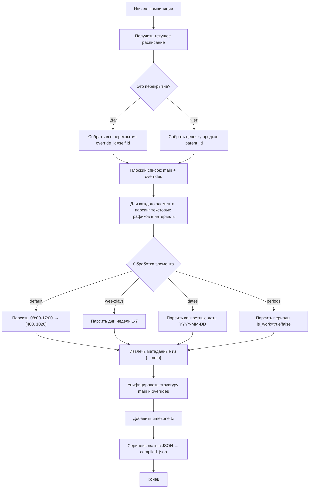

### Точки входа

- [ ] Вызов компиляции в `onBeforeSave()` модели `Schedules`
- [ ] Каскадная перекомпиляция всех потомков (через `parent_id`)

### Задачи компиляции

#### 1. Сборка цепочки предков в плоский список

- [ ] Получить все расписания-основы (без `override_id`) от текущего до корня иерархии
- [ ] Получить все перекрытия (`override_id = self.id`) с их периодами действия
- [ ] Результат: плоский массив объектов `main` + `overrides[]`

#### 2. Парсинг текстового графика в минутные интервалы

- [ ] Конвертация "08:00-17:00" → `[480, 1020]`
- [ ] Конвертация "08:00-12:00,13:00-17:00" → `[[480, 720], [780, 1020]]`
- [ ] Конвертация "-" (выходной) → `[]`
- [ ] Извлечение метаданных из `{...meta}` суффикса
- [ ] Устранение пересечений согласно правилу из readme.md: 08:00-12:00{meta1} и 10:00-14:00{meta2} -> 08:00-10:00{meta1} и 10:00-14:00{meta2}
- [ ] Сортировка интервалов по левой границе

#### 3. Расчёт timestamp in minutes (_tsm)

- [ ] Конвертация дат/времени в `_tsm` (минуты от Unix epoch)
- [ ] `main.start_tsm`, `main.end_tsm` — границы основного расписания
- [ ] `override.start_tsm`, `override.end_tsm` — границы перекрытий
- [ ] `period.start_tsm`, `period.end_tsm` — границы периодов
- [ ] `date_tsm` в ключах `dates` — timestamp даты (начало дня)

#### 4. Унификация структуры базового расписания и перекрытий

- [ ] Обе сущности должны иметь идентичную структуру: `name`, `start`, `end`, `default`, `weekdays`, `dates`, `periods`, `comment`
- [ ] Поле `tz` — часовой пояс (из `schedules` или `Yii::$app->params['schedulesTZShift']`)
- [ ] Сортировка данных `periods`, `overrides`, `dates`, `weekdays` в структуре для оптимизации поиска (см. ограничения консистентности)

### Типовое описание entry (запись дня)

| Поле | Тип | Описание |
| ---- | --- | -------- |
| `schedule` | string | Оригинальный текстовый график "08:00-17:00" или "-" |
| `intervals` | array | Массив интервалов рабочего времени |
| `meta` | object | Метаданные записи (опционально) |
| `comment` | string | Комментарий к записи |

**Интервал:** `[start_minute, end_minute, {meta}]`

- Пример: `[480, 1020, {}]` — 08:00-17:00 без метаданных
- Пример: `[600, 900, {"duty": "Иванов"}]` — 10:00-15:00 с метаданными

### Типовое описание периода (period)

| Поле | Тип | Описание |
| ---- | --- | -------- |
| `start` | string | Дата начала "YYYY-MM-DD hh:mm" |
| `start_tsm` | integer | Timestamp in minutes от epoch |
| `end` | string | Дата окончания "YYYY-MM-DD hh:mm" |
| `end_tsm` | integer | Timestamp in minutes от epoch |
| `is_work` | boolean | true — рабочий период, false — нерабочий |
| `comment` | string | Комментарий к периоду |

---


## Работа со скомпилированным расписанием

Необходимо чтобы библиотека реализовывала методы обработки скомпилированного расписания на основе следующих 27 функций:

#### 1. Основные публичные методы (API)

| Функция | Описание | Использование |
| ------- | -------- | ------------- |
| `isWorkDay(date_tsm)` | Проверить рабочий ли день | Календари, запросы |
| `isWorkTime(tsm)` | Проверить рабочее ли время | Валидация времени |
| `getMeta(tsm)` | Получить метаданные на дату-время | Агрегация данных |
| `nextWorkingDateTime(dateTime)` | Ближайшее рабочее время | Планирование |
| `nextWorkingMeta(dateTime)` | Метаданные ближайшего рабочего времени | Планирование |

#### 2. Базовые алгоритмические функции

| Функция | Описание | Использование |
| ------- | -------- | ------------- |
| `getDatePeriods(date_tsm)` | Периоды, перекрывающие дату | getDateIntervals |
| `getDatePeriodsIntervals(date_tsm)` | Интервалы периодов в пределах дня | getDateIntervals |
| `getDateIntervals(date_tsm)` | Итоговые интервалы расписания на дату | isWorkDay, isWorkTime, getMeta |
| `applyPeriodsToDay(intervals, periods, dateTsm)` | Наложение периодов на интервалы | getDateIntervals |
| `nextRecord(pos, target)` | Ближайшая запись (entry/override) с позиции, применяя фильтр target для типов | nextWorkingDateTime |

#### 3. Вспомогательные функции — интервалы

| Функция | Описание | Использование |
| ------- | -------- | ------------- |
| `intervalsContains(intervals, tsm)` | Найти интервал, содержащий tsm (только в таблице) | isWorkTime, getMeta |
| `intervalsSubtract(intervals, remove)` | Вычесть интервал из набора | applyPeriodsToDay, intervalsAdd |
| `intervalsAdd(intervals, override)` | Добавить интервал (БЕЗ MERGE) | applyPeriodsToDay |
| `filterBefore(entry, tsm)` | Отфильтровать интервалы завершённые до tsm (только в таблице) | nextWorkDateEntry |

#### 4. Вспомогательные функции — конвертация времени

| Функция | Описание | Использование |
| ------- | -------- | ------------- |
| `strToTsm(string)` | Преобразовать строку в tsm | Парсинг |
| `tsmToStr(integer)` | Преобразовать tsm в "YYYY-MM-DD hh:mm" | Форматирование |
| `tsmToDateTsm(integer)` | Преобразовать tsm в начало дня | Нормализация |

#### 5. Вспомогательные функции — поиск

| Функция | Описание | Использование |
| ------- | -------- | ------------- |
| `inBounds(tsm, bounds)` | Проверить tsm в границах | findOverride, findPeriod |
| `findPeriod(tsm, is_work?)` | Найти period по времени (работающий или любой) | getDatePeriods, nextWorkingDateTime |
| `findOverride(dateTime)` | Найти override или вернуть main | getDateIntervals |
| `nextPeriod(tsm, isWork)` | Ближайший период с end ≥ tsm, опционально отфильтрованный по is_work | nextWorkingDateTime |
| `nextOverride(tsm)` | Ближайший override с start ≥ tsm | nextRecord |
| `nextWorkDateEntry(tsm, target)` | Ближайшая дата с рабочими интервалами | nextRecord |

#### 6. Вспомогательные функции — дата и запись

| Функция | Описание | Использование |
| ------- | -------- | ------------- |
| `dayOfWeek(tsm)` | День недели (1=пн, 7=вс) (только в таблице) | nextWeekDayEntry |
| `getEntryIntervals(target, dateTsm)` | Интервалы entry на дату (только в таблице) | getDateIntervals |
| `nextWeekDayEntry(pos, target)` | Ближайшая запись (entry) по дням недели с фильтром target из позиции | nextRecord, планирование |

---

### Подробное описание функций

#### Метод `intervalsAdd(intervals, override)` — добавить интервал с NO MERGE

**Назначение:** Добавить интервал override к набору интервалов с приоритетом его meta. **КРИТИЧНО:** интервалы НИКОГДА не объединяются/не merging, даже если соседние имеют одинаковую meta!

**Описание:**
При наложении интервала override (period) на массив интервалов выполняются два шага:

1. **Шаг 1: Вычитание** — вычитаем override из всех интервалов (освобождаем место для override) через [`intervalsSubtract()`](modules/schedules/plans/compile.md:879)
2. **Шаг 2: Добавление без merge** — добавляем копию override в массив как отдельный элемент

**Особенность NO MERGE:**
Результат содержит ВСЕ интервалы отдельно, включая соседние с одинаковой meta. Причина: границы интервалов содержат важную информацию о происхождении (какой period/override их создал), поэтому они должны быть сохранены как отдельные элементы.

**Пример с тремя интервалами:**
```
baseIntervals = [[480, 1020, {}]]
positive override = [[600, 900, {}]]

Шаг 1: Вычитаем [600,900] из [[480,1020]] → [[480, 600, {}], [900, 1020, {}]]
Шаг 2: Добавляем override → [[480, 600, {}], [600, 900, {}], [900, 1020, {}]]

ИТОГ: [[480, 600, {}], [600, 900, {}], [900, 1020, {}]]
🔴 КРИТИЧНО: результат НЕ объединяется в [[480, 900, {}], [900, 1020, {}]]!
```

**Демо код из demo.js:**

```js
function intervalsAdd(intervals, override) {
    if (!intervals || intervals.length === 0) {
        return override ? [[...override]] : [];
    }
    
    if (!override || override[1] <= override[0]) {
        return [...intervals];
    }
    
    // 1. Вычитаем override из интервалов (освобождаем место)
    let result = intervalsSubtract(intervals, override);
    
    // 2. Добавляем override в массив БЕЗ MERGE
    result.push([...override]);
    
    return result;
}
```

**Test Cases:**

| № | Категория | Входные данные | Ожидаемый результат | Проверяется |
|---|-----------|----------------|---------------------|-------------|
| 1 | Happy Path | intervalsAdd([[480, 1020, {}]], [[600, 900, {}]]) | [[480, 600, {}], [600, 900, {}], [900, 1020, {}]] | intervalsAdd: вычитаем [600,900] → [[480,600], [900,1020]], затем добавляем [600,900] → Два интервала отдельно, БЕЗ склейки |
| 2 | Happy Path | intervalsAdd([[480, 1020, {}]], [[300, 500, {}]]) | [[300, 500, {}], [500, 1020, {}]] | Overlap с 480-500: вычитаем [300,500] из [480,1020] → [500,1020], затем добавляем [300,500] |
| 3 | Happy Path | intervalsAdd([[480, 600, {}], [700, 1020, {}]], [[550, 750, {}]]) | [[480, 550, {}], [550, 750, {}], [750, 1020, {}]] | Перекрываем gap между базовых интервалов: результат содержит ВСЕ подряд раздельно |
| 4 | Edge | intervalsAdd([], [[600, 900, {}]]) | [[600, 900, {}]] | Пустой базовый: override становится единственным интервалом |
| 5 | Edge | intervalsAdd([[480, 1020, {}]], []) | [[480, 1020, {}]] | Пустой override (пустой массив): базовый не меняется |
| 6 | Edge | intervalsAdd([[480, 1020, {}]], [[400, 1200, {}]]) | [[400, 1200, {}]] | Override полностью покрывает базовый |
| 7 | Edge | intervalsAdd([[480, 600, {}], [700, 1020, {}]], [[550, 750, {duty: "test"}]]) | [[480, 550, {}], [550, 750, {duty: "test"}], [750, 1020, {}]] | Meta override сохраняется, соседние интервалы отдельно (не склеиваются) |
| 8 | Edge | intervalsAdd([[480, 720, {}], [780, 1020, {}]], [[600, 900, {}]]) | [[480, 600, {}], [600, 900, {}], [780, 1020, {}]] | Override закрывает разрыв: интервалы не объединяются на границах |
| 9 | Empty | intervalsAdd([], []) | [] | Оба пусто: пустой результат |
| 10 | Edge | intervalsAdd([[480, 1020, {}]], null) | [[480, 1020, {}]] | Null override: базовый не меняется |
| 11 | Integration | intervalsAdd([[480, 600, {meta1}], [700, 1020, {meta2}]], [550, 750, {meta3}]) | [[480, 550, {meta1}], [550, 750, {meta3}], [750, 1020, {meta2}]] | Все три интервала отдельно БЕЗ склейки |

#### Метод `getDatePeriods(date_tsm)` — получить периоды, попадающие в дату

Возвращает периоды, которые "зацепляют" указанный день хотя бы одним концом (перекрывающие + касающиеся границ).

**Алгоритм:** период попадает в день, если он заканчивается НЕ раньше начала дня ИЛИ начинается РАНЬШЕ конца дня:

- `period.end_tsm >= dayStart` — период заканчивается в начале дня или позже
- `period.start_tsm < dayEnd` — период начинается до конца дня

```js
function getDatePeriods(date_tsm) {
    const dayStart = tsmToDateTsm(date_tsm)       // Начало дня (00:00)
    const dayEnd   = dayStart + 1440              // Конец дня (24ч = 1440 мин)
    const periods  = schedule.periods             // Все периоды расписания
    const result   = []                           // Пустой массив результата
    
    for (const period of periods) {
        // Период попадает в день, если:
        // - заканчивается НЕ РАНЬШЕ начала дня (end_tsm >= dayStart)
        // ИЛИ
        // - начинается РАНЬШЕ конца дня (start_tsm < dayEnd)
        if (period.end_tsm >= dayStart || period.start_tsm < dayEnd) {
            result.push(period)             // Добавить период в результат
        }
    }
    
    return result
}
```

**Test Cases:**

| № | Категория | Входные данные | Ожидаемый результат | Проверяется |
|---|-----------|----------------|---------------------|-------------|
| 1 | Happy Path | Период охватывает день полностью: start_tsm=28410680 (2024-01-10 10:00 UTC+5), end_tsm=28418939 (2024-01-12 22:59 UTC+5), date_tsm=28414800 (2024-01-11 00:00) | Период включён в результат | Период, начавшийся раньше дня и закончившийся позже дня, должен быть включён |
| 2 | Happy Path | Период начинается с начала дня: start_tsm=28414800 (2024-01-11 00:00), end_tsm=28417200 (2024-01-11 12:00), date_tsm=28414800 | Период включён | Период, совпадающий по start с началом дня, должен быть включён |
| 3 | Happy Path | Период заканчивается в конце дня: start_tsm=28417200 (2024-01-11 12:00), end_tsm=28429200 (2024-01-12 00:00), date_tsm=28414800 | Период включён | Период, end_tsm которого совпадает с концом дня (00:00 следующего), должен быть включён |
| 4 | Edge | Период минимально перекрывает день (1 минута): start_tsm=28414799 (2024-01-10 23:59), end_tsm=28414801 (2024-01-11 00:01), date_tsm=28414800 | Период включён | Граничный случай: период весь находится в диапазоне дня (даже 1 минута) |
| 5 | Edge | Период нулевой длины (одна минута/timestamp): start_tsm=28414800, end_tsm=28414800, date_tsm=28414800 | Период включён | Период, где start_tsm == end_tsm, должен быть включён согласно условию |
| 6 | Edge | Период заканчивается ровно на границе начала дня: start_tsm=28412400 (2024-01-10 00:00), end_tsm=28414800 (2024-01-11 00:00, начало дня), date_tsm=28414800 | Период НЕ включён | Логика интервалов: левая граница включается, правая нет. Период [start, end) не содержит 28414800 как точку проверки |
| 7 | Edge | Период начинается на следующий день: start_tsm=28429200 (2024-01-12 00:00), end_tsm=28431840 (2024-01-12 23:59), date_tsm=28414800 (2024-01-11) | Период НЕ включён | Период полностью находится в следующем дне |
| 8 | Edge | Период начался давно, заканчивается внутри дня: start_tsm=28166400 (2023-12-01 00:00), end_tsm=28419300 (2024-01-11 15:00), date_tsm=28414800 | Период включён | Длительный период, охватывающий многие дни, включая целевой день |
| 9 | Edge | **Новый**: Период начинается и заканчивается внутри одного дня: start_tsm=28416000 (2024-01-11 08:00), end_tsm=28417800 (2024-01-11 10:00), date_tsm=28414800 | Период включён | Полностью внутри дня |
| 10 | Empty | schedule.periods = [], date_tsm=28414800 | Пустой массив [] | Отсутствие периодов должно вернуть пустой результат |
| 11 | Empty | schedule.periods = null, date_tsm=28414800 | Пустой массив [] | Null periods должен обрабатываться как отсутствие данных |
| 12 | Error | date_tsm = null, schedule.periods=[...] | Пустой массив [] | Обработка null входного параметра |
| 13 | Error | date_tsm = undefined, schedule.periods=[...] | Пустой массив [] | Обработка undefined входного параметра |

#### Метод `getDatePeriodsIntervals(date_tsm)` — получить интервалы периодов, перекрывающих дату

Возвращает набор интервалов в пределах дня date_tsm, полученных из перекрывающих день периодов.

```json
{
  "positive": [ // периоды непрерывной работы, накладывающие рабочее время
    [600, 900, {"comment":"Работали непрерывно в связи с форсмажором"}]
  ],
  "negative": [ // периоды простоя, накладывающие нерабочее время
    [910, 1000, {"comment":"Аварийное отключение электричества"}]
  ]
}
```

```JS
/**
 * Возвращает набор интервалов в пределах дня date_tsm, 
 * полученных из перекрывающих день периодов.
 * 
 * @param {number} date_tsm - timestamp in minutes начала дня
 * @returns {Object} { positive: [], negative: [] }
 */
function getDatePeriodsIntervals(date_tsm) {
    // 1. Получаем периоды, перекрывающие дату
    const periods = getDatePeriods(date_tsm);
    
    // 2. Вычисляем границы дня
    const dayStart = tsmToDateTsm(date_tsm);   // Начало дня (00:00 tsm)
    const dayEnd = dayStart + 1440;            // Конец дня (24ч = 1440 мин)
    
    // 3. Инициализация результата
    const positive = [];    // Периоды работы (is_work = true)
    const negative = [];    // Периоды простоя (is_work = false)
    
    // 4. Для каждого периода вычисляем пересечение с днём
    for (const period of periods) {
        // 4.1. Обрезаем период по границам дня
        const intervalStart = Math.max(period.start_tsm, dayStart);
        const intervalEnd = Math.min(period.end_tsm, dayEnd);
        
        // 4.2. Конвертируем в минуты от начала дня (0-1440)
        const startMinute = intervalStart - dayStart;
        const endMinute = intervalEnd - dayStart;
        
        // 4.3. Формируем интервал [start, end, meta]
        const interval = [startMinute, endMinute, period.meta || {}];
        
        // 4.4. Добавляем в соответствующий массив
        if (period.is_work === true) {
            positive.push(interval);   // Добавить в work-периоды
        } else {
            negative.push(interval);   // Добавить в non-work периоды
        }
    }
    
    // 5. Возвращаем результат
    return { positive, negative };
}
```

**Test Cases:**

Функция должна преобразовать периоды, перекрывающие день, в интервалы в пределах дня (минуты от начала дня, 0-1440).

| № | Категория | Входные данные | Ожидаемый результат | Проверяется |
|---|-----------|----------------|---------------------|-------------|
| 1 | Happy Path | Период работы внутри дня: getDatePeriods()→[{is_work:true, start_tsm:28416000 (08:00), end_tsm:28417200 (12:00), meta:{}}], date_tsm=28414800 (00:00) | {positive: [[480, 720, {}]], negative: []} | Период работы (is_work=true) добавляется в massive positive с конвертацией в минуты от начала дня |
| 2 | Happy Path | Период простоя внутри дня: getDatePeriods()→[{is_work:false, start_tsm:28416000 (08:00), end_tsm:28417200 (12:00), meta:{}}], date_tsm=28414800 | {positive: [], negative: [[480, 720, {}]]} | Период простоя (is_work=false) добавляется в массив negative |
| 3 | Happy Path | Несколько периодов смешанного типа: getDatePeriods()→[{is_work:true, start_tsm:28416000, end_tsm:28417200}, {is_work:false, start_tsm:28420800 (14:00), end_tsm:28422000 (15:00)}], date_tsm=28414800 | {positive: [[480, 720, {}]], negative: [[840, 900, {}]]} | Оба типа периодов группируются в соответствующие массивы |
| 4 | Edge | Период выходит за границы дня (начинается раньше, заканчивается позже): getDatePeriods()→[{is_work:true, start_tsm:28410680 (20:00 пред.дня), end_tsm:28427040 (04:00 след.дня)}], date_tsm=28414800 | {positive: [[0, 1440, {}]], negative: []} | Интервал обрезается по границам дня: [max(start, dayStart), min(end, dayEnd)] → [0, 1440] |
| 5 | Edge | Период начинается в полночь (начало дня): getDatePeriods()→[{is_work:true, start_tsm:28414800, end_tsm:28416000 (08:00)}], date_tsm=28414800 | {positive: [[0, 480, {}]], negative: []} | Начало дня = 0 минут от dayStart |
| 6 | Edge | Период заканчивается в полночь (конец дня): getDatePeriods()→[{is_work:true, start_tsm:28420800 (14:00), end_tsm:28429200 (00:00 след.дня)}], date_tsm=28414800 | {positive: [[840, 1440, {}]], negative: []} | Конец дня = 1440 минут (24 часа) |
| 7 | Edge | Период ровно один час (минимальное значимое): getDatePeriods()→[{is_work:false, start_tsm:28419600 (10:00), end_tsm:28420200 (11:00)}], date_tsm=28414800 | {positive: [], negative: [[600, 660, {}]]} | Конвертация минут: (10:00→600, 11:00→660) |
| 8 | Empty | getDatePeriods()→[], date_tsm=28414800 | {positive: [], negative: []} | Отсутствие периодов (пустой результат getDatePeriods) |
| 9 | Empty | getDatePeriods()→[...], но обе категории пусты, date_tsm=28414800 | {positive: [], negative: []} | Нет периодов нужной категории |
| 10 | Error | date_tsm = null | {positive: [], negative: []} | Обработка null: не должно быть исключения, вернуть пустой результат |
| 11 | Integration | 5 периодов разного типа: 3 work + 2 non-work, вызов getDatePeriods внутри | {positive: [3 интервала], negative: [2 интервала]} | Проверка всех периодов собираются в соответствующие массивы |

#### Метод `applyPeriodsToDay(baseIntervals, periods, dateTsm)` — наложение периодов на интервалы дня

**Назначение:** Применить периоды работы и простоя к базовым интервалам дня.

**Описание:**
1. **negative** (is_work=false): вычитаются из интервалов через [`intervalsSubtract(intervals, neg)`](modules/schedules/plans/compile.md:879)
2. **positive** (is_work=true): добавляются через [`intervalsAdd(intervals, pos)`](modules/schedules/plans/compile.md:938) БЕЗ merge соседних интервалов — см. подробнее в описании intervalsAdd

**ВАЖНО:** При наложении positive периодов интервалы НЕ склеиваются - все остаются отдельно, даже если соседние имеют одинаковую meta!

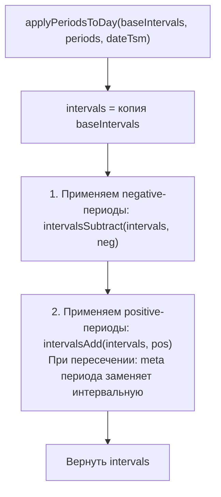

**Демо код из demo.js:**

```js
function applyPeriodsToDay(baseIntervals, periods, dateTsm) {
    let intervals = [...baseIntervals];
    
    // 1. Вычитаем negative-периоды (is_work=false)
    for (const neg of periods.negative) {
        intervals = intervalsSubtract(intervals, neg);
    }
    
    // 2. Добавляем positive-периоды (is_work=true)
    // При пересечении: period имеет приоритет, его meta заменяет интервальный
    for (const pos of periods.positive) {
        intervals = intervalsAdd(intervals, pos);
    }
    
    return intervals;
}
```

**Test Cases:**

| № | Категория | Входные данные | Ожидаемый результат | Проверяется |
|---|-----------|----------------|---------------------|-------------|
| 1 | Happy Path | baseIntervals=[[480, 1020, {}]], negative=[], positive=[[600, 900, {}]] | [[480, 600, {}], [600, 900, {}], [900, 1020, {}]] | Только positive: добавляются БЕЗ merge интервалы |
| 2 | Happy Path | baseIntervals=[[480, 1020, {}]], negative=[[600, 900, {}]], positive=[] | [[480, 600, {}], [900, 1020, {}]] | Только negative: вычитаниe из интервалов |
| 3 | Happy Path | baseIntervals=[[480, 1020, {}]], negative=[[600, 750, {}]], positive=[[700, 900, {}]] | [[480, 600, {}], [700, 900, {}], [900, 1020, {}]] | Комбинация: сначала вычитаем, затем добавляем |

#### Метод `intervalsAdd(intervals, override)` — добавить интервал с NO MERGE

**Назначение:** Добавить интервал override к набору интервалов с приоритетом его meta. **КРИТИЧНО:** интервалы НИКОГДА не объединяются/не merging, даже если соседние имеют одинаковую meta!

**Описание:**
При наложении интервала override (period) на массив интервалов выполняются два шага:

1. **Шаг 1: Вычитание** — вычитаем override из всех интервалов (освобождаем место для override) через [`intervalsSubtract()`](modules/schedules/plans/compile.md:879)
2. **Шаг 2: Добавление без merge** — добавляем копию override в массив как отдельный элемент

**Особенность NO MERGE:**
Результат содержит ВСЕ интервалы отдельно, включая соседние с одинаковой meta. Причина: границы интервалов содержат важную информацию о происхождении (какой period/override их создал), поэтому они должны быть сохранены как отдельные элементы.

**Пример с тремя интервалами:**
```
baseIntervals = [[480, 1020, {}]]
positive override = [[600, 900, {}]]

Шаг 1: Вычитаем [600,900] из [[480,1020]] → [[480, 600, {}], [900, 1020, {}]]
Шаг 2: Добавляем override → [[480, 600, {}], [600, 900, {}], [900, 1020, {}]]

ИТОГ: [[480, 600, {}], [600, 900, {}], [900, 1020, {}]]
🔴 КРИТИЧНО: результат НЕ объединяется в [[480, 900, {}], [900, 1020, {}]]!
```

**Демо код из demo.js:**

```js
function intervalsAdd(intervals, override) {
    if (!intervals || intervals.length === 0) {
        return override ? [[...override]] : [];
    }
    
    if (!override || override[1] <= override[0]) {
        return [...intervals];
    }
    
    // 1. Вычитаем override из интервалов (освобождаем место)
    let result = intervalsSubtract(intervals, override);
    
    // 2. Добавляем override в массив БЕЗ MERGE
    result.push([...override]);
    
    return result;
}
```

**Test Cases:**

| № | Категория | Входные данные | Ожидаемый результат | Проверяется |
|---|-----------|----------------|---------------------|-------------|
| 1 | Happy Path | intervalsAdd([[480, 1020, {}]], [[600, 900, {}]]) | [[480, 600, {}], [600, 900, {}], [900, 1020, {}]] | intervalsAdd: вычитаем [600,900] → [[480,600], [900,1020]], затем добавляем [600,900] → ВСЕ три отдельно, БЕЗ склейки |
| 2 | Happy Path | intervalsAdd([[480, 1020, {}]], [[300, 500, {}]]) | [[300, 500, {}], [500, 1020, {}]] | Overlap с 480-500: вычитаем [300,500] из [480,1020] → [500,1020], затем добавляем [300,500] |
| 3 | Happy Path | intervalsAdd([[480, 600, {}], [700, 1020, {}]], [[550, 750, {}]]) | [[480, 600, {}], [550, 750, {}], [700, 1020, {}]] | Несколько базовых интервалов: результат содержит ВСЕ отдельно |
| 4 | Edge | intervalsAdd([], [[600, 900, {}]]) | [[600, 900, {}]] | Пустой базовый: override становится единственным интервалом |
| 5 | Edge | intervalsAdd([[480, 1020, {}]], []) | [[480, 1020, {}]] | Пустой override (пустой массив): базовый не меняется |
| 6 | Edge | intervalsAdd([[480, 1020, {}]], [[400, 1200, {}]]) | [[400, 1200, {}]] | Override полностью покрывает базовый |
| 7 | Edge | intervalsAdd([[480, 600, {}], [700, 1020, {}]], [[550, 750, {duty: "test"}]]) | [[480, 600, {}], [550, 750, {duty: "test"}], [700, 1020, {}]] | Meta override сохраняется, соседние интервалы отдельно (не склеиваются) |
| 8 | Edge | intervalsAdd([[480, 720, {}], [780, 1020, {}]], [[600, 900, {}]]) | [[480, 600, {}], [600, 900, {}], [780, 1020, {}]] | Override закрывает разрыв: интервалы не объединяются на границах |
| 9 | Empty | intervalsAdd([], []) | [] | Оба пусто: пустой результат |
| 10 | Edge | intervalsAdd([[480, 1020, {}]], null) | [[480, 1020, {}]] | Null override: базовый не меняется |
| 11 | Integration | intervalsAdd([[480, 600, {meta1}], [700, 1020, {meta2}]], [[500, 750, {meta3}]]) | [[480, 500, {meta1}], [500, 750, {meta3}], [700, 1020, {meta2}]] | Все три интервала отдельно БЕЗ склейки |

---

#### Метод `getDateIntervals(date_tsm)` — получить интервалы расписания на дату

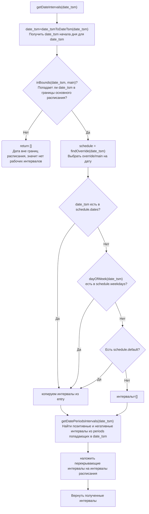

**Test Cases:**

| № | Категория | Входные данные | Ожидаемый результат | Описание теста |
|---|-----------|----------------|---------------------|----------------|
| 1 | Happy Path | Дата в weekdays: понедельник с графиком 08:00-17:00 | [[480, 1020, {}]] | Стандартный рабочий день |
| 2 | Happy Path | Дата в dates (исключение): 2024-01-01 с графиком 10:00-15:00 | [[600, 900, {}]] | Переопределённая дата |
| 3 | Happy Path | Дата в dates с "-" (выходной) | [] | Явный выходной |
| 4 | Happy Path | Override active: летнее время, date_tsm в периоде override | Интервалы из override | Override переопределяет main |
| 5 | Edge | Дата вне границ расписания (до start или после end) | [] | Расписание ещё не началось или закончилось |
| 6 | Edge | Дата = start граница | Интервалы | Точно на границе start |
| 7 | Edge | Дата = end граница | [] | Точно на границе end |
| 8 | Edge | Пустой weekdays и нет default | [] | Нет интервалов для даты |
| 9 | Edge | Пустой dates и weekday без интервалов | [] | Запись есть но пустая |
| 10 | Edge | Период is_work=true, пересекающий 2 интервала: baseIntervals=[[480,600, {}], [700,1020, {}]], period=[550,750,{}] | [[480, 550, {}], [550, 750, {}], [700, 1020, {}]] | intervalsAdd не склеивает → три отдельных интервала |
| 11 | Edge | Период is_work=false удаляет интервалы | Базовые минус период | Наложение non-work периода |
| 12 | Empty | main = null | [] | Основное расписание не задано |
| 13 | Empty | schedule = null | [] | Расписание не найдено |
| 14 | Error | date_tsm = null | [] или Exception | Входной параметр null |
| 15 | Integration | Вызов после applyPeriodsToDay | Корректные intervals | Проверка интеграции всех вызовов |
| 16 | Validation | Дублирование записи на один день недели | Exception/Error | ВАЛИДАЦИЯ: нельзя создать 2 записи на один день недели |
| 17 | Validation | Дублирование записи на одну дату | Exception/Error | ВАЛИДАЦИЯ: нельзя создать 2 записи на одну дату |

TODO:

- 4: для override нужно обспечить ожидаемое расписание. в тесте нет конкретных данных по расписанию override и какие данные ожидать
- работа с днями недели
  - попасть на день недели, который есть в расписании -> график из этого дня недели
  - попасть на день недели, которого нет в расписании, но есть default -> график из default
  - попасть на день недели, которого нет в расписании, и нет default -> график пустой
- работа с датами
  - попасть на дату, которая есть в расписании и нет в днях недели -> график из этой даты
  - попасть на дату, которая есть в расписании и есть в днях недели -> график из этой даты
- работа с override
  - попасть в дату, которая есть в днях недели базового расписания но отсутствует в override (default отсутствует) -> пустое расписание
  - попасть в дату, которая есть в днях недели базового расписания и есть в днях недели override (default отсутствует) -> расписание из override
  - попасть в дату, которая есть в днях недели базового расписания и отсутствует в днях недели override (default присутствует) -> default расписание из override
  - попасть в дату, которая есть в датах базового расписания и есть в днях недели override (default отсутствует) -> расписание из даты базового расписания, так как даты имеют приоритет над днями недели, а override не содержит дат
- работа с периодами
  - нет периодов -> график не изменяется
  - рабочий период перекрывает день с графиком -> график меняется на "00:00-24:00"
  - нерабочий период перекрывает день  -> график меняется на "-"
  - график состоит из трех разделенных интервалов с метаданными. нерабочий период начинается в середине первого интелвала и зкаканчивается в третьем -> первый и последний интервалы обрезаются до границ периода. средний период удален из графика.
  - график состоит из трех разделенных интервалов с метаданными. рабочий период начинается в середине первого интелвала и зкаканчивается в третьем -> первый и последний интервалы обрезаются до границ периода. период формирует рабочее время без метаданных между ними. средний период удален из графика.
  - график состоит из трех разделенных интервалов с метаданными. рабочий период не имеет начала и заканчивается середине второго интелвала -> график от 00:00 и до середины второго интервала заменяется на рабочее время без метаданных, второй интервал обрезается периодом, третий без изменений
  - график состоит из трех разделенных интервалов с метаданными. нерабочий период начинается в середине второго интелвала и не заканчивается -> график от середины второго интервала и до 24:00 очищается, второй интервал обрезается периодом, первый без изменений
- комбинации дат, периодов и override
  
#### Метод `isWorkDay(date_tsm)` — проверка рабочего дня на дату

Возвращает true если есть хотя бы один рабочий интервал на дату. **Примечание:** интервалы получены из getDateIntervals, которая использует intervalsAdd без merge - значит может быть несколько соседних интервалов, но isWorkDay проверяет только наличие непустого набора.

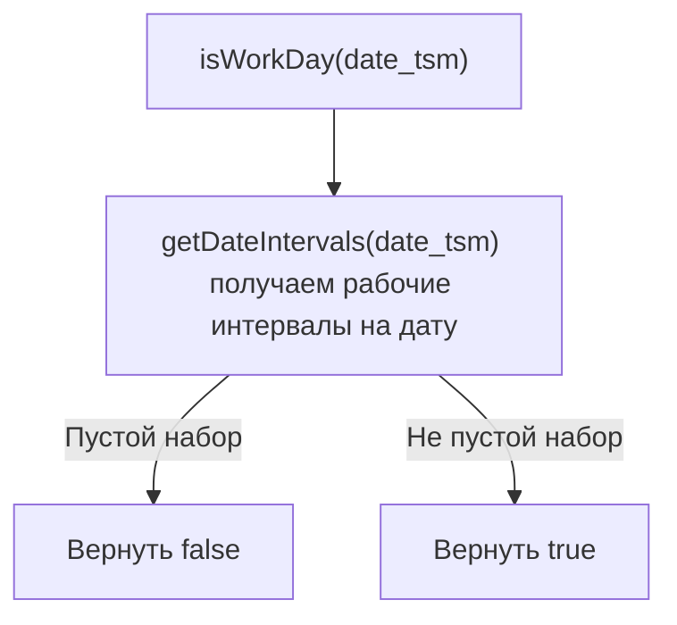

**Test Cases:**

| № | Категория | Входные данные | Ожидаемый результат | Проверяется |
|---|-----------|----------------|---------------------|-------------|
| 1 | Happy Path | date_tsm=28416003 (2024-01-08, пн), weekday.schedule="08:00-17:00", intervals=[[480, 1020, {}]] | true | Обычный рабочий день с рабочим графиком вернёт true |
| 2 | Happy Path | date_tsm=28418400 (2024-01-06, сб), schedule="-", intervals=[] | false | Выходной день (суббота) с пустыми интервалами вернёт false |
| 3 | Happy Path | date_tsm=28401120 (2024-01-01, пн, праздник как исключение), dates[28401120]={schedule:"10:00-15:00", intervals:[[600,900,{}]]} | true | Дата-исключение с рабочим графиком вернёт true |
| 4 | Happy Path | date_tsm=28401120 (2024-01-01, пн, новый год), dates[28401120]={schedule:"-", intervals:[]} | false | Дата-исключение с выходным графиком вернёт false |
| 5 | Edge | date_tsm=28414800 (2024-01-11), getDateIntervals()→[], дня нет в dates и нет weekday | false | Отсутствие интервалов (пустой результат getDateIntervals) |
| 6 | Edge | date_tsm=28401000 (раньше main.start_tsm=28401120), schedule вне границ | false | Дата раньше начала расписания не является рабочим днём |
| 7 | Edge | date_tsm=28401120 (точно main.start_tsm), intervals=[[480, 1020, {}]] | true | Точно на границе start расписания — день рабочий |
| 8 | Edge | date_tsm=28430400 (после end_tsm расписания), main.end_tsm=28429200 | false | Дата после конца действия расписания |
| 9 | Empty | getDateIntervals()→[] (нет интервалов ни в dates, ни в weekday, ни в default) | false | Полное отсутствие рабочих интервалов |
| 10 | Error | date_tsm = null | false | Обработка null: вернуть false без исключения |
| 11 | Integration | Вызов getDateIntervals (параметры: override check, period application, date/weekday resolution) | true/false (зависит от интервалов) | Интеграция всех слоёв: получение интервалов → проверка на пустоту |


#### Метод `isWorkTime(tsm)` — проверка рабочего времени на дату-время

Проверяет входит ли конкретное время в один из рабочих интервалов. **Примечание:** даже если интервалы соседятся и имеют одинаковую meta, поиск происходит по каждому интервалу отдельно - это не влияет на результат т.к. мы ищем точку внутри интервала.

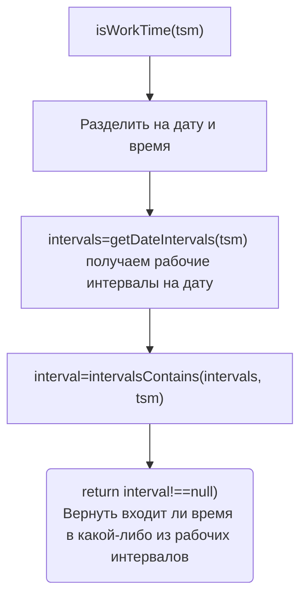

**Test Cases:**

| № | Категория | Входные данные | Ожидаемый результат | Проверяется |
|---|-----------|----------------|---------------------|-------------|
| 1 | Happy Path | Рабочее время: getDateIntervals()→[[480, 1020, {}]] (08:00-17:00), tsm=28416600 (10:00), minutesFromDay=600 | true | Время находится внутри рабочего интервала: intervalsContains вернёт интервал |
| 2 | Happy Path | Нерабочее время после графика: getDateIntervals()→[[480, 1020, {}]] (08:00-17:00), tsm=28420800 (18:00), minutesFromDay=1200 | false | Время позже конца интервала (1200 >= 1020) |
| 3 | Happy Path | Нерабочее время до графика: getDateIntervals()→[[480, 1020, {}]] (08:00-17:00), tsm=28415400 (07:00), minutesFromDay=360 | false | Время раньше начала интервала (360 < 480) |
| 4 | Edge | Граница start включена: getDateIntervals()→[[480, 1020, {}]], tsm=28416000 (08:00), minutesFromDay=480 | true | Левая граница включена [start, end) |
| 5 | Edge | Граница end не включена: getDateIntervals()→[[480, 1020, {}]], tsm=28421800 (17:00), minutesFromDay=1020 | false | Правая граница не включена [start, end) |
| 6 | Edge | Несколько интервалов, между ними: getDateIntervals()→[[480, 720, {}], [780, 1020, {}]] (08:00-12:00, 13:00-17:00), tsm=28418400 (12:30), minutesFromDay=750 | false | 750 находится между интервалами (720 < 750 < 780) |
| 7 | Edge | Несколько интервалов, во втором: getDateIntervals()→[[480, 720, {}], [780, 1020, {}]], tsm=28419600 (14:00), minutesFromDay=840 | true | 840 входит во второй интервал [780, 1020] |
| 8 | Edge | Граница между интервалами (точка): getDateIntervals()→[[480, 720, {}], [780, 1020, {}]], tsm=28418280 (12:18), minutesFromDay=720 | false | 720 - граница конца первого (не включено в [480, 720)) |
| 9 | Empty | Интервалы пустые: getDateIntervals()→[], tsm=28416600 (10:00) | false | Нет рабочих интервалов → intervalsContains вернёт null |
| 10 | Error | tsm = null | false | Обработка null: getDateIntervals(null)→[] → false |
| 11 | Integration | Вызов getDateIntervals (в т.ч. с override, периодами), затем intervalsContains | true/false (зависит от результата getDateIntervals) | Полная цепь: получение интервалов дня → поиск интервала, содержащего время |

#### Метод `getMeta(tsm)` — получение метаданных

Возвращает metadata из интервала, который содержит время tsm. **Примечание:** даже если соседние интервалы имеют одинаковую meta, мы возвращаем meta того интервала, который содержит время - разделение интервалов гарантирует что найдём точный интервал.

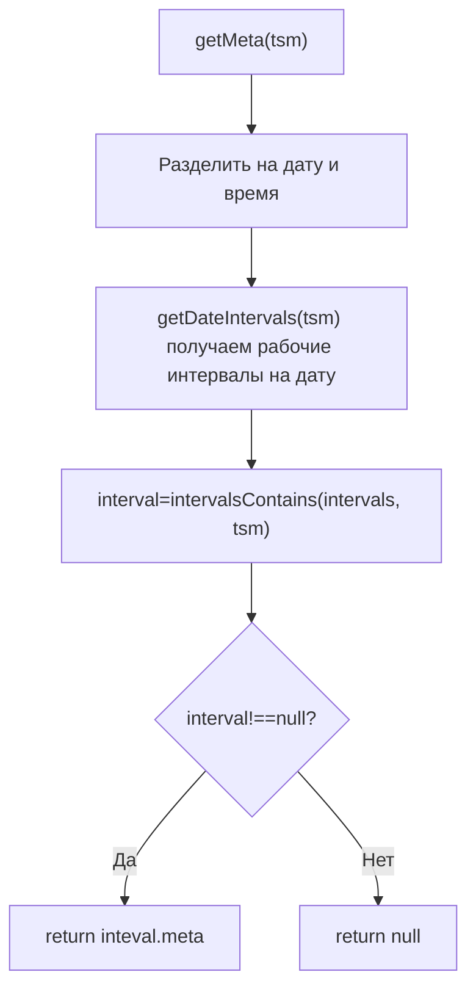

**Test Cases:**

| № | Категория | Входные данные | Ожидаемый результат | Проверяется |
|---|-----------|----------------|---------------------|-------------|
| 1 | Happy Path | Интервал с meta: getDateIntervals()→[[480, 1020, {duty: "Иванов"}]], tsm=28416600 (10:00, minutesFromDay=600) | {duty: "Иванов"} | Meta найден и возвращён из интервала, содержащего время |
| 2 | Happy Path | Интервал без meta (пустой объект): getDateIntervals()→[[480, 1020, {}]], tsm=28416600, minutesFromDay=600 | {} | Пустой объект meta возвращается (не null) |
| 3 | Happy Path | Вне рабочего времени: getDateIntervals()→[[480, 1020, {}]], tsm=28420800 (18:00), minutesFromDay=1200 | null | intervalsContains вернул null → meta = null |
| 4 | Edge | Граница start (включена): getDateIntervals()→[[480, 1020, {duty: "Петров"}]], tsm=28416000 (08:00), minutesFromDay=480 | {duty: "Петров"} | Левая граница включена, meta возвращён |
| 5 | Edge | Граница end (не включена): getDateIntervals()→[[480, 1020, {duty: "Сидоров"}]], tsm=28421800 (17:00), minutesFromDay=1020 | null | Правая граница не включена, время вне интервала |
| 6 | Edge | Несколько интервалов с разными meta, время во втором: getDateIntervals()→[[480, 720, {duty: "Иванов"}], [780, 1020, {duty: "Петров"}]], tsm=28419600 (14:00), minutesFromDay=840 | {duty: "Петров"} | Meta второго интервала возвращен |
| 7 | Empty | Интервалы пустые: getDateIntervals()→[], tsm=28416600 | null | intervalsContains вернул null → meta = null |
| 8 | Error | tsm = null | null | getDateIntervals(null)→[] → intervalsContains→null → meta = null |
| 9 | Error | schedule = null (расписание не загружено) | null | Обработка отсутствия расписания |
| 10 | Integration | Вызов getDateIntervals (с override, периодами) → intervalsContains → возврат meta из найденного интервала | {meta} или null | Полная цепь: получение интервалов → поиск содержащего интервала → возврат meta |

#### Метод `nextWorkingDateTime(dateTime)` — ближайшее рабочее время

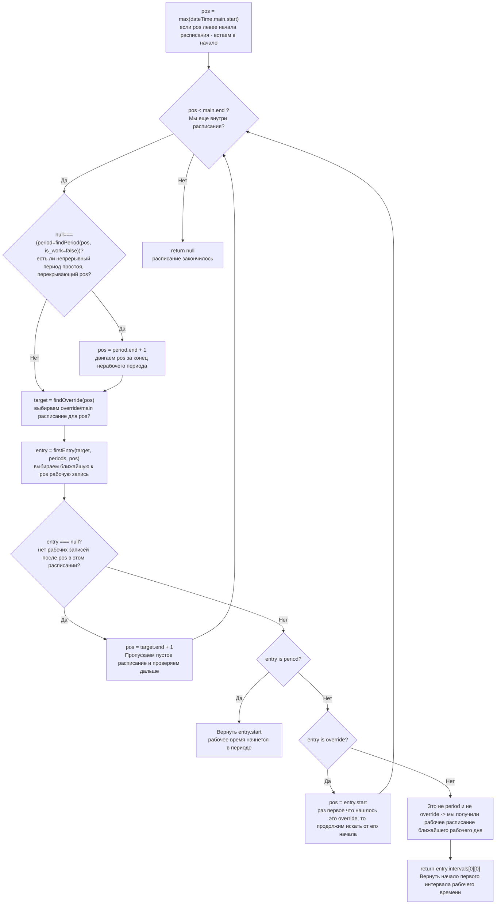

**Test Cases:**

| № | Категория | Входные данные | Ожидаемый результат | Описание теста |
|---|-----------|----------------|---------------------|----------------|
| 1 | Happy Path | Рабочее время: dateTime = 10:00 | 10:00 | Уже рабочее время |
| 2 | Happy Path | Нерабочее время сегодня: dateTime = 18:00, след. раб. = завтра 08:00 | Завтра 08:00 | Переход на следующий день |
| 3 | Happy Path | После рабочего дня: dateTime = 20:00, след. раб. = понедельник 08:00 | Понедельник 08:00 | Через выходные |
| 4 | Edge | dateTime до начала расписания: dateTime = 2020-01-01 05:00, start = 2024-01-01 | 2024-01-01 08:00 | До начала действия |
| 5 | Edge | dateTime после конца расписания: dateTime = 2025-01-01 (end = null) | След. раб. время | Расписание бесконечное |
| 6 | Edge | dateTime в периоде простоя: dateTime = 12:00 (period non-work 11:00-14:00) | 14:00 | Пропуск периода простоя |
| 7 | Edge | dateTime точно на границе интервала: dateTime = 17:00 (end) | След. раб. день | На границе конца |
| 8 | Edge | Несколько выходных подряд: суббота-воскресенье-понедельник | Вторник 08:00 | Множественные выходные |
| 9 | Empty | Расписание пустое, dateTime = 10:00 | null | Нет рабочего времени |
| 10 | Error | dateTime = null | null | Входной параметр null |
| 11 | Integration | Вызов findPeriod, findOverride, firstEntry | Корректное время | Интеграция |

#### Метод `nextWorkingMeta(dateTime)` — метаданные ближайшего рабочего времени

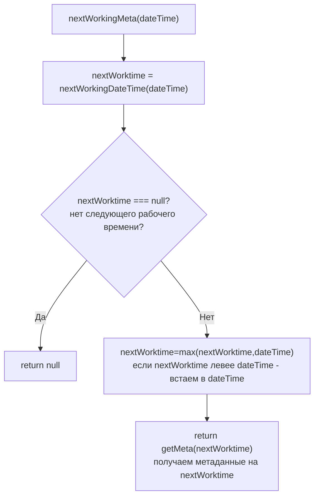

**Test Cases:**

| № | Категория | Входные данные | Ожидаемый результат | Описание теста |
|---|-----------|----------------|---------------------|----------------|
| 1 | Happy Path | Рабочее время с meta: 10:00, meta = {duty: "Иванов"} | {duty: "Иванов"} | Текущее время с meta |
| 2 | Happy Path | Нерабочее время: 18:00, след. раб. 08:00 с meta | {duty: "Петров"} | Следующее время с meta |
| 3 | Edge | dateTime раньше start расписания | meta на start | До начала |
| 4 | Edge | dateTime в периоде простоя | meta на время после периода | Пропуск периода |
| 5 | Empty | nextWorkingDateTime = null | null | Нет рабочего времени |
| 6 | Error | dateTime = null | null | Входной параметр null |
| 7 | Integration | Вызов nextWorkingDateTime, getMeta | Корректный meta | Интеграция |

---

#### Метод `inBounds(tsm, bounds)` — проверка попадания tsm в границы

Проверяет, попадает ли tsm в интервал от bounds.start до bounds.end

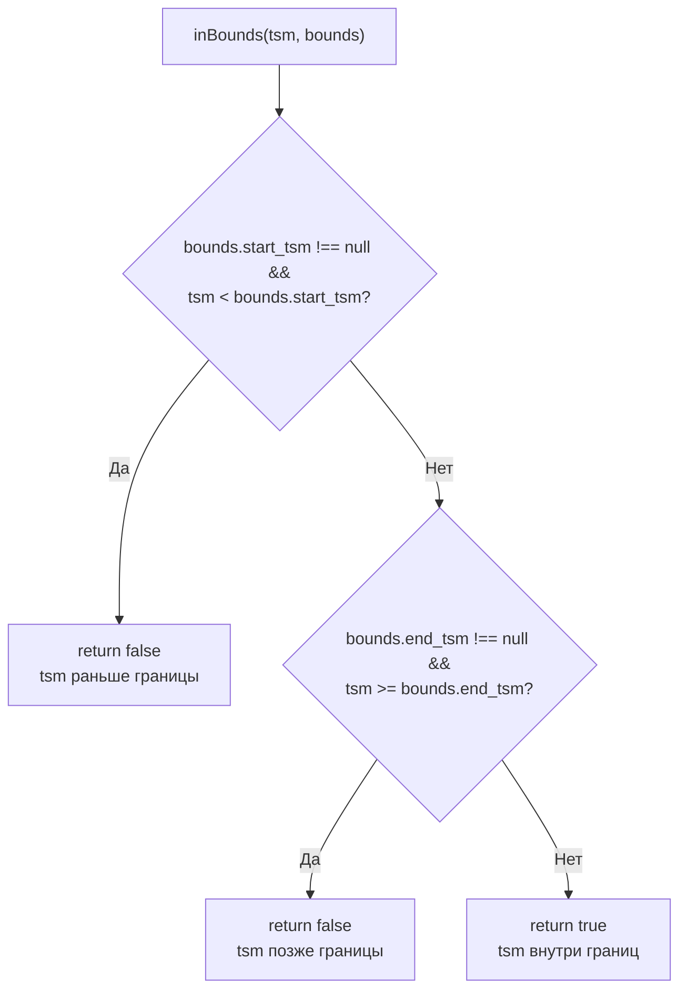

**Test Cases:**

| № | Категория | Входные данные | Ожидаемый результат | Проверяется |
|---|-----------|----------------|---------------------|-------------|
| 1 | Happy Path | tsm=28416600, bounds={start_tsm: 28401120, end_tsm: 28429200} | true | Время находится внутри границ [start, end) |
| 2 | Happy Path | tsm=28401120 (точно start), bounds={start_tsm: 28401120, end_tsm: 28429200} | true | Левая граница включена: tsm >= start_tsm |
| 3 | Happy Path | tsm=28429200 (точно end), bounds={start_tsm: 28401120, end_tsm: 28429200} | false | Правая граница не включена: tsm < end_tsm |
| 4 | Edge | tsm=28401119 (на 1 минуту раньше start), bounds={start_tsm: 28401120, end_tsm: 28429200} | false | Раньше start_tsm |
| 5 | Edge | tsm=28429201 (на 1 минуту после end), bounds={start_tsm: 28401120, end_tsm: 28429200} | false | Позже end_tsm |
| 6 | Edge | tsm=28500000 (произвольное), bounds={start_tsm: null, end_tsm: 28429200} | true | Нет ограничения на start: не проверяется условие start_tsm |
| 7 | Edge | tsm=100 (даже очень большой), bounds={start_tsm: 28401120, end_tsm: null} | true | Нет ограничения на end: не проверяется условие end_tsm |
| 8 | Edge | tsm=любой (28500000), bounds={start_tsm: null, end_tsm: null} | true | Полностью безграничный: обе границы null |
| 9 | Edge | tsm=28401120 (точно на start), bounds={start_tsm: 28401120, end_tsm: null} | true | На start + unbounded end |
| 10 | Error | tsm = null, bounds={start_tsm: 28401120, end_tsm: 28429200} | false | Обработка null входного tsm |
| 11 | Error | tsm = 28416600, bounds = null | false | Обработка null bounds |

#### Метод `nextOverride(tsm)` — найти ближайший override, начинающийся не ранее tsm

Ищет первый override с start_tsm >= tsm. ГАРАНТИЯ: overrides отсортированы по start_tsm при компиляции.

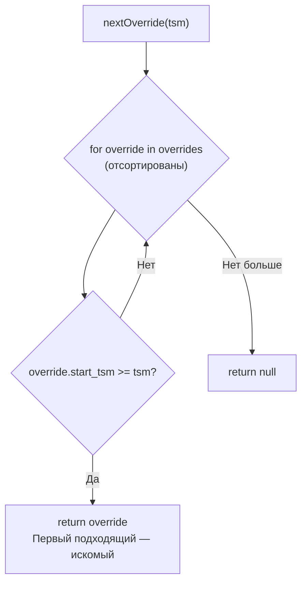

**Test Cases:**

| № | Категория | Входные данные | Ожидаемый результат | Проверяется |
|---|-----------|----------------|---------------------|-------------|
| 1 | Happy Path | tsm=28416600, overrides=[{start_tsm: 28419600, end_tsm: 28427000, name: "override1"}] | override1 | Override с start_tsm больше tsm возвращается (первый подходящий)|
| 2 | Happy Path | tsm=28419600 (точно на start override), overrides=[{start_tsm: 28419600, end_tsm: 28427000}] | override | Override с start_tsm == tsm возвращается |
| 3 | Happy Path | Несколько overrides: [start=28401120, start=28416600, start=28429200], tsm=28414800 | override со start=28416600 | Первый override с start >= tsm |
| 4 | Edge | tsm=28401000 (раньше всех), overrides=[{start_tsm: 28401120, ...}] | override | Дажё если tsm раньше первого override, он возвращается |
| 5 | Edge | tsm=28500000 (позже всех), overrides=[{start_tsm: 28401120, ...}, {start_tsm: 28429200, ...}] | null | Все overrides раньше tsm → null |
| 6 | Empty | overrides = [], tsm=28416600 | null | Пустой массив overrides |
| 7 | Empty | overrides = null, tsm=28416600 | null | Null overrides |
| 8 | Error | tsm = null, overrides=[{start_tsm: 28401120, ...}] | null | Обработка null входного tsm |

#### Метод `nextWorkDateEntry(tsm, target)` — найти ближайшую запись на дату с рабочими интервалами

Ищет первую запись в target.dates с интервалами, которые ещё не закончились полностью.
Критерий: date_tsm >= tsm AND (date_tsm + 1440) > tsm.
ГАРАНТИЯ: target.dates отсортирован по ключу (date_tsm) при компиляции.

**Особенности обработки текущего дня:**
- Если date_tsm совпадает с датой tsm (текущий день), необходимо отфильтровать интервалы, которые уже завершились к моменту tsm
- Интервал считается завершённым, если его конец <= минутам от начала дня tsm
- Если все интервалы отфильтрованы — дата пропускается
- Возвращается клон записи с отфильтрованными интервалами (мутация оригинала недопустима)

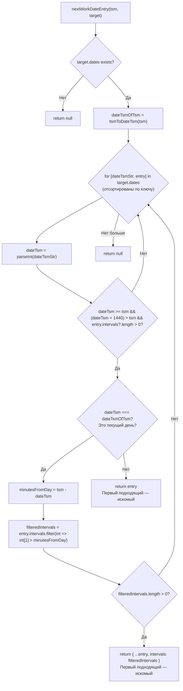

**Test Cases:**

| № | Категория | Входные данные | Ожидаемый результат | Проверяется |
|---|-----------|----------------|---------------------|-------------|
| 1 | Happy Path | tsm=28416600, target.dates={"28429200": {intervals: [[480, 1020, {}]], ...}}, date_tsm=28429200 (будущая дата) | entry с intervals=[[480, 1020, {}]] | Дата ищется в target.dates отсортирован, найти первую с date_tsm >= tsm |
| 2 | Happy Path | tsm=28416600, target.dates={"28414800": {intervals: [...]}} (дата раньше tsm и dayEnd < tsm) | null | Дата уже полностью прошла (dayEnd = date_tsm + 1440 <= tsm) |
| 3 | Happy Path | Несколько дат в dates: {28401120, 28414800, 28429200}, tsm=28416600 | entry для 28429200 | Первая дата с date_tsm >= tsm AND (date_tsm + 1440) > tsm |
| 4 | Edge | tsm точно совпадает с date_tsm (текущий день): tsm=28414800, date_tsm=28414800 | entry с отфильтрованными интервалами | Проверка minutesFromDay: фильтруются интервалы с end <= minutesFromDay |
| 5 | Edge | Дата без интервалов (пустые): target.dates={"28414800": {intervals: []}} | null | Пропустить дату без интервалов |
| 6 | Edge | Дата уже полностью прошла: tsm=28429200, date_tsm=28414800 (end=28414800+1440=28416240 < tsm) | null | День завершился до tsm |
| 7 | Edge | Текущий день (tsm и date_tsm одна дата), все интервалы завершились: tsm=28414800+901 (15:01), date_tsm=28414800, intervals=[[480, 900, {}]] | null | Все интервалы кончились (900 <= 901) |
| 8 | Edge | Текущий день, некоторые интервалы ещё активны: tsm=28414800+901, date_tsm=28414800, intervals=[[480, 900, {}], [1200, 1320, {}]] | entry с intervals=[[1200, 1320, {}]] | Отфильтровать: оставить только int[1] > minutesFromDay |
| 9 | Edge | Следующий день (date_tsm > tsmDateOnly): tsm=28414800+100, date_tsm=28416240 (следующий день) | entry с полными intervals | Не текущий день: вернуть без фильтрации |
| 10 | Edge | Точно в начало дня (tsm = date_tsm): tsm=28414800, date_tsm=28414800, intervals=[[480, 1020, {}]] | entry с полными intervals | minutesFromDay=0 → все интервалы с end > 0 |
| 11 | Edge | За минуту до начала дня: tsm=28414799, date_tsm=28414800, intervals=[[480, 1020, {}]] | entry с полными intervals | Дата ещё в будущем (даже за 1 минуту) |
| 12 | Edge | Первая дата совпадает с tsm ровно: tsm=28429200, date_tsm=28429200 (новый день) | entry с полными intervals | Точное совпадение на новый день (текущий = следующий) |
| 13 | Empty | target.dates = {}, tsm=28416600 | null | Пустые dates |
| 14 | Empty | target.dates = null, tsm=28416600 | null | Null dates |
| 15 | Error | tsm = null, target.dates={...} | null | Обработка null входного tsm |
| 16 | Error | target = null | null | Обработка null target |

#### Метод `nextRecord(pos, target)` — поиск ближайшей рабочей записи

Находит в расписании target ближайший справа к pos элемент из набора:
- periods[is_work=true] - периоды непрерывной работы
- override (если target это main)
- дата-исключение с рабочим графиком (если target это main)
- день из расписания на неделю с рабочим графиком

ГАРАНТИЯ: overrides и dates отсортированы при компиляции. Периоды проверяются перебором (необходимо отсортировать при компиляции).

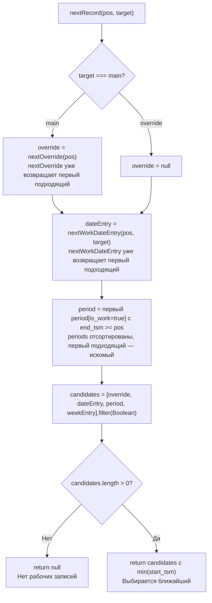

**Test Cases:**

| № | Категория | Входные данные | Ожидаемый результат | Проверяется |
|---|-----------|----------------|---------------------|-------------|
| 1 | Happy Path | pos=28416600, target=main, есть override (start=28419600) и dateEntry (start=28429200) и work-period (start=28423200) | Выбирается элемент с min(start_tsm): override | Сравнение всех кандидатов, выбор ближайшего |
| 2 | Happy Path | pos=28416600, target=override (не main), есть work-period (start=28423200) | work-period | Поиск периода работы в override |
| 3 | Happy Path | pos=28416600, target=main, нет override/periods, есть weekday 3 (среда) с intervals=[[480, 1020, {}]] | weekday вернуть из _findWeekdayEntry | День недели с рабочим графиком или default |
| 4 | Edge | pos=28416600, все кандидаты имеют пустые intervals: override.intervals=[], dateEntry.intervals=[], etc. | null | Нет рабочих записей (filterBefore исключит пустые) |
| 5 | Edge | pos внутри интервала weekday: pos=28416600, weekday[3].intervals=[[480, 1020, {}]], текущий день есть | weekday с обрезанным intervalом (filterBefore) | Обрезание intervals после текущего времени |
| 6 | Edge | Все 7 дней недели без рабочих интервалов | null | Нет рабочих дней в цикле |
| 7 | Edge | pos=28500000 (далеко в будущем), все candidates кончились | null | Рабочее время не найдено на горизонте |
| 8 | Empty | target.weekdays = {}, target.default = null | null | Нет weekdays и default |
| 9 | Error | target = null | null | Обработка null target |
| 10 | Error | pos = null | null | Обработка null pos |
| 11 | Integration | Вызов nextOverride, nextWorkDateEntry, findPeriod, _findWeekdayEntry, filterBefore | Корректный результат со всеми интеграциями | Полная цепь всех вызовов |

#### Метод `findPeriod(dateTime,is_work)` — поиск периода непрерывной работы/простоя на дату время

- `is_work=true` — ищем период непрерывной работы, который перекрывает dateTime
- `is_work=false` — ищем период простоя, который перекрывает dateTime
- `is_work=null` — ищем любой период, который перекрывает dateTime

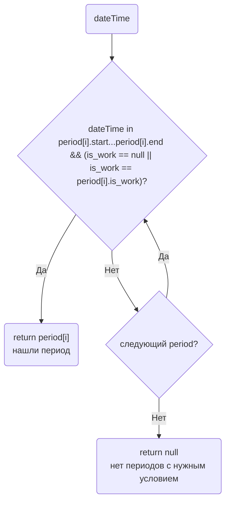

**Test Cases:**

| № | Категория | Входные данные | Ожидаемый результат | Проверяется |
|---|-----------|----------------|---------------------|-------------|
| 1 | Happy Path | is_work=true, dateTime=28417200 (внутри period[start=28416000, end=28419600, is_work=true]) | period object | Поиск work периода: перебор и проверка is_work==true, проверка dateTime в [start, end) |
| 2 | Happy Path | is_work=false, dateTime=28417200 (внутри period[start=28416000, end=28419600, is_work=false]) | period object | Поиск non-work периода: is_work==false |
| 3 | Happy Path | is_work=null, dateTime=28417200 (внутри любого периода, независимо от типа) | period object (первый найденный) | Поиск любого периода: условие is_work пропускается |
| 4 | Edge | is_work=true, dateTime точно на start: dateTime=28416000, period[start=28416000, end=28419600, is_work=true] | period | Левая граница включена [start, end) |
| 5 | Edge | is_work=true, dateTime точно на end: dateTime=28419600, period[start=28416000, end=28419600, is_work=true] | null | Правая граница не включена [start, end) |
| 6 | Edge | is_work=true, dateTime вне всех периодов: dateTime=28500000, periods=[{start=28416000, end=28419600}] | null | Нет пересечения ни с каким периодом |
| 7 | Empty | periods = [], is_work=true, dateTime=28417200 | null | Пустой массив периодов |
| 8 | Empty | periods = null, is_work=true, dateTime=28417200 | null | Null periods |
| 9 | Error | dateTime = null, periods=[{...}], is_work=true | null | Обработка null dateTime |
| 10 | Validation | Пересекающиеся периоды (при компиляции они должны быть отсортированы и не пересекаться, как гарантия) | Exception при валидации БД в onBeforeSave | ВАЛИДАЦИЯ БД: периоды не могут пересекаться |

#### Метод `findOverride(dateTime)` — поиск перекрытия расписания на дату/время

находит override, который перекрывает dateTime, либо main если такого нет и работаем в этом месте по осноному расписанию

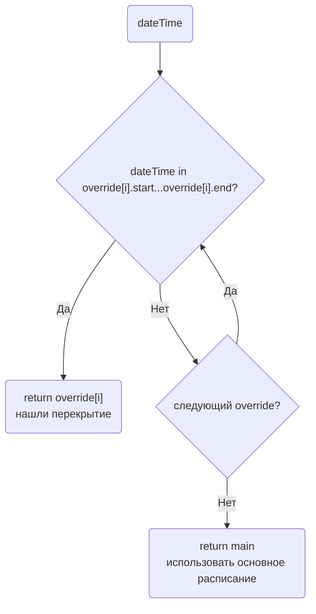

**Test Cases:**

| № | Категория | Входные данные | Ожидаемый результат | Проверяется |
|---|-----------|----------------|---------------------|-------------|
| 1 | Happy Path | dateTime=28417200 (внутри override[start=28416000, end=28427000]) | override object | Поиск override, перекрывающего dateTime: проверка dateTime >= start AND dateTime < end |
| 2 | Happy Path | dateTime=28428000 (вне всех override) | main object | Fallback: когда dateTime не входит ни в какой override |
| 3 | Edge | dateTime=28416000 (точно на start override) | override | Левая граница включена [start, end) |
| 4 | Edge | dateTime=28427000 (точно на end override) | main | Правая граница не включена: dateTime < end |
| 5 | Edge | dateTime между двумя override (есть разрыв) | main | Между overrides |
| 6 | Edge | Override с end=null (безграничный): dateTime=28500000 (после start) | override | Условие: dateTime >= start, нет проверки end |
| 7 | Edge | Несколько overrides, dateTime в среднем: overrides=[{start=28401120, end=28414800}, {start=28416000, end=28427000}, {start=28429200, end=28435400}], dateTime=28417200 | override со start=28416000 | Первый найденный override (перебором) |
| 8 | Empty | overrides = [], dateTime=28417200 | main | Пустой массив overrides |
| 9 | Empty | overrides = null, dateTime=28417200 | main | Null overrides |
| 10 | Error | dateTime = null, overrides=[...] | main | Обработка null: вернуть main (не исключение) |
| 11 | Error | main = null, dateTime=28417200, overrides=[...] | null | Обработка: нет основного расписания |
| 12 | Validation | Пересекающиеся overrides (должны проверяться при компиляции) | Exception при валидации БД | ВАЛИДАЦИЯ БД: overrides не могут пересекаться |

---

#### PHP (внутреннее использование)

- [ ] `CompiledScheduleHelper` — класс для работы с компилированными расписаниями

#### JS (внешние системы)

- [ ] `ScheduleRuntime` — класс для работы с JSON на клиенте

#### Lua (для интеграции с Asterisk)

## Вопросы для уточнения

- **Версионирование:** нужно ли хранить историю версий скомпилированных расписаний - нет
- **Горизонт компиляции:** на какой срок вперёд/назад компилировать даты-исключения и перекрытия?
  - По умолчанию можно собрать все данные
  - Но также рассмотреть, например, 1 год вперёд и 1 год назад от текущей даты для оптимизации размера JSON - есть ли сценарии, где нас это может не устроить?
