# План компиляции расписаний

## Целевое состояние

Скомпилированное расписание хранится в поле `compiled_json` таблицы `schedules` и представляет собой плоскую структуру данных для быстрого поиска без рекурсии и запросов к БД.

---

## Структура скомпилированного расписания

```json
{
  "tz": "Asia/Yekaterinburg",
  "tz_shift_tsm": 300,
  "compiled": "2024-01-15T10:30:00Z",
  "main": {
    "name": "График работы офиса",
    "start": "2024-01-01",
    "start_tsm": 28401120,
    "end": null,
    "end_tsm": null,
    "default": {
      "schedule": "08:00-17:00",
      "intervals": [[480, 1020, {}]]
    },
    "weekdays": {
      "1": { "schedule": "08:00-17:30", "intervals": [[480, 1050, {}]], "comment": "Понедельник с удлинённым графиком"},
      "5": { "schedule": "08:00-16:00", "intervals": [[480, 960, {"user":"pupkin"}]], "comment": "Пятница с укороченным графиком"},
      "6": { "schedule": "-", "intervals": [] },
      "7": { "schedule": "-", "intervals": [] }
    },
    "dates": {
      "28401120": { "date_tsm": 28401120, "schedule": "-", "intervals": [], "comment": "С новым годом!" },
      "28402560": { "date_tsm": 28402560, "schedule": "10:00-15:00", "intervals": [[600, 900, {}]], "comment": "Работа в первый день после праздника" }
    },
    "periods": [
      { "start": "2024-01-10 10:00", "start_tsm": 28414680, "end": "2024-01-12 22:59", "end_tsm": 28418139, "is_work": true, "comment": "Работали непрерывно в связи с форсмажором" },
      { "start": "2024-02-01 15:10", "start_tsm": 28446430, "end": "2024-02-02 18:17", "end_tsm": 28448047, "is_work": false, "comment": "Аварийное отключение электричества" }
    ],
  },
  "overrides": [
    {
      "name": "Лето 2024",
      "start": "2024-06-01",
      "start_tsm": 28620000,
      "end": "2024-08-31",
      "end_tsm": 28752400,
      "default": { "schedule": "09:00-18:00", "intervals": [[540, 1080, {}]] },
      "weekdays": {},
      "comment": "Летний график 2024"
    }
  ]
}
```

**Пояснение к атрибутам с суффиксом `_tsm`:**

- `_tsm` (timestamp in minutes) — количество минут от Unix epoch (01.01.1970 00:00 UTC)
- Пример: `2024-01-01 00:00:00` → `1704067200` секунд → `28401120` минут
- Используется для быстрых числовых сравнений без парсинга строк и конвертации дат
- Строковые представления (`start`, `end`, `date`) сохранены для отладки и JSON API

---

## Ограничения консистентности данных

### Для исходных данных (до компиляции)

Ограничения, накладываемые валидацией БД:

- **Периоды (periods)** — не могут пересекаться внутри одного расписания. Валидация не даст создать перекрывающиеся периоды.
- **Перекрытия (overrides)** — не могут пересекаться. Валидация не даст создать несколько перекрытий на одну дату.
- **Записи на день недели/дату** — в одном расписании не может быть несколько записей на один и тот же день недели или одну дату. Валидация не даст создать дублирующие записи.

### Для скомпилированных данных

Ограничения, гарантируемые компиляцией:

- **Интервалы в графике** — при компиляции все коллизии интервалов разрешаются: накладывающиеся интервалы (например, `08:00-12:00{meta1}` и `10:00-14:00{meta2}`) автоматически разделяются по границе: `08:00-10:00{meta1}` и `10:00-14:00{meta2}`. Следовательно, в скомпилированном расписании **коллизии интервалов невозможны**.
- **Границы временных интервалов** — при проверке попадания отметки времени `t` в границы `start ... end`: `t >= start` и `t < end`. То есть если расписание заканчивается в 17:00, то 17:00 уже не входит в рабочее время. Это касается всех сценариев: попадание в периоды (periods), в перекрытия (overrides), в интервалы (intervals).
- **Сортировка данных для поиска** — для оптимизации алгоритмов поиска все данные отсортированы:
  - `periods` — отсортирован по `start_tsm` по возрастанию
  - `overrides` — отсортирован по `start_tsm` по возрастанию
  - `dates` — ключи (date_tsm строки) отсортированы по возрастанию
  - `weekdays` — ключи (1-7) естественно упорядочены по дням недели (1=пн, 7=вс)

  **Преимущества сортировки:**
  - При поиске ближайшего элемента не нужна сортировка — достаточно взять первый элемент, удовлетворяющий условию
  - Сложность поиска O(n) упрощается до O(1) для первого элемента
  - Можно использовать бинарный поиск (O(log n)) для нахождения элемента по диапазону

---

## Задачи компиляции

### 1. Сборка цепочки предков в плоский список

- [ ] Получить все расписания-основы (без `override_id`) от текущего до корня иерархии
- [ ] Получить все перекрытия (`override_id = self.id`) с их периодами действия
- [ ] Результат: плоский массив объектов `main` + `overrides[]`

### 2. Парсинг текстового графика в минутные интервалы

- [ ] Конвертация "08:00-17:00" → `[480, 1020]`
- [ ] Конвертация "08:00-12:00,13:00-17:00" → `[[480, 720], [780, 1020]]`
- [ ] Конвертация "-" (выходной) → `[]`
- [ ] Извлечение метаданных из `{...meta}` суффикса
- [ ] Устранение пересечений согласно правилу из readme.md: 08:00-12:00{meta1} и 10:00-14:00{meta2} -> 08:00-10:00{meta1} и 10:00-14:00{meta2}

### 3. Расчёт timestamp in minutes (_tsm)

- [ ] Конвертация дат/времени в `_tsm` (минуты от Unix epoch)
- [ ] `main.start_tsm`, `main.end_tsm` — границы основного расписания
- [ ] `override.start_tsm`, `override.end_tsm` — границы перекрытий
- [ ] `period.start_tsm`, `period.end_tsm` — границы периодов
- [ ] `date_tsm` в ключах `dates` — timestamp даты (начало дня)

### 4. Унификация структуры базового расписания и перекрытий

- [ ] Обе сущности должны иметь идентичную структуру: `name`, `start`, `end`, `default`, `weekdays`, `dates`, `periods`, `comment`
- [ ] Поле `tz` — часовой пояс (из `schedules` или `Yii::$app->params['schedulesTZShift']`)

### 5. Типовое описание entry (запись дня)

| Поле | Тип | Описание |
| ---- | --- | -------- |
| `schedule` | string | Оригинальный текстовый график "08:00-17:00" или "-" |
| `intervals` | array | Массив интервалов рабочего времени |
| `meta` | object | Метаданные записи (опционально) |
| `comment` | string | Комментарий к записи |

**Интервал:** `[start_minute, end_minute, {meta}]`

- Пример: `[480, 1020, {}]` — 08:00-17:00 без метаданных
- Пример: `[600, 900, {"duty": "Иванов"}]` — 10:00-15:00 с метаданными

### 6. Типовое описание периода (period)

| Поле | Тип | Описание |
| ---- | --- | -------- |
| `start` | string | Дата начала "YYYY-MM-DD hh:mm" |
| `start_tsm` | integer | Timestamp in minutes от epoch |
| `end` | string | Дата окончания "YYYY-MM-DD hh:mm" |
| `end_tsm` | integer | Timestamp in minutes от epoch |
| `is_work` | boolean | true — рабочий период, false — нерабочий |
| `comment` | string | Комментарий к периоду |

---

## Применение периодов к расписанию

Логика наложения периодов на день (реализуется в runtime JS/PHP библиотеке):

1. Найти периоды, перекрывающие дату
2. Для каждого периода:
   - если is_work=true: добавить intervals к рабочим
   - если is_work=false: вычесть intervals из рабочих
3. Слить пересекающиеся интервалы

---

## Инвалидация и перекомпиляция

- [ ] Вызов компиляции в `onBeforeSave()` модели `Schedules`
- [ ] Каскадная перекомпиляция всех потомков (через `parent_id`)

---

## Библиотеки для работы

### Компиляция

- [ ] `Schedules.compile` — метод компиляции расписаний в JSON

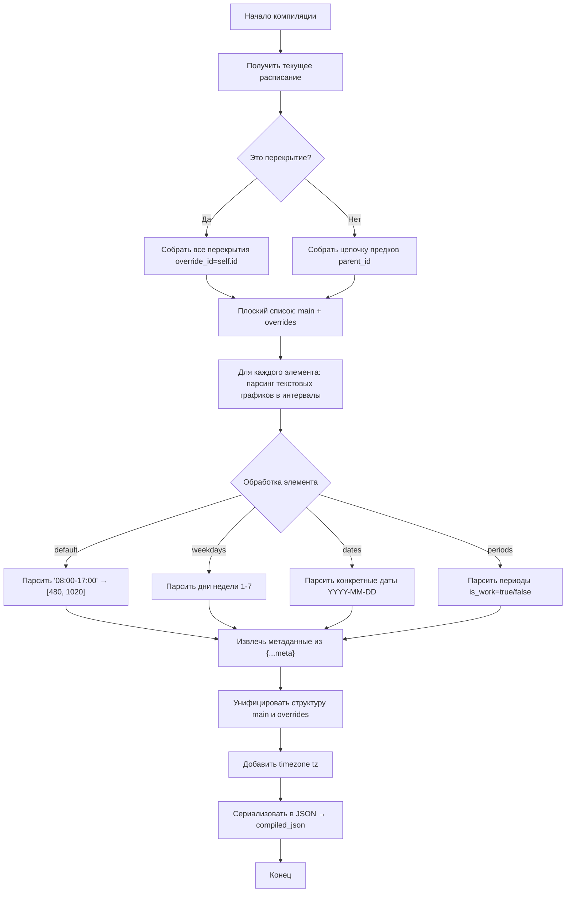

### Работа со скомпилированным расписанием

Необходимо чтобы библиотека реализовывала методы обработки скомпилированного расписания:

- IsWorkDay(date) — рабочий/не рабочий день (на дату YYYY-MM-DD)
- IsWorkTime(dateTime) — рабочее/не рабочее время (на дату/время YYYY-MM-DD hh:mm)
- GetMeta(dateTime) — метаданные на дату/время YYYY-MM-DD hh:mm (если есть, иначе null)
- NextWorkingDateTime(dateTime) — ближайшее рабочее дата/время (либо текущее либо следующее) в формате "YYYY-MM-DD hh:mm" (если вернулось меньше dateTime, значит dateTime в рабочем перириоде)
- NextWorkingMeta(dateTime) — метаданные на ближайшее рабочее дату/время (либо текущее либо следующее)

Для простых функций сделано описание на JS для более сложных добавлена диаграмма

### Алгоритмическое описание работы со скомпилированным расписанием

#### Метод `getDatePeriods(date_tsm)` — получить периоды, попадающие в дату

Возвращает периоды, которые "зацепляют" указанный день хотя бы одним концом (перекрывающие + касающиеся границ).

**Алгоритм:** период попадает в день, если он заканчивается НЕ раньше начала дня ИЛИ начинается РАНЬШЕ конца дня:

- `period.end_tsm >= dayStart` — период заканчивается в начале дня или позже
- `period.start_tsm < dayEnd` — период начинается до конца дня

```js
function getDatePeriods(date_tsm) {
    const dayStart = tsmToDateTsm(date_tsm)       // Начало дня (00:00)
    const dayEnd   = dayStart + 1440              // Конец дня (24ч = 1440 мин)
    const periods  = schedule.periods             // Все периоды расписания
    const result   = []                           // Пустой массив результата
    
    for (const period of periods) {
        // Период попадает в день, если:
        // - заканчивается НЕ РАНЬШЕ начала дня (end_tsm >= dayStart)
        // ИЛИ
        // - начинается РАНЬШЕ конца дня (start_tsm < dayEnd)
        if (period.end_tsm >= dayStart || period.start_tsm < dayEnd) {
            result.push(period)             // Добавить период в результат
        }
    }
    
    return result
}
```

**Test Cases:**

| № | Категория | Входные данные | Ожидаемый результат | Описание теста |
|---|-----------|----------------|---------------------|----------------|
| 1 | Happy Path | Период: 2024-01-10 10:00 - 2024-01-12 22:59, date_tsm = 2024-01-11 00:00 | Период включён | Период полностью охватывает день |
| 2 | Happy Path | Период: 2024-01-11 00:00 - 2024-01-11 12:00, date_tsm = 2024-01-11 00:00 | Период включён | Период начинается с начала дня |
| 3 | Happy Path | Период: 2024-01-11 12:00 - 2024-01-12 00:00, date_tsm = 2024-01-11 00:00 | Период включён | Период заканчивается в конце дня |
| 4 | Edge | Период: 2024-01-10 23:59 - 2024-01-11 00:01, date_tsm = 2024-01-11 00:00 | Период включён | Период минимально перекрывает день |
| 5 | Edge | Период: 2024-01-11 00:00 - 2024-01-11 00:00, date_tsm = 2024-01-11 00:00 | Период включён | Период нулевой длительности |
| 6 | Edge | Период: 2024-01-10 00:00 - 2024-01-11 00:00, date_tsm = 2024-01-11 00:00 | Период НЕ включён | период заканчивает ровно в начале дня, но согласно логике работы с временными интервалами левая граница включается, а правая нет. поэтому в точке 2024-01-11 00:00 включается левая граница начала дня и не включается правая граница периода |
| 7 | Edge | Период: 2024-01-12 00:00 - 2024-01-12 23:59, date_tsm = 2024-01-11 00:00 | Период НЕ включён | Период начинается на следующий день |
| 8 | Edge | Период: 2023-12-01 - 2024-01-11 15:00, date_tsm = 2024-01-11 00:00 | Период включён | Период начался задолго до дня, но заканчивается внутри дня |
| 9 | Empty | schedule.periods = [] | Пустой массив | Нет периодов в расписании |
| 10 | Empty | schedule.periods = null | Пустой массив | Периоды не заданы |
| 11 | Error | date_tsm = null | Пустой массив | Входной параметр null |
| 12 | Error | date_tsm = undefined | Пустой массив | Входной параметр undefined |

TODO: добавить период начинающийся и заканчивающийся внутри дня

#### Метод `getDatePeriodsIntervals(date_tsm)` — получить интервалы периодов, перекрывающих дату

Возвращает набор интервалов в пределах дня date_tsm, полученных из перекрывающих день периодов.

```json
{
  "positive": [ // периоды непрерывной работы, накладывающие рабочее время
    [600, 900, {"comment":"Работали непрерывно в связи с форсмажором"}]
  ],
  "negative": [ // периоды простоя, накладывающие нерабочее время
    [910, 1000, {"comment":"Аварийное отключение электричества"}]
  ]
}
```

```JS
/**
 * Возвращает набор интервалов в пределах дня date_tsm, 
 * полученных из перекрывающих день периодов.
 * 
 * @param {number} date_tsm - timestamp in minutes начала дня
 * @returns {Object} { positive: [], negative: [] }
 */
function getDatePeriodsIntervals(date_tsm) {
    // 1. Получаем периоды, перекрывающие дату
    const periods = getDatePeriods(date_tsm);
    
    // 2. Вычисляем границы дня
    const dayStart = tsmToDateTsm(date_tsm);   // Начало дня (00:00 tsm)
    const dayEnd = dayStart + 1440;            // Конец дня (24ч = 1440 мин)
    
    // 3. Инициализация результата
    const positive = [];    // Периоды работы (is_work = true)
    const negative = [];    // Периоды простоя (is_work = false)
    
    // 4. Для каждого периода вычисляем пересечение с днём
    for (const period of periods) {
        // 4.1. Обрезаем период по границам дня
        const intervalStart = Math.max(period.start_tsm, dayStart);
        const intervalEnd = Math.min(period.end_tsm, dayEnd);
        
        // 4.2. Конвертируем в минуты от начала дня (0-1440)
        const startMinute = intervalStart - dayStart;
        const endMinute = intervalEnd - dayStart;
        
        // 4.3. Формируем интервал [start, end, meta]
        const interval = [startMinute, endMinute, period.meta || {}];
        
        // 4.4. Добавляем в соответствующий массив
        if (period.is_work === true) {
            positive.push(interval);   // Добавить в work-периоды
        } else {
            negative.push(interval);   // Добавить в non-work периоды
        }
    }
    
    // 5. Возвращаем результат
    return { positive, negative };
}
```

**Test Cases:**

Задача проверить наложение периодов на рабочий график тестового дня.


| № | Категория | Входные данные | Ожидаемый результат | Описание теста |
|---|-----------|----------------|---------------------|----------------|
| 1 | Happy Path | Период is_work=true: 2024-01-11 08:00-12:00, date_tsm=2024-01-11 | positive: [[480, 720, {}]], negative: [] | Период работы внутри дня |
| 2 | Happy Path | Период is_work=false: 2024-01-11 08:00-12:00, date_tsm=2024-01-11 | positive: [], negative: [[480, 720, {}]] | Период простоя внутри дня |
| 3 | Happy Path | Несколько периодов: work + non-work, date_tsm=2024-01-11 | positive и negative заполнены | Оба типа периодов |
| 4 | Edge | Период выходит за границы дня: 2024-01-10 20:00 - 2024-01-12 04:00, date_tsm=2024-01-11 | Интервал обрезан до [0, 1440] | Период шире дня |
| 5 | Edge | Период начинается в полночь: 2024-01-11 00:00 - 2024-01-11 08:00, date_tsm=2024-01-11 | Интервал: [0, 480] | Период с начала дня |
| 6 | Edge | Период заканчивается в полночь: 2024-01-11 20:00 - 2024-01-12 00:00, date_tsm=2024-01-11 | Интервал: [1200, 1440] | Период до конца дня |
| 7 | Edge | Период ровно один час: 2024-01-11 10:00 - 2024-01-11 11:00, date_tsm=2024-01-11 | Интервал: [600, 660] | Минимальный период |
| 8 | Empty | getDatePeriods возвращает [] | {positive: [], negative: []} | Нет периодов |
| 9 | Empty | periods = null | {positive: [], negative: []} | periods null |
| 10 | Error | date_tsm = null | {positive: [], negative: []} | Входной параметр null |
| 11 | Integration | Вызов после getDatePeriods | Корректные intervals | Проверка интеграции с getDatePeriods |

TODO:

- не понял 11 - getDatePeriods вызывается внутри каждого getDatePeriodsIntervals. Какая дополнительная интеграция?
- нет периодов -> график не изменяется
- рабочий период перекрывает день с графиком -> график меняется на "00:00-24:00"
- нерабочий период перекрывает день  -> график меняется на "-"
- график состоит из трех разделенных интервалов с метаданными. нерабочий период начинается в середине первого интелвала и зкаканчивается в третьем -> первый и последний интервалы обрезаются до границ периода. средний период удален из графика.
- график состоит из трех разделенных интервалов с метаданными. рабочий период начинается в середине первого интелвала и зкаканчивается в третьем -> первый и последний интервалы обрезаются до границ периода. период формирует рабочее время без метаданных между ними. средний период удален из графика.
- график состоит из трех разделенных интервалов с метаданными. рабочий период не имеет начала и заканчивается середине второго интелвала -> график от 00:00 и до середины второго интервала заменяется на рабочее время без метаданных, второй интервал обрезается периодом, третий без изменений
- график состоит из трех разделенных интервалов с метаданными. нерабочий период начинается в середине второго интелвала и не заканчивается -> график от середины второго интервала и до 24:00 очищается, второй интервал обрезается периодом, первый без изменений

#### Метод `applyPeriodsToDay(baseIntervals, periods, dateTsm)` — наложение периодов на интервалы дня

Нал periods на интервалы дня:

- **negative** (is_work=false): вычитаются из интервалов
- **positive** (is_work=true): добавляются к интервалам, при этом **meta периода заменяет meta интервала** в зоне пересечения

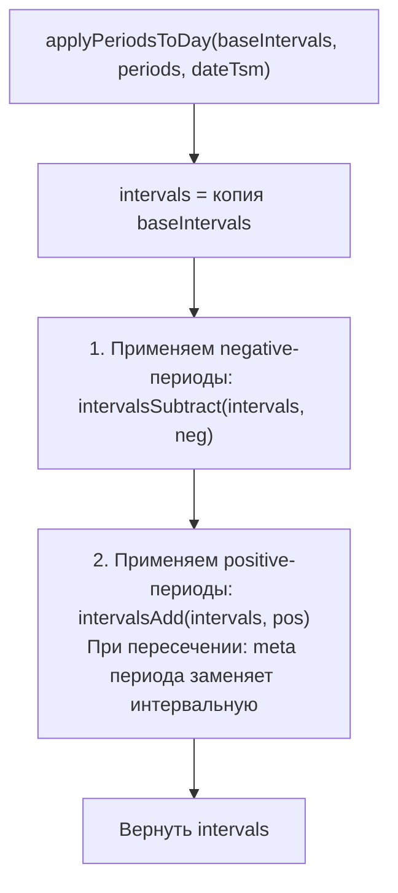

**Алгоритм:**
```js
function applyPeriodsToDay(baseIntervals, periods, dateTsm) {
    let intervals = [...baseIntervals];
    
    // 1. Вычитаем negative-периоды (is_work=false)
    for (const neg of periods.negative) {
        intervals = intervalsSubtract(intervals, neg);
    }
    
    // 2. Добавляем positive-периоды (is_work=true)
    // При пересечении: period имеет приоритет, его meta заменяет интервальный
    for (const pos of periods.positive) {
        intervals = intervalsAdd(intervals, pos);
    }
    
    return intervals;
}
```

**О функции intervalsAdd:**

Алгоритм: сначала вычитаем override (освобождаем место), затем добавляем override в массив. Это проще сложной логики обработки пересечений.

При наложении интервала override (period) на массив интервалов:
- Пересекающиеся части получают meta от override
- Части вне override сохраняют оригинальную meta  
- Если override не пересекается с интервалами — добавляется как новый интервал (для positive периодов, добавляющих рабочее время)

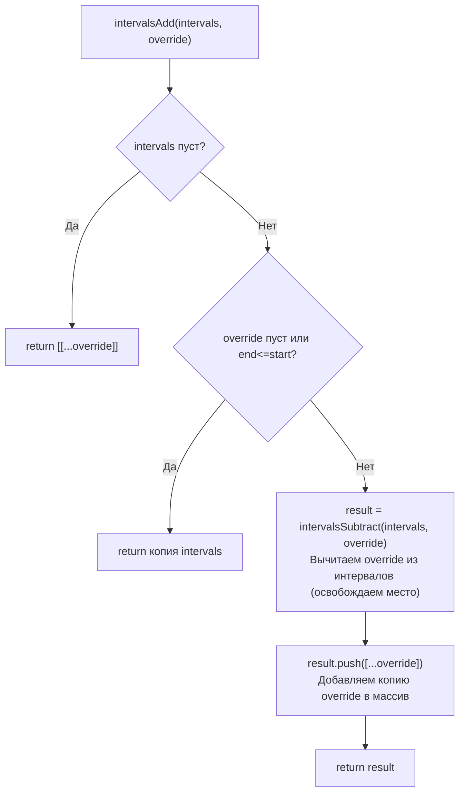

**Test Cases:**

| № | Категория | Входные данные | Ожидаемый результат | Описание теста |
|---|-----------|----------------|---------------------|----------------|
| 1 | Happy Path | base=[480,1020], positive=[600,900], negative=[] | [480,1020] + [600,900] | Добавление work периода |
| 2 | Happy Path | base=[480,1020], positive=[], negative=[500,600] | [480,1020] - [500,600] | Вычитание non-work |
| 3 | Happy Path | Пересекающиеся интервалы: base=[[480,600],[700,1020]], positive=[550,750] | [[480,1020]] | Слияние пересечений |
| 4 | Edge | Пустой baseIntervals | positive или negative | Работа с пустым базовым |
| 5 | Edge | Пустой periods | baseIntervals | Без периодов |
| 6 | Edge | Полное перекрытие: base=[480,1020], negative=[400,1200] | [] | Интервал полностью удалён |
| 7 | Edge | Частичное перекрытие: base=[480,1020], negative=[500,600] | [[480,500],[600,1020]] | Разделение интервала |
| 8 | Edge | Несколько перекрытий: base=[480,1020], negative=[[500,600],[700,800]] | [[480,500],[600,700],[800,1020]] | Множественное вычитание |
| 9 | Empty | base=[], positive=[], negative=[] | [] | Всё пустое |
| 10 | Error | baseIntervals = null | [] | Null входные данные |
| 11 | Integration | Вызов intervalsMerge, intervalsSubtract | Корректный результат | Интеграция с интервальными функциями |

#### Метод `getDateIntervals(date_tsm)` — получить интервалы расписания на дату

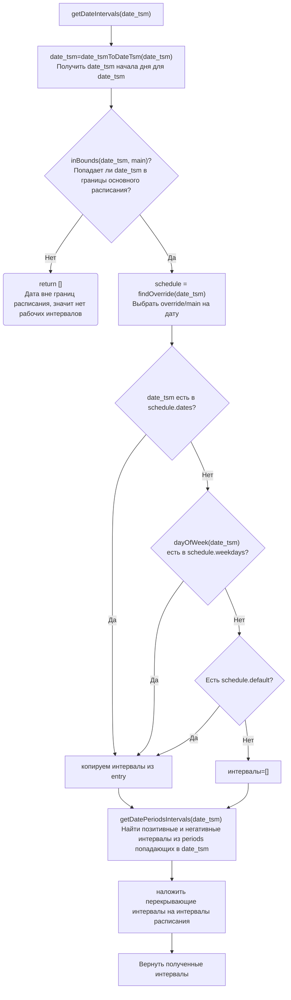

**Test Cases:**

| № | Категория | Входные данные | Ожидаемый результат | Описание теста |
|---|-----------|----------------|---------------------|----------------|
| 1 | Happy Path | Дата в weekdays: понедельник с графиком 08:00-17:00 | [[480, 1020, {}]] | Стандартный рабочий день |
| 2 | Happy Path | Дата в dates (исключение): 2024-01-01 с графиком 10:00-15:00 | [[600, 900, {}]] | Переопределённая дата |
| 3 | Happy Path | Дата в dates с "-" (выходной) | [] | Явный выходной |
| 4 | Happy Path | Override active: летнее время, date_tsm в периоде override | Интервалы из override | Override переопределяет main |
| 5 | Edge | Дата вне границ расписания (до start или после end) | [] | Расписание ещё не началось или закончилось |
| 6 | Edge | Дата = start граница | Интервалы | Точно на границе start |
| 7 | Edge | Дата = end граница | [] | Точно на границе end |
| 8 | Edge | Пустой weekdays и нет default | [] | Нет интервалов для даты |
| 9 | Edge | Пустой dates и weekday без интервалов | [] | Запись есть но пустая |
| 10 | Edge | Период is_work=true добавляет интервалы | Базовые + период | Наложение work периода |
| 11 | Edge | Период is_work=false удаляет интервалы | Базовые минус период | Наложение non-work периода |
| 12 | Empty | main = null | [] | Основное расписание не задано |
| 13 | Empty | schedule = null | [] | Расписание не найдено |
| 14 | Error | date_tsm = null | [] или Exception | Входной параметр null |
| 15 | Integration | Вызов после applyPeriodsToDay | Корректные intervals | Проверка интеграции всех вызовов |
| 16 | Validation | Дублирование записи на один день недели | Exception/Error | ВАЛИДАЦИЯ: нельзя создать 2 записи на один день недели |
| 17 | Validation | Дублирование записи на одну дату | Exception/Error | ВАЛИДАЦИЯ: нельзя создать 2 записи на одну дату |

TODO:

- 4: для override нужно обспечить ожидаемое расписание. в тесте нет конкретных данных по расписанию override и какие данные ожидать


#### Метод `isWorkDay(date_tsm)` — проверка рабочего дня на дату

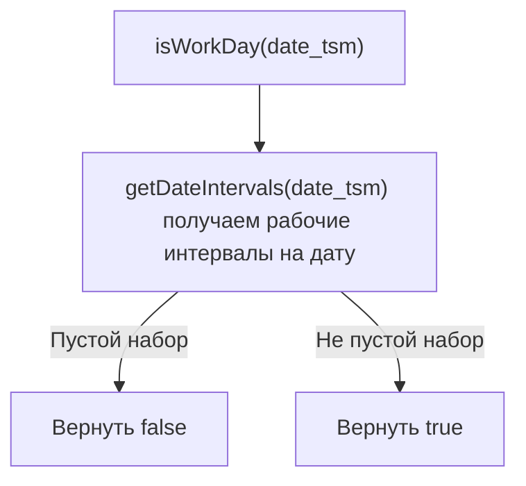

**Test Cases:**

| № | Категория | Входные данные | Ожидаемый результат | Описание теста |
|---|-----------|----------------|---------------------|----------------|
| 1 | Happy Path | Рабочий день с 08:00-17:00 | true | Стандартный рабочий день |
| 2 | Happy Path | Выходной (суббота, воскресенье) с графиком "-" | false | Выходной день |
| 3 | Happy Path | Дата-исключение с рабочим графиком | true | Переопределённый рабочий день |
| 4 | Happy Path | Дата-исключение с "-" (праздник) | false | Явный выходной (праздник) |
| 5 | Edge | Пустой intervals | false | Нет рабочего времени |
| 6 | Edge | date_tsm вне границ расписания | false | Расписание не действует |
| 7 | Edge | date_tsm = start граница | true | Точно на границе |
| 8 | Empty | getDateIntervals возвращает [] | false | Пустой результат getDateIntervals |
| 9 | Error | date_tsm = null | false | Входной параметр null |
| 10 | Integration | Вызов getDateIntervals | Корректный результат | Интеграция с getDateIntervals |

#### Метод `isWorkTime(tsm)` — проверка рабочего времени на дату-время

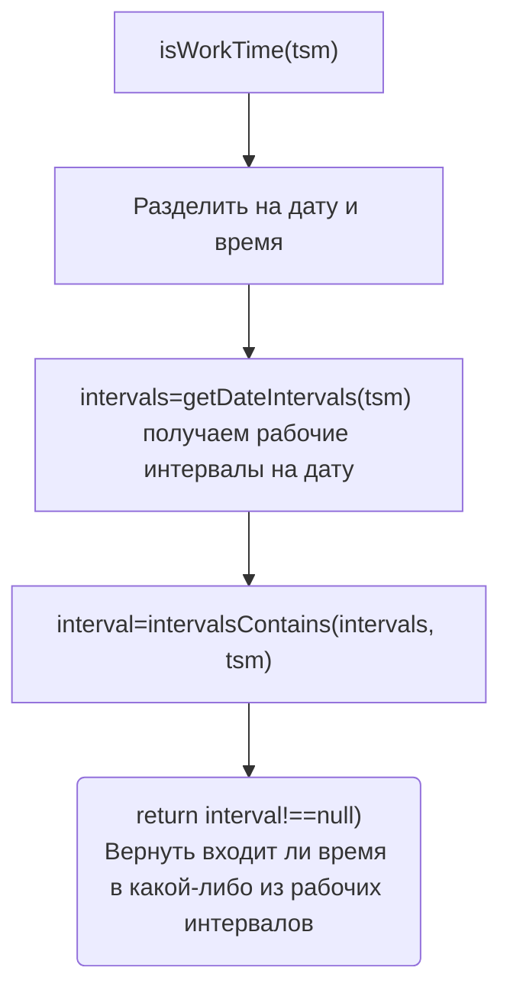

**Test Cases:**

| № | Категория | Входные данные | Ожидаемый результат | Описание теста |
|---|-----------|----------------|---------------------|----------------|
| 1 | Happy Path | Рабочее время: 08:00-17:00, tsm = 10:00 | true | Внутри рабочего интервала |
| 2 | Happy Path | Нерабочее время: 08:00-17:00, tsm = 18:00 | false | После рабочего времени |
| 3 | Happy Path | Нерабочее время: 08:00-17:00, tsm = 07:00 | false | До рабочего времени |
| 4 | Edge | Граница start: 08:00-17:00, tsm = 08:00 | true | Точно на начале |
| 5 | Edge | Граница end: 08:00-17:00, tsm = 17:00 | false (или true если включительно) | Точно на конце |
| 6 | Edge | Несколько интервалов: 08:00-12:00,13:00-17:00, tsm = 12:30 | false | Между интервалами |
| 7 | Edge | Несколько интервалов: 08:00-12:00,13:00-17:00, tsm = 14:00 | true | Во втором интервале |
| 8 | Empty | Интервалы пустые, tsm = 10:00 | false | Нет рабочих интервалов |
| 9 | Error | tsm = null | false | Входной параметр null |
| 10 | Integration | Вызов getDateIntervals, intervalsContains | Корректный результат | Интеграция с внутренними методами |

#### Метод `getMeta(tsm)` — получение метаданных

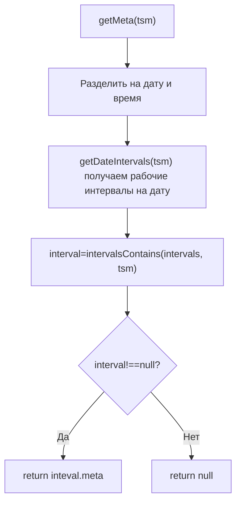

**Test Cases:**

| № | Категория | Входные данные | Ожидаемый результат | Описание теста |
|---|-----------|----------------|---------------------|----------------|
| 1 | Happy Path | Интервал с meta: [480, 1020, {duty: "Иванов"}], tsm = 10:00 | {duty: "Иванов"} | Метаданные найдены |
| 2 | Happy Path | Интервал без meta: [480, 1020, {}], tsm = 10:00 | {} | Пустой объект meta |
| 3 | Happy Path | Вне рабочего времени, tsm = 18:00 | null | Нерабочее время |
| 4 | Edge | Граница start: tsm = 08:00 | meta | Точно на начале |
| 5 | Edge | Несколько интервалов с разными meta, tsm = 14:00 | meta второго интервала | Разные meta в интервалах |
| 6 | Empty | Интервалы = [], tsm = 10:00 | null | Нет интервалов |
| 7 | Error | tsm = null | null | Входной параметр null |
| 8 | Error | schedule = null | null | Расписание не задано |
| 9 | Integration | Вызов getDateIntervals, intervalsContains | Корректный meta | Интеграция |

#### Метод `nextWorkingDateTime(dateTime)` — ближайшее рабочее время

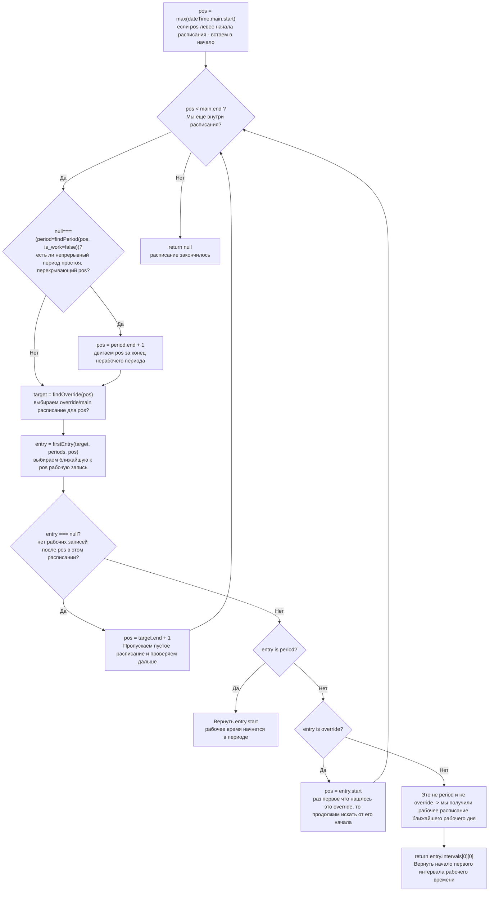

**Test Cases:**

| № | Категория | Входные данные | Ожидаемый результат | Описание теста |
|---|-----------|----------------|---------------------|----------------|
| 1 | Happy Path | Рабочее время: dateTime = 10:00 | 10:00 | Уже рабочее время |
| 2 | Happy Path | Нерабочее время сегодня: dateTime = 18:00, след. раб. = завтра 08:00 | Завтра 08:00 | Переход на следующий день |
| 3 | Happy Path | После рабочего дня: dateTime = 20:00, след. раб. = понедельник 08:00 | Понедельник 08:00 | Через выходные |
| 4 | Edge | dateTime до начала расписания: dateTime = 2020-01-01 05:00, start = 2024-01-01 | 2024-01-01 08:00 | До начала действия |
| 5 | Edge | dateTime после конца расписания: dateTime = 2025-01-01 (end = null) | След. раб. время | Расписание бесконечное |
| 6 | Edge | dateTime в периоде простоя: dateTime = 12:00 (period non-work 11:00-14:00) | 14:00 | Пропуск периода простоя |
| 7 | Edge | dateTime точно на границе интервала: dateTime = 17:00 (end) | След. раб. день | На границе конца |
| 8 | Edge | Несколько выходных подряд: суббота-воскресенье-понедельник | Вторник 08:00 | Множественные выходные |
| 9 | Empty | Расписание пустое, dateTime = 10:00 | null | Нет рабочего времени |
| 10 | Error | dateTime = null | null | Входной параметр null |
| 11 | Integration | Вызов findPeriod, findOverride, firstEntry | Корректное время | Интеграция |

#### Метод `nextWorkingMeta(dateTime)` — метаданные ближайшего рабочего времени

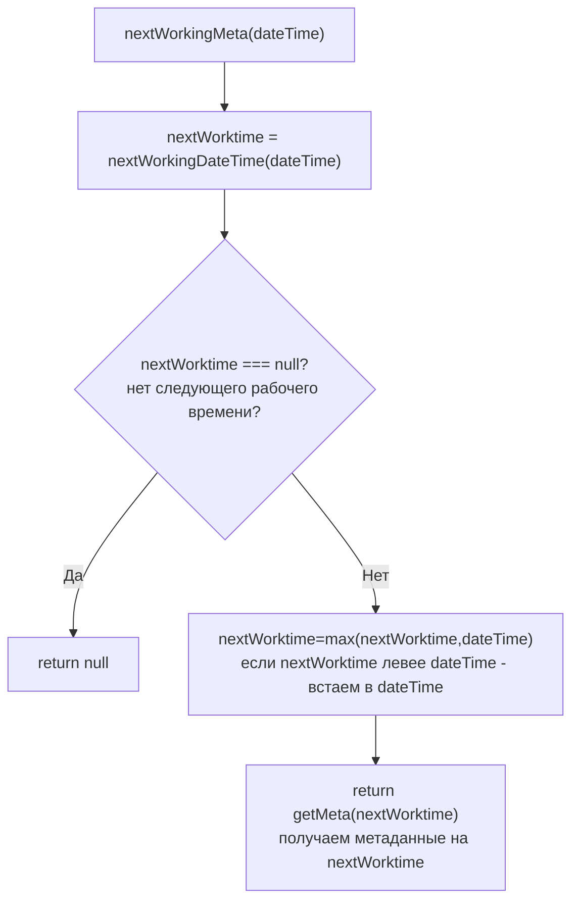

**Test Cases:**

| № | Категория | Входные данные | Ожидаемый результат | Описание теста |
|---|-----------|----------------|---------------------|----------------|
| 1 | Happy Path | Рабочее время с meta: 10:00, meta = {duty: "Иванов"} | {duty: "Иванов"} | Текущее время с meta |
| 2 | Happy Path | Нерабочее время: 18:00, след. раб. 08:00 с meta | {duty: "Петров"} | Следующее время с meta |
| 3 | Edge | dateTime раньше start расписания | meta на start | До начала |
| 4 | Edge | dateTime в периоде простоя | meta на время после периода | Пропуск периода |
| 5 | Empty | nextWorkingDateTime = null | null | Нет рабочего времени |
| 6 | Error | dateTime = null | null | Входной параметр null |
| 7 | Integration | Вызов nextWorkingDateTime, getMeta | Корректный meta | Интеграция |

---

### Вспомогательные функции

Ниже перечислены функции, необходимые для работы алгоритмов. Реализуются в отдельных модулях/утилитах.

#### 1. Конвертация времени

| Функция | Описание | Использование |
| ------- | -------- | ------------- |
| `strToTsm(string)` | Строка "YYYY-MM-DD" или "YYYY-MM-DD hh:mm" → tsm | API вход |
| `tsmToStr(integer)` | tsm → строка "YYYY-MM-DD hh:mm" | API выход |
| `tsmToDateTsm(integer)` | tsm → tsm начала дня (отбросить время) | getDateIntervals |
| `tsmNoDateTsm(integer)` | tsm → минуты с начала дня (отбросить дату) | intervalsContains |

#### 2. Работа с интервалами

| Функция | Описание | Использование |
| ------- | -------- | ------------- |
| `intervalsContains(intervals, tsm)` | Из набора интервалов вернуть тот, который содержит tsm (null, если не содержит) | isWorkTime, getMeta |
| `intervalsIntersect(a, b)` | Пересечение двух интервалов | applyPeriods |
| `intervalsMerge(intervals)` | Объединить пересекающиеся интервалы | intervalsSubtract, intervalsAdd |
| `intervalsSubtract(intervals, remove)` | Вычесть из набора интервалов intervals интервал remove (вычитать из одного другой для упрощения смысла нет, т.к. эта операция может выдать на выходе 2 интервала) | applyPeriodsToDay |
| `intervalsAdd(intervals, override)` | Добавить интервал override с приоритетом его meta над интервальным (при пересечении meta заменяется) | applyPeriodsToDay |
| `filterBefore(entry, tsm)` | Отфильтровать интервалы записи, оставив только те, которые ещё не завершились к моменту tsm. Если запись не на текущий день (entry.start_tsm !== date_tsm(tsm)) — возвращается оригинал. Интервал считается завершённым если end <= минутам от начала дня | nextWorkDateEntry, nextWeekDayEntry |

#### 3. Поиск в данных

| Функция | Описание | Использование |
| ------- | -------- | ------------- |
| `inBounds(tsm, bounds)` | Проверить, попадает ли tsm в границы bounds.start ... bounds.end | getDateIntervals, findOverride |
| `findPeriod(tsm, is_work?)` | Найти период, перекрывающий tsm | nextWorkingDateTime |
| `findOverride(tsm)` | Найти **override**, перекрывающий tsm | getDateIntervals |
| `findNearest(candidates, tsm)` | Найти ближайший элемент не левее tsm | firstEntry |
| `nextOverride(tsm)` | Найти ближайший **override**, заканчивающийся не левее tsm | firstEntry |
| `nextWorkDateEntry(tsm)` | Найти ближайшую **запись на дату**, содержащую рабчие интервалы, заканчивающиеся не левее tsm | firstEntry |


#### 4. Работа с датами

| Функция | Описание | Использование |
| ------- | -------- | ------------- |
| `dayOfWeek(tsm)` | День недели (1-7) от Unix epoch | firstEntry |

#### 5. Алгоритмические

| Функция | Описание | Использование |
| ------- | -------- | ------------- |
| `applyPeriodsToDay(intervals, periods, dateTsm)` | Наложить periods на интервалы дня | getDateIntervals |
| `getEntryIntervals(target, dateTsm)` | Получить intervals для даты (weekday/date/default) | getDateIntervals |
| `calculateEntryStart(entry, dateTsm)` | Вычислить абсолютный start для записи | firstEntry |

#### Метод `inBounds(tsm, bounds)` — проверка попадания tsm в границы

Проверяет, попадает ли tsm в интервал от bounds.start до bounds.end

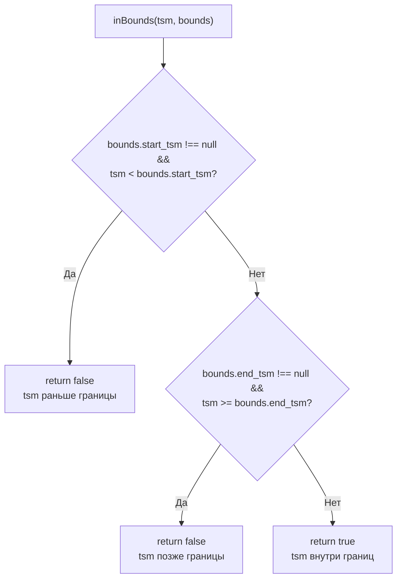

**Test Cases:**

| № | Категория | Входные данные | Ожидаемый результат | Описание теста |
|---|-----------|----------------|---------------------|----------------|
| 1 | Happy Path | tsm=100, bounds=[50, 200] | true | Внутри границ |
| 2 | Happy Path | tsm=50, bounds=[50, 200] | true (если включительно) | На границе start |
| 3 | Happy Path | tsm=200, bounds=[50, 200] | false (если не включительно) | На границе end |
| 4 | Edge | tsm=49, bounds=[50, 200] | false | Чуть раньше start |
| 5 | Edge | tsm=201, bounds=[50, 200] | false | Чуть позже end |
| 6 | Edge | bounds.start=null, tsm=100 | true | Нет ограничения start |
| 7 | Edge | bounds.end=null, tsm=1000000 | true | Нет ограничения end |
| 8 | Edge | bounds=[null, null], tsm=любой | true | Безграничный интервал |
| 9 | Error | tsm = null | false | Входной параметр null |
| 10 | Error | bounds = null | false | bounds null |

#### Метод `nextOverride(tsm)` — найти ближайший override, начинающийся не ранее tsm

Ищет первый override с start_tsm >= tsm. ГАРАНТИЯ: overrides отсортированы по start_tsm при компиляции.

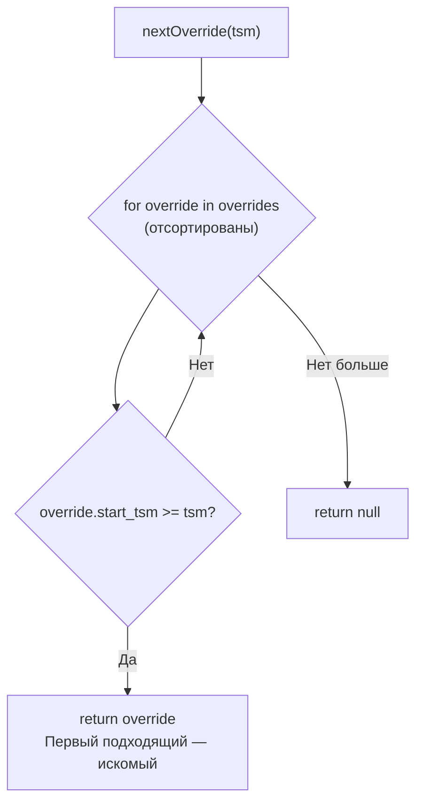

**Test Cases:**

| № | Категория | Входные данные | Ожидаемый результат | Описание теста |
|---|-----------|----------------|---------------------|----------------|
| 1 | Happy Path | tsm=100, override.start=150 | override | Override начинается позже |
| 2 | Happy Path | tsm=150, override.start=150 | override | Точно на границе start |
| 3 | Happy Path | Несколько override: start=100,200,300, tsm=150 | override со start=200 | Ближайший справа |
| 4 | Edge | tsm=50, override.start=100 | override | Раннее tsm |
| 5 | Edge | tsm=500, override.start=100 | null | Все override раньше tsm |
| 6 | Empty | overrides = [] | null | Нет overrides |
| 7 | Empty | overrides = null | null | Null overrides |
| 8 | Error | tsm = null | null | Null входные данные |

#### Метод `nextWorkDateEntry(tsm, target)` — найти ближайшую запись на дату с рабочими интервалами

Ищет первую запись в target.dates с интервалами, которые ещё не закончились полностью.
Критерий: date_tsm >= tsm AND (date_tsm + 1440) > tsm.
ГАРАНТИЯ: target.dates отсортирован по ключу (date_tsm) при компиляции.

**Особенности обработки текущего дня:**
- Если date_tsm совпадает с датой tsm (текущий день), необходимо отфильтровать интервалы, которые уже завершились к моменту tsm
- Интервал считается завершённым, если его конец <= минутам от начала дня tsm
- Если все интервалы отфильтрованы — дата пропускается
- Возвращается клон записи с отфильтрованными интервалами (мутация оригинала недопустима)

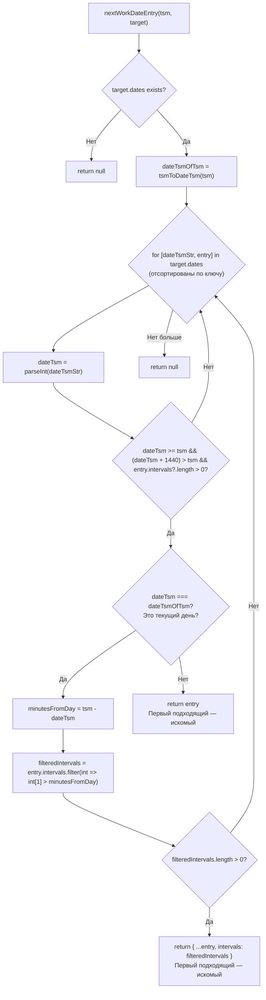

**Test Cases:**

| № | Категория | Входные данные | Ожидаемый результат | Описание теста |
|---|-----------|----------------|---------------------|----------------|
| 1 | Happy Path | tsm=100, date=200 с интервалами | date entry | Дата позже tsm |
| 2 | Happy Path | tsm=100, date=50 с интервалами | null | Дата раньше tsm |
| 3 | Happy Path | Несколько дат: 50,200,300 с инт., tsm=100 | date entry 200 | Ближайшая дата |
| 4 | Edge | tsm точно на дате | date entry | Точно на границе |
| 5 | Edge | Дата без интервалов (intervals=[]) | null | Пропускаем пустые |
| 6 | Edge | Дата уже закончилась: tsm=200, date=50 (end=50+1440=1490<200) | null | День прошёл |
| 7 | Edge | **Новый**: tsm=2024-01-01 15:01 (901 мин), date=2024-01-01 с 8:00-15:00 (480-900) | null | **Текущий день: все интервалы уже завершились** |
| 8 | Edge | **Новый**: tsm=2024-01-01 15:01 (901 мин), date=2024-01-01 с 8:00-15:00,20:00-22:00 (480-900,1200-1320) | entry с intervals=[[1200,1320,{}]] | **Текущий день: оставить только будущие интервалы** |
| 9 | Edge | **Новый**: tsm=2024-01-01 15:01, date=2024-01-02 с любым графиком | entry для 2024-01-02 | Следующий день: полные интервалы |
| 10 | Edge | **Новый**: tsm=2024-01-01 08:00 (480 мин), date=2024-01-01 с 8:00-17:00 (480-1020) | entry с полными интервалами | Начало дня: все интервалы валидны |
| 11 | Edge | **Новый**: tsm=2024-01-01 07:59 (479 мин), date=2024-01-01 с 8:00-17:00 (480-1020) | entry с полными интервалами | За минуту до начала: интервалы ещё не начались |
| 12 | Empty | target.dates = {} | null | Нет дат |
| 13 | Empty | target.dates = null | null | Null dates |
| 14 | Error | tsm = null | null | Null входные данные |
| 15 | Error | target = null | null | Null target |

#### Метод `firstEntry(pos, target, main)` — поиск ближайшего к pos элемента в расписании target

Находит в расписании target ближайший справа к pos элемент из набора:
- periods[is_work=true] - периоды непрерывной работы
- override (если target это main)
- дата-исключение с рабочим графиком (если target это main)
- день из расписания на неделю с рабочим графиком

ГАРАНТИЯ: overrides и dates отсортированы при компиляции. Периоды проверяются перебором (необходимо отсортировать при компиляции).

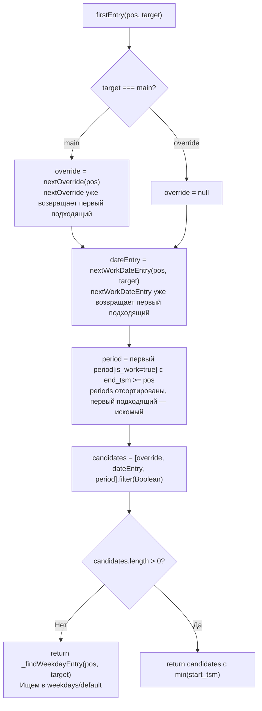

**Test Cases:**

| № | Категория | Входные данные | Ожидаемый результат | Описание теста |
|---|-----------|----------------|---------------------|----------------|
| 1 | Happy Path | target=main, есть override и weekday | Ближайший элемент | Выбор ближайшего |
| 2 | Happy Path | target=override, есть periods | period[is_work=true] | Период работы в override |
| 3 | Happy Path | weekday имеет рабочий график | weekday entry | День недели с графиком |
| 4 | Edge | Все записи пустые (интервалы=[]) | null | Нет рабочих записей |
| 5 | Edge | pos внутри интервала weekday | weekday с обрезанным start | Текущий день |
| 6 | Edge | 7 дней подряд без рабочих | null | Нет рабочих дней |
| 7 | Empty | target.weekdays пуст, default пуст | null | Нет данных |
| 8 | Error | target = null | null | Null входные данные |
| 9 | Error | pos = null | null | Null pos |
| 10 | Integration | Вызов filterBefore из nextWorkDateEntry, nextWeekDayEntry | Корректный результат | Интеграция |

#### Метод `findPeriod(dateTime,is_work)` — поиск периода непрерывной работы/простоя на дату время

- `is_work=true` — ищем период непрерывной работы, который перекрывает dateTime
- `is_work=false` — ищем период простоя, который перекрывает dateTime
- `is_work=null` — ищем любой период, который перекрывает dateTime

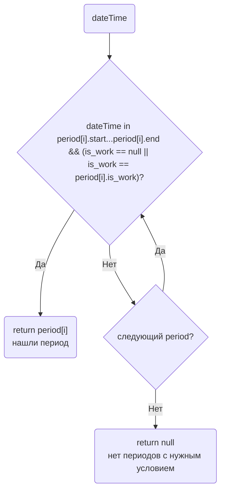

**Test Cases:**

| № | Категория | Входные данные | Ожидаемый результат | Описание теста |
|---|-----------|----------------|---------------------|----------------|
| 1 | Happy Path | is_work=true, dateTime внутри period[is_work=true] | period | Найден work период |
| 2 | Happy Path | is_work=false, dateTime внутри period[is_work=false] | period | Найден non-work период |
| 3 | Happy Path | is_work=null, dateTime внутри любого period | period | Любой период |
| 4 | Edge | dateTime на границе start period | period | Точно на start |
| 5 | Edge | dateTime на границе end period | null или period | На end (зависит от включительности) |
| 6 | Edge | dateTime вне всех периодов | null | Нет пересечения |
| 7 | Empty | periods = [] | null | Нет периодов |
| 8 | Empty | periods = null | null | periods null |
| 9 | Error | dateTime = null | null | Null dateTime |
| 10 | Validation | Пересекающиеся periods | Exception/Error | ВАЛИДАЦИЯ: periods не могут пересекаться! (тест на валидацию БД) |

#### Метод `findOverride(dateTime)` — поиск перекрытия расписания на дату/время

находит override, который перекрывает dateTime, либо main если такого нет и работаем в этом месте по осноному расписанию

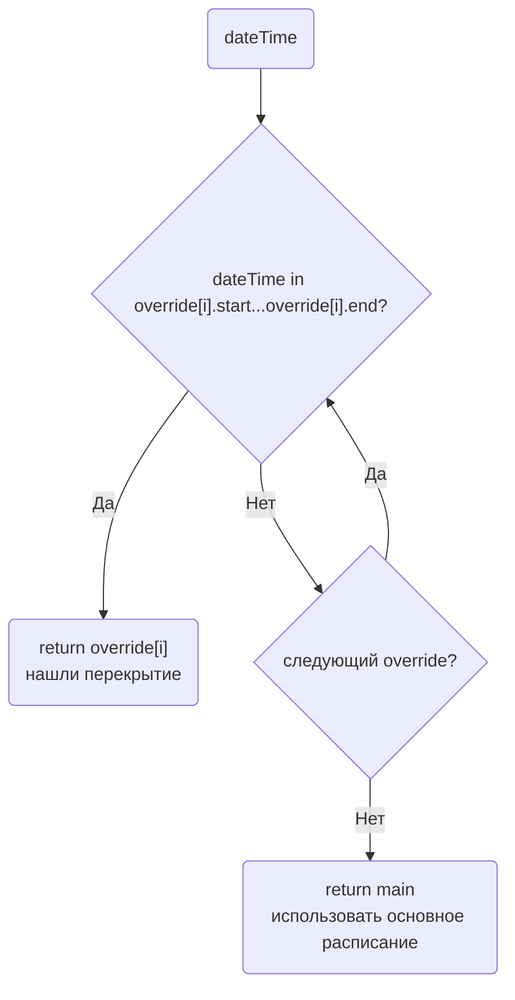

**Test Cases:**

| № | Категория | Входные данные | Ожидаемый результат | Описание теста |
|---|-----------|----------------|---------------------|----------------|
| 1 | Happy Path | dateTime внутри override | override | Override найден |
| 2 | Happy Path | dateTime вне override | main | Fallback на main |
| 3 | Edge | dateTime точно на границе start override | override | На границе start |
| 4 | Edge | dateTime точно на границе end override | main | На границе end |
| 5 | Edge | dateTime между override (если есть разрыв) | main | Между overrides |
| 6 | Edge | Override безграничный (end=null) для dateTime после start | override | Бесконечный override |
| 7 | Empty | overrides = [] | main | Нет overrides |
| 8 | Empty | overrides = null | main | Null overrides |
| 9 | Error | dateTime = null | main | Null dateTime |
| 10 | Error | main = null | null | Main null - нет расписания |
| 11 | Validation | Пересекающиеся overrides | Exception/Error | ВАЛИДАЦИЯ: overrides не могут пересекаться! (тест на валидацию БД) |

---

#### PHP (внутреннее использование)

- [ ] `CompiledScheduleHelper` — класс для работы с компилированными расписаниями

#### JS (внешние системы)

- [ ] `ScheduleRuntime` — класс для работы с JSON на клиенте

#### Lua (для интеграции с Asterisk)

## Вопросы для уточнения

- **Версионирование:** нужно ли хранить историю версий скомпилированных расписаний - нет
- **Горизонт компиляции:** на какой срок вперёд/назад компилировать даты-исключения и перекрытия?
  - По умолчанию можно собрать все данные
  - Но также рассмотреть, например, 1 год вперёд и 1 год назад от текущей даты для оптимизации размера JSON - есть ли сценарии, где нас это может не устроить?
