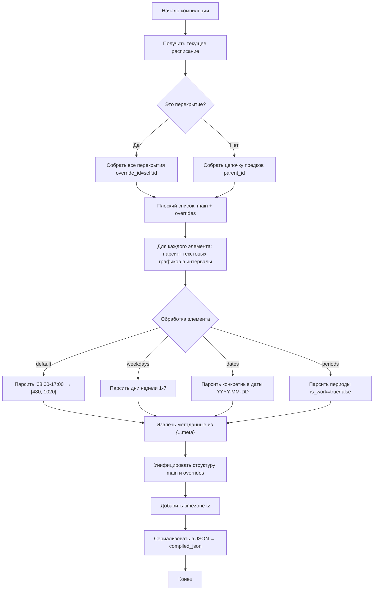
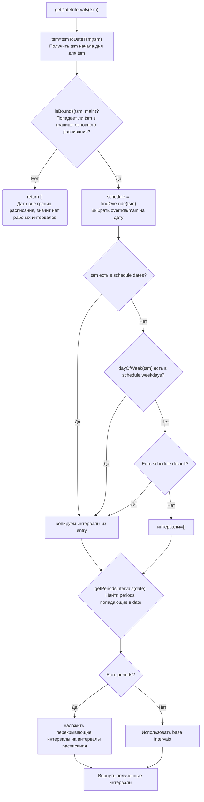
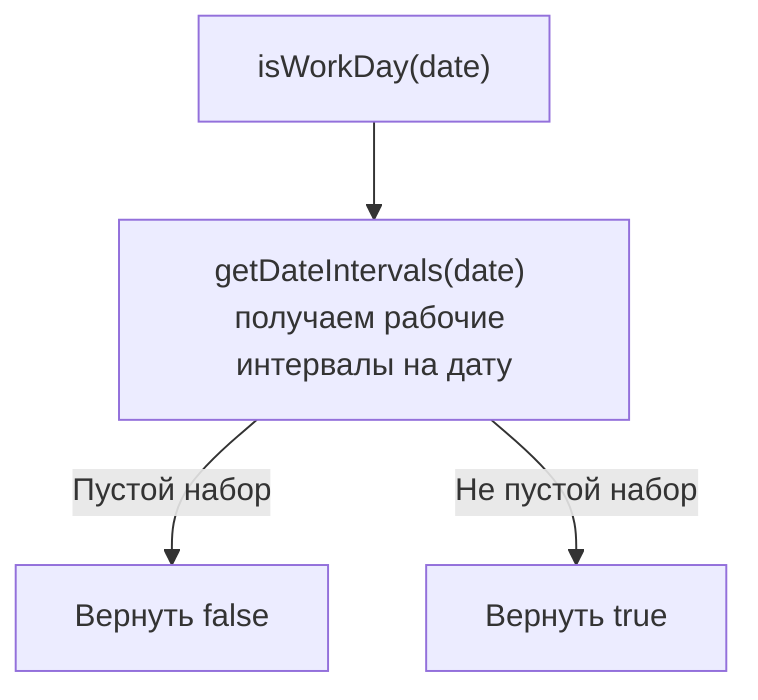
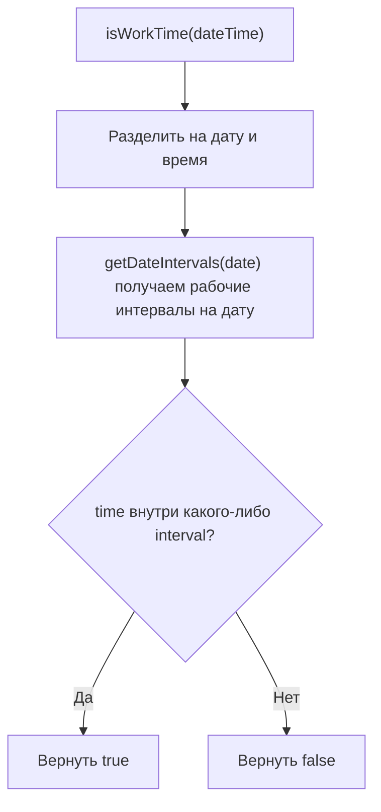
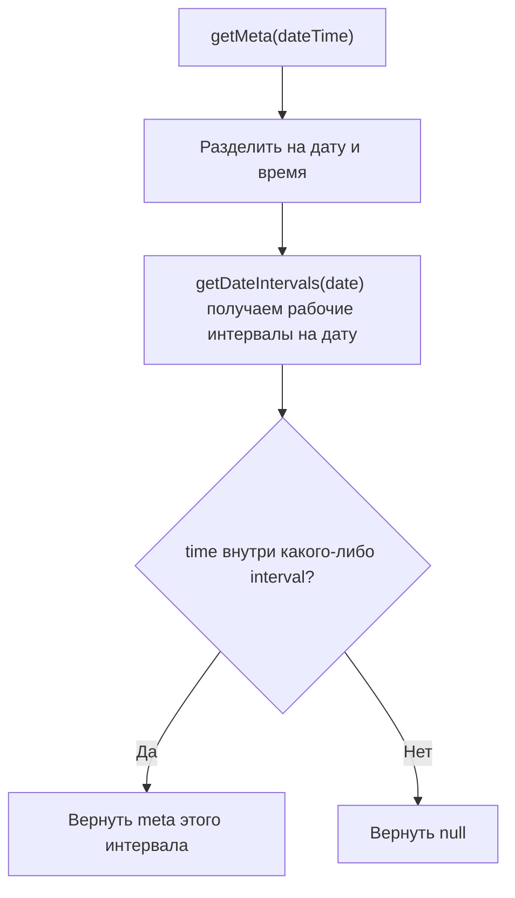
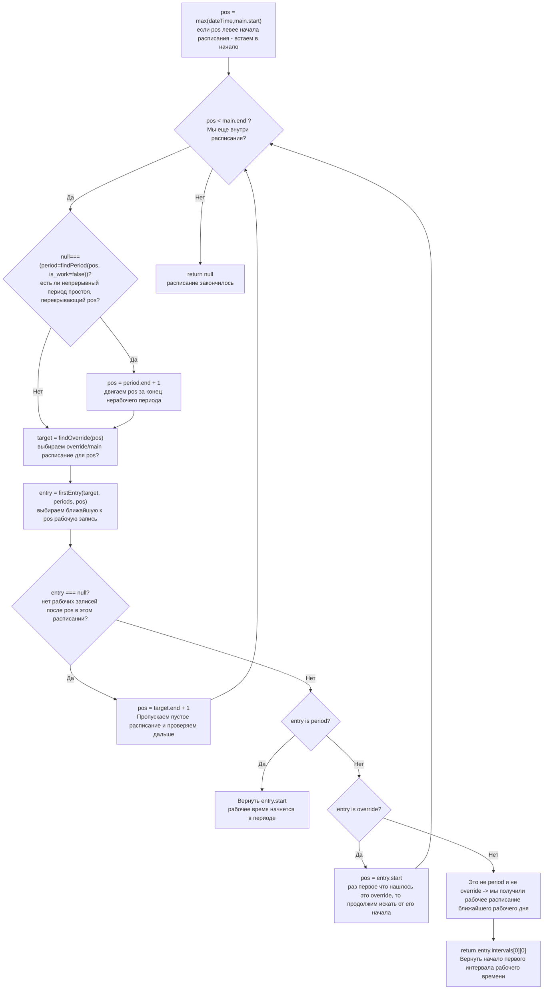
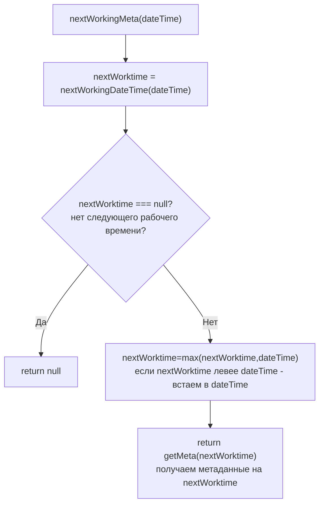
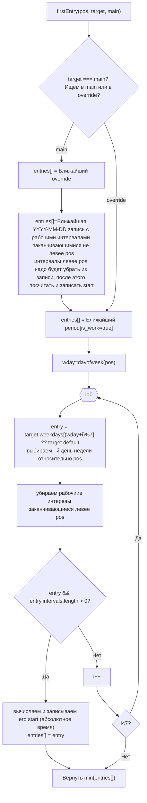
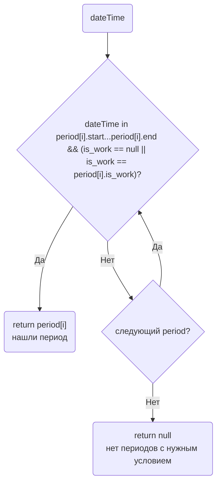
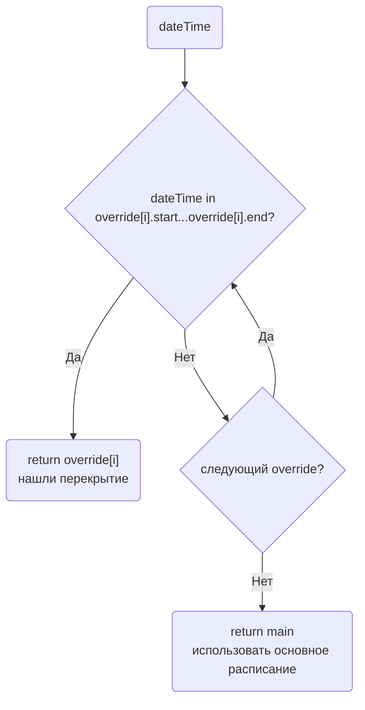

# План компиляции расписаний

## Целевое состояние

Скомпилированное расписание хранится в поле `compiled_json` таблицы `schedules` и представляет собой плоскую структуру данных для быстрого поиска без рекурсии и запросов к БД.

---

## Структура скомпилированного расписания

```json
{
  "tz": "Asia/Yekaterinburg",
  "tz_shift_tsm": 300,
  "compiled": "2024-01-15T10:30:00Z",
  "main": {
    "name": "График работы офиса",
    "start": "2024-01-01",
    "start_tsm": 28401120,
    "end": null,
    "end_tsm": null,
    "default": {
      "schedule": "08:00-17:00",
      "intervals": [[480, 1020, {}]]
    },
    "weekdays": {
      "1": { "schedule": "08:00-17:30", "intervals": [[480, 1050, {}]], "comment": "Понедельник с удлинённым графиком"},
      "5": { "schedule": "08:00-16:00", "intervals": [[480, 960, {"user":"pupkin"}]], "comment": "Пятница с укороченным графиком"},
      "6": { "schedule": "-", "intervals": [] },
      "7": { "schedule": "-", "intervals": [] }
    },
    "dates": {
      "2024-01-01": { "date_tsm": 28401120, "schedule": "-", "intervals": [], "comment": "С новым годом!" },
      "2024-01-02": { "date_tsm": 28402560, "schedule": "10:00-15:00", "intervals": [[600, 900, {}]], "comment": "Работа в первый день после праздника" }
    },
    "periods": [
      { "start": "2024-01-10 10:00", "start_tsm": 28414680, "end": "2024-01-12 22:59", "end_tsm": 28418139, "is_work": true, "comment": "Работали непрерывно в связи с форсмажором" },
      { "start": "2024-02-01 15:10", "start_tsm": 28446430, "end": "2024-02-02 18:17", "end_tsm": 28448047, "is_work": false, "comment": "Аварийное отключение электричества" }
    ],
  },
  "overrides": [
    {
      "name": "Лето 2024",
      "start": "2024-06-01",
      "start_tsm": 28620000,
      "end": "2024-08-31",
      "end_tsm": 28752400,
      "default": { "schedule": "09:00-18:00", "intervals": [[540, 1080, {}]] },
      "weekdays": {},
      "comment": "Летний график 2024"
    }
  ]
}
```

**Пояснение к атрибутам с суффиксом `_tsm`:**

- `_tsm` (timestamp in minutes) — количество минут от Unix epoch (01.01.1970 00:00 UTC)
- Пример: `2024-01-01 00:00:00` → `1704067200` секунд → `28401120` минут
- Используется для быстрых числовых сравнений без парсинга строк и конвертации дат
- Строковые представления (`start`, `end`, `date`) сохранены для отладки и JSON API

---

## Задачи компиляции

### 1. Сборка цепочки предков в плоский список

- [ ] Получить все расписания-основы (без `override_id`) от текущего до корня иерархии
- [ ] Получить все перекрытия (`override_id = self.id`) с их периодами действия
- [ ] Результат: плоский массив объектов `main` + `overrides[]`

### 2. Парсинг текстового графика в минутные интервалы

- [ ] Конвертация "08:00-17:00" → `[480, 1020]`
- [ ] Конвертация "08:00-12:00,13:00-17:00" → `[[480, 720], [780, 1020]]`
- [ ] Конвертация "-" (выходной) → `[]`
- [ ] Извлечение метаданных из `{...meta}` суффикса

### 3. Расчёт timestamp in minutes (_tsm)

- [ ] Конвертация дат/времени в `_tsm` (минуты от Unix epoch)
- [ ] `main.start_tsm`, `main.end_tsm` — границы основного расписания
- [ ] `override.start_tsm`, `override.end_tsm` — границы перекрытий
- [ ] `period.start_tsm`, `period.end_tsm` — границы периодов
- [ ] `date_tsm` в ключах `dates` — timestamp даты (начало дня)

### 4. Унификация структуры базового расписания и перекрытий

- [ ] Обе сущности должны иметь идентичную структуру: `name`, `start`, `end`, `default`, `weekdays`, `dates`, `periods`, `comment`
- [ ] Поле `tz` — часовой пояс (из `schedules` или `Yii::$app->params['schedulesTZShift']`)

### 5. Типовое описание entry (запись дня)

| Поле | Тип | Описание |
| ---- | --- | -------- |
| `schedule` | string | Оригинальный текстовый график "08:00-17:00" или "-" |
| `intervals` | array | Массив интервалов рабочего времени |
| `meta` | object | Метаданные записи (опционально) |
| `comment` | string | Комментарий к записи |

**Интервал:** `[start_minute, end_minute, {meta}]`

- Пример: `[480, 1020, {}]` — 08:00-17:00 без метаданных
- Пример: `[600, 900, {"duty": "Иванов"}]` — 10:00-15:00 с метаданными

### 6. Типовое описание периода (period)

| Поле | Тип | Описание |
| ---- | --- | -------- |
| `start` | string | Дата начала "YYYY-MM-DD hh:mm" |
| `start_tsm` | integer | Timestamp in minutes от epoch |
| `end` | string | Дата окончания "YYYY-MM-DD hh:mm" |
| `end_tsm` | integer | Timestamp in minutes от epoch |
| `is_work` | boolean | true — рабочий период, false — нерабочий |
| `comment` | string | Комментарий к периоду |

---

## Применение периодов к расписанию

Логика наложения периодов на день (реализуется в runtime JS/PHP библиотеке):

1. Найти периоды, перекрывающие дату
2. Для каждого периода:
   - если is_work=true: добавить intervals к рабочим
   - если is_work=false: вычесть intervals из рабочих
3. Слить пересекающиеся интервалы

---

## Инвалидация и перекомпиляция

- [ ] Вызов компиляции в `onBeforeSave()` модели `Schedules`
- [ ] Каскадная перекомпиляция всех потомков (через `parent_id`)

---

## Библиотеки для работы

### Компиляция

- [ ] `Schedules.compile` — метод компиляции расписаний в JSON



### Работа со скомпилированным расписанием

Необходимо чтобы библиотека реализовывала методы обработки скомпилированного расписания:

- IsWorkDay(date) — рабочий/не рабочий день (на дату YYYY-MM-DD)
- IsWorkTime(dateTime) — рабочее/не рабочее время (на дату/время YYYY-MM-DD hh:mm)
- GetMeta(dateTime) — метаданные на дату/время YYYY-MM-DD hh:mm (если есть, иначе null)
- NextWorkingDateTime(dateTime) — ближайшее рабочее дата/время (либо текущее либо следующее) в формате "YYYY-MM-DD hh:mm" (если вернулось меньше dateTime, значит dateTime в рабочем перириоде)
- NextWorkingMeta(dateTime) — метаданные на ближайшее рабочее дату/время (либо текущее либо следующее)

### Алгоритмическое описание работы со скомпилированным расписанием

#### Метод `getPeriods(date_tsm)` — получить периоды, перекрывающие дату

возвращает периоды которые заканчиваются не раньше конца дня и начинаются не позже начала дня, т.е. перекрывают день

#### Метод `getPeriodsIntervals(date_tsm)` — получить интервалы периодов, перекрывающих дату

Возвращает набор интервалов в пределах дня date_tsm, полученных от перекрывающих день периодов. 

```json
{
  "positive": [ // периоды непрерывной работы, накладывающие рабочее время
    [600, 900, {"comment":"Работали непрерывно в связи с форсмажором"}]
  ],
  "negative": [ // периоды простоя, накладывающие нерабочее время
    [910, 1000, {"comment":"Аварийное отключение электричества"}]
  ]
}
```

#### Метод `getDateIntervals(tsm)` — получить интервалы расписания на дату



#### Метод `isWorkDay(date)` — проверка рабочего дня на дату



#### Метод `isWorkTime(dateTime)` — проверка рабочего времени на дату-время



#### Метод `getMeta(dateTime)` — получение метаданных



#### Метод `nextWorkingDateTime(dateTime)` — ближайшее рабочее время



#### Метод `nextWorkingMeta(dateTime)` — метаданные ближайшего рабочего времени



---

### Вспомогательные функции

Ниже перечислены функции, необходимые для работы алгоритмов. Реализуются в отдельных модулях/утилитах.

#### 1. Конвертация времени

| Функция | Описание | Использование |
| ------- | -------- | ------------- |
| `strToTsm(string)` | Строка "YYYY-MM-DD" или "YYYY-MM-DD hh:mm" → tsm | API вход |
| `tsmToStr(integer)` | tsm → строка "YYYY-MM-DD hh:mm" | API выход |
| `tsmToDateTsm(integer)` | tsm → tsm начала дня (отбросить время) | getDateIntervals |
| `tsmNoDateTsm(integer)` | tsm → минуты с начала дня (отбросить дату) | intervalsContains |

#### 2. Работа с интервалами

| Функция | Описание | Использование |
| ------- | -------- | ------------- |
| `intervalsContains(intervals, tsm)` | Проверить, содержит ли любой интервал время | isWorkTime, getMeta |
| `intervalsIntersect(a, b)` | Пересечение двух интервалов | applyPeriods |
| `intervalsMerge(intervals)` | Объединить пересекающиеся интервалы | applyPeriods |
| `intervalsSubtract(base, remove)` | Вычесть интервалы (для period is_work=false) | applyPeriods |
| `filterBefore(intervals, tsm)` | Убрать интервалы, заканчивающиеся раньше pos | firstEntry |

#### 3. Поиск в данных

| Функция | Описание | Использование |
| ------- | -------- | ------------- |
| `inBounds(tsm, bounds)` | Проверить, попадает ли tsm в границы bounds.start ... bounds.end | findOverrides, findPeriods |
| `findPeriod(tsm, is_work?)` | Найти период, перекрывающий tsm | findPeriod, getDateIntervals |
| `findOverrides(tsm)` | Найти **override**, перекрывающий tsm | findOverride, getDateIntervals |
| `findNearest(candidates, tsm)` | Найти ближайший элемент не левее tsm | firstEntry |
| `nextOverride(tsm)` | Найти ближайший **override**, заканчивающийся не левее tsm | firstEntry |
| `nextWorkDateEntry(tsm)` | Найти ближайшую **запись на дату**, содержащую рабчие интервалы, заканчивающиеся не левее tsm | firstEntry |


#### 4. Работа с датами

| Функция | Описание | Использование |
| ------- | -------- | ------------- |
| `dayOfWeek(tsm)` | День недели (1-7) | firstEntry |

#### 5. Алгоритмические

| Функция | Описание | Использование |
| ------- | -------- | ------------- |
| `applyPeriodsToDay(intervals, periods, dateTsm)` | Наложить periods на интервалы дня | getDateIntervals |
| `getEntryIntervals(target, dateTsm)` | Получить intervals для даты (weekday/date/default) | getDateIntervals |
| `calculateEntryStart(entry, dateTsm)` | Вычислить абсолютный start для записи | firstEntry |

#### Метод `firstEntry(pos, target, main)` — поиск ближайшего к pos элемента в расписании target

находит в расписании target ближайший справа к pos элемент из набора

- periods[is_work=true] - периоды непрерывной работы
- override (если target это main)
- дата-исключение с рабочим графиком (если target это main)
- день из расписания на неделю с рабочим графиком



#### Метод `findPeriod(dateTime,is_work)` — поиск периода непрерывной работы/простоя на дату время

- `is_work=true` — ищем период непрерывной работы, который перекрывает dateTime
- `is_work=false` — ищем период простоя, который перекрывает dateTime
- `is_work=null` — ищем любой период, который перекрывает dateTime



#### Метод `findOverride(dateTime)` — поиск перекрытия расписания на дату/время

находит override, который перекрывает dateTime, либо main если такого нет и работаем в этом месте по осноному расписанию




---

#### PHP (внутреннее использование)

- [ ] `CompiledScheduleHelper` — класс для работы с компилированными расписаниями

#### JS (внешние системы)

- [ ] `ScheduleRuntime` — класс для работы с JSON на клиенте

#### Lua (для интеграции с Asterisk)

## Вопросы для уточнения

- **Версионирование:** нужно ли хранить историю версий скомпилированных расписаний - нет
- **Горизонт компиляции:** на какой срок вперёд/назад компилировать даты-исключения и перекрытия?
  - По умолчанию можно собрать все данные
  - Но также рассмотреть, например, 1 год вперёд и 1 год назад от текущей даты для оптимизации размера JSON - есть ли сценарии, где нас это может не устроить?
