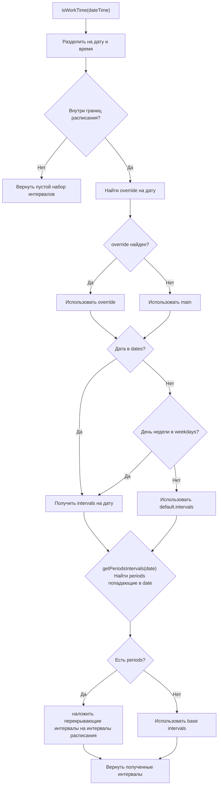
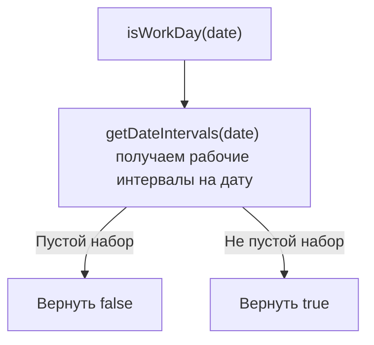
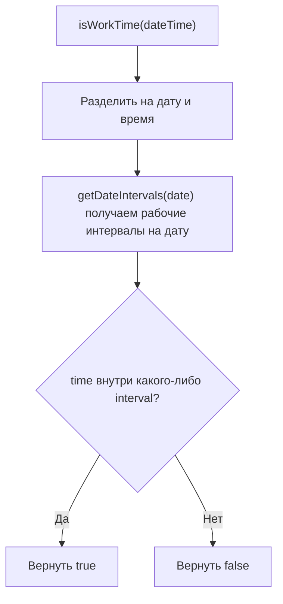
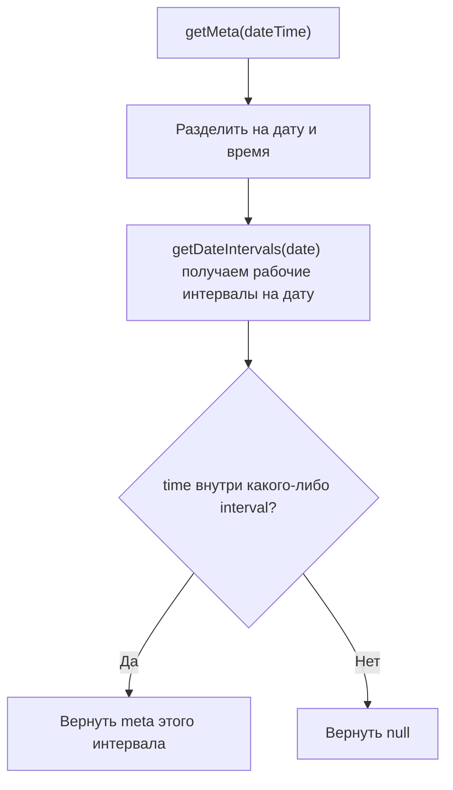
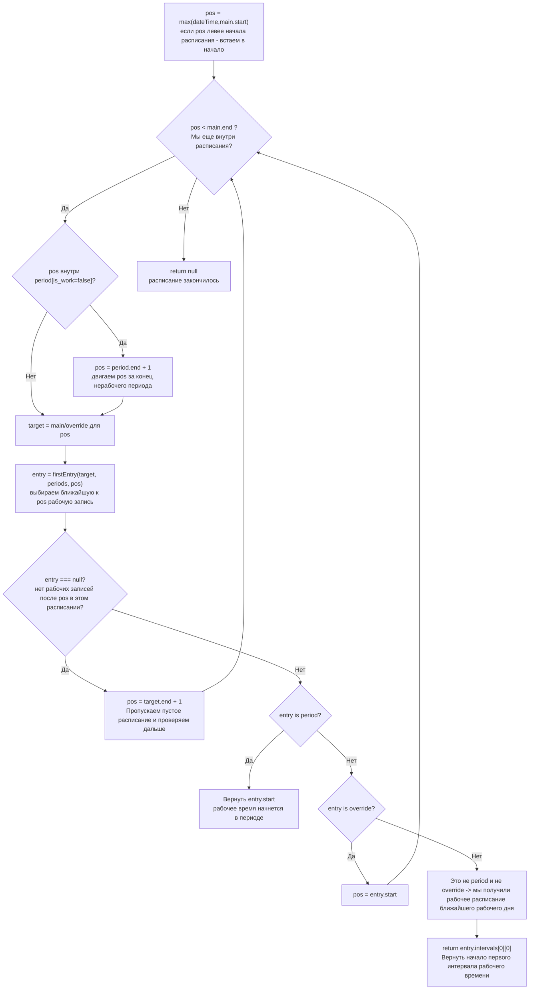
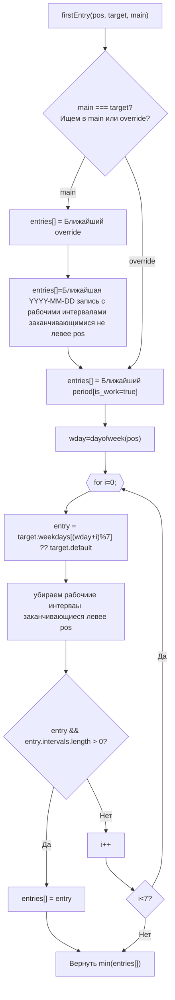
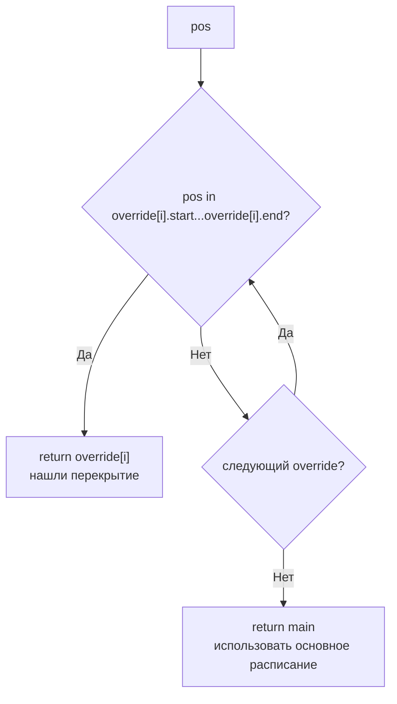
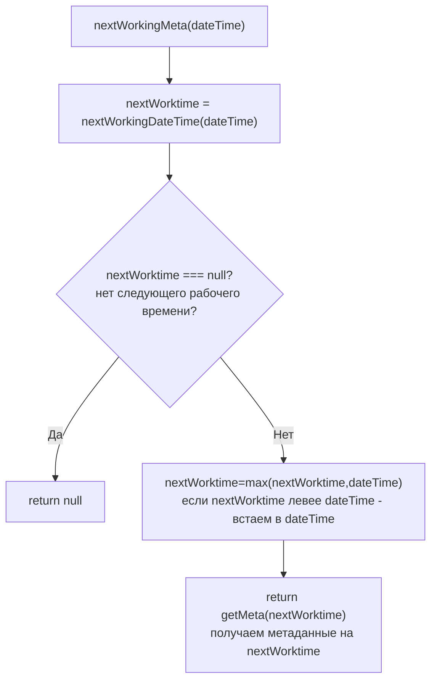

# План компиляции расписаний

## Целевое состояние

Скомпилированное расписание хранится в поле `compiled_json` таблицы `schedules` и представляет собой плоскую структуру данных для быстрого поиска без рекурсии и запросов к БД.

---

## Структура скомпилированного расписания

```json
{
  "tz": "Asia/Yekaterinburg",
  "compiled": "2024-01-15T10:30:00Z",
  "main": {
    "name": "График работы офиса",
    "start": "2024-01-01",
    "end": null,
    "default": {
      "schedule": "08:00-17:00",
      "intervals": [[480, 1020, {}]]
    },
    "weekdays": {
      "1": { "schedule": "08:00-17:30", "intervals": [[480, 1050, {}]], "comment": "Понедельник с удлинённым графиком"},
      "5": { "schedule": "08:00-16:00", "intervals": [[480, 960, {"user":"pupkin"}]], "comment": "Пятница с укороченным графиком"},
      "6": { "schedule": "-", "intervals": [] },
      "7": { "schedule": "-", "intervals": [] }
    },
    "dates": {
      "2024-01-01": { "schedule": "-", "intervals": [], "comment": "С новым годом!" },
      "2024-01-02": { "schedule": "10:00-15:00", "intervals": [[600, 900, {}]], "comment": "Работа в первый день после праздника" }
    },
    "periods": [
      { "start": "2024-01-10 10:00", "end": "2024-01-12 22:59", "is_work": true, "comment": "Работали непрерывно в связи с форсмажором" },
      { "start": "2024-02-01 15:10", "end": "2024-02-02 18:17", "is_work": false, "comment": "Аварийное отключение электричества" }
    ],
  },
  "overrides": [
    {
      "name": "Лето 2024",
      "start": "2024-06-01",
      "end": "2024-08-31",
      "default": { "schedule": "09:00-18:00", "intervals": [[540, 1080, {}]] },
      "weekdays": {},
      "comment": "Летний график 2024"
    }
  ]
}
```

---

## Задачи компиляции

### 1. Сборка цепочки предков в плоский список

- [ ] Получить все расписания-основы (без `override_id`) от текущего до корня иерархии
- [ ] Получить все перекрытия (`override_id = self.id`) с их периодами действия
- [ ] Результат: плоский массив объектов `main` + `overrides[]`

### 2. Парсинг текстового графика в минутные интервалы

- [ ] Конвертация "08:00-17:00" → `[480, 1020]`
- [ ] Конвертация "08:00-12:00,13:00-17:00" → `[[480, 720], [780, 1020]]`
- [ ] Конвертация "-" (выходной) → `[]`
- [ ] Извлечение метаданных из `{...meta}` суффикса

### 3. Унификация структуры базового расписания и перекрытий

- [ ] Обе сущности должны иметь идентичную структуру: `name`, `start`, `end`, `default`, `weekdays`, `dates`, `periods`, `comment`
- [ ] Поле `tz` — часовой пояс (из `schedules` или `Yii::$app->params['schedulesTZShift']`)

### 4. Типовое описание entry (запись дня)

| Поле | Тип | Описание |
| ---- | --- | -------- |
| `schedule` | string | Оригинальный текстовый график "08:00-17:00" или "-" |
| `intervals` | array | Массив интервалов рабочего времени |
| `meta` | object | Метаданные записи (опционально) |
| `comment` | string | Комментарий к записи |

**Интервал:** `[start_minute, end_minute, {meta}]`

- Пример: `[480, 1020, {}]` — 08:00-17:00 без метаданных
- Пример: `[600, 900, {"duty": "Иванов"}]` — 10:00-15:00 с метаданными

### 5. Типовое описание периода (period)

| Поле | Тип | Описание |
| ---- | --- | -------- |
| `start` | string | Дата начала "YYYY-MM-DD hh:mm" |
| `end` | string | Дата окончания "YYYY-MM-DD hh:mm" |
| `is_work` | boolean | true — рабочий период, false — нерабочий |
| `comment` | string | Комментарий к периоду |

---

## Применение периодов к расписанию

Логика наложения периодов на день (реализуется в runtime JS/PHP библиотеке):

1. Найти периоды, перекрывающие дату
2. Для каждого периода:
   - если is_work=true: добавить intervals к рабочим
   - если is_work=false: вычесть intervals из рабочих
3. Слить пересекающиеся интервалы

---

## Инвалидация и перекомпиляция

- [ ] Вызов компиляции в `onBeforeSave()` модели `Schedules`
- [ ] Каскадная перекомпиляция всех потомков (через `parent_id`)

---

## Библиотеки для работы

### Компиляция

- [ ] `Schedules.compile` — метод компиляции расписаний в JSON

```mermaid
flowchart TD
    A[Начало компиляции] --> B[Получить текущее расписание]
    B --> C{Это перекрытие?}
    C -->|Да| D[Собрать все перекрытия override_id=self.id]
    C -->|Нет| E[Собрать цепочку предков parent_id]
    D --> F[Плоский список: main + overrides]
    E --> F
    F --> G[Для каждого элемента: парсинг текстовых графиков в интервалы]
    G --> H{Обработка элемента}
    H -->|default| I[Парсить '08:00-17:00' → [480, 1020]]
    H -->|weekdays| J[Парсить дни недели 1-7]
    H -->|dates| K[Парсить конкретные даты YYYY-MM-DD]
    H -->|periods| L[Парсить периоды is_work=true/false]
    I --> M[Извлечь метаданные из {...meta}]
    J --> M
    K --> M
    L --> M
    M --> N[Унифицировать структуру main и overrides]
    N --> O[Добавить timezone tz]
    O --> P[Сериализовать в JSON → compiled_json]
    P --> Q[Конец]
```

### Работа со скомпилированным расписанием

Необходимо чтобы библиотека реализовывала методы обработки скомпилированного расписания:

- IsWorkDay(date) — рабочий/не рабочий день (на дату YYYY-MM-DD)
- IsWorkTime(dateTime) — рабочее/не рабочее время (на дату/время YYYY-MM-DD hh:mm)
- GetMeta(dateTime) — метаданные на дату/время YYYY-MM-DD hh:mm (если есть, иначе null)
- NextWorkingDateTime(dateTime) — ближайшее рабочее дата/время (либо текущее либо следующее) в формате "YYYY-MM-DD hh:mm" (если вернулось меньше dateTime, значит dateTime в рабочем перириоде)
- NextWorkingMeta(dateTime) — метаданные на ближайшее рабочее дату/время (либо текущее либо следующее)

#### Алгоритмическое описание

#### Метод (вспомогательный) `getPeriodsIntervals(date)` — получить на день периоды исключения в виде интервалов

Для удобного складывания с интервалами графика периоды тоже нужно получить в виде минутных интервалов

#### Метод `getDateIntervals(date)` — получить интервалы расписания на день



#### Метод `isWorkDay(date)` — проверка рабочего дня



#### Метод `isWorkTime(dateTime)` — проверка рабочего времени



#### Метод `getMeta(dateTime)` — получение метаданных



#### Метод `nextWorkingDateTime(dateTime)` — ближайшее рабочее время



#### Подпрограмма `firstEntry(pos, target, main)` — поиск кандидатов

находит в расписании target ближайший справа к pos

- periods[is_work=true]
- override (если target это main)
- дата-исключение с рабочим графиком (если target это main)
- день из расписания на неделю с рабочим графиком



#### Подпрограмма `findActiveOverride(pos)` — поиск активного перекрытия



#### Метод `nextWorkingMeta(dateTime)` — метаданные ближайшего рабочего времени



#### PHP (внутреннее использование)

- [ ] `CompiledScheduleHelper` — класс для работы с компилированными расписаниями

#### JS (внешние системы)

- [ ] `ScheduleRuntime` — класс для работы с JSON на клиенте

#### Lua (для интеграции с Asterisk)

## Вопросы для уточнения

- **Версионирование:** нужно ли хранить историю версий скомпилированных расписаний - нет
- **Горизонт компиляции:** на какой срок вперёд/назад компилировать даты-исключения и перекрытия?
  - По умолчанию можно собрать все данные
  - Но также рассмотреть, например, 1 год вперёд и 1 год назад от текущей даты для оптимизации размера JSON - есть ли сценарии, где нас это может не устроить?
